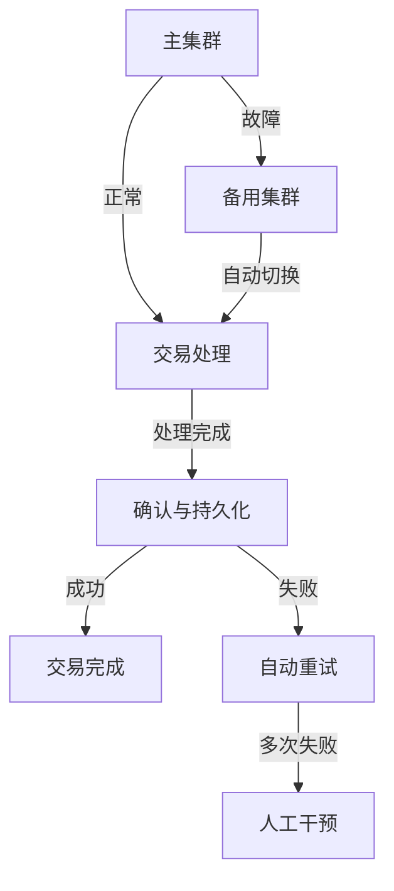
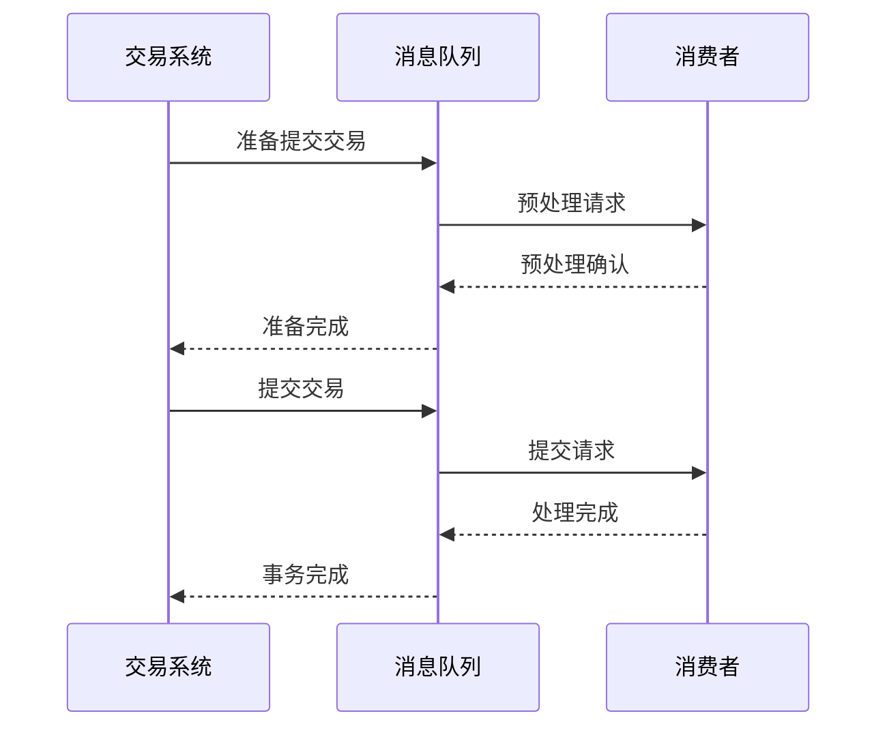

## 前言

在当今数字化金融时代，交易系统对可靠性和性能的要求达到了前所未有的高度。消息队列作为分布式系统的核心组件，在金融交易系统中扮演着至关重要的角色。然而，与一般业务系统相比，金融交易系统对消息队列有着更为特殊和严格的要求。

本文将深入探讨消息队列在金融交易系统中的特殊应用场景、技术挑战以及解决方案，帮助金融科技从业者和架构师构建高性能、高可靠的交易系统。

## 金融交易系统对消息队列的特殊要求

### 1. 极低延迟需求

金融交易，特别是高频交易(HFT)场景，对消息传递的延迟要求极为苛刻，通常需要在微秒级别。

```
典型延迟要求:
- 高频交易: <100微秒
- 普通交易: <10毫秒
- 批处理交易: <100毫秒
```

::: tip
在金融交易中，每微秒的延迟优势都可能意味着巨大的商业价值，因此消息队列的延迟优化是金融科技的核心竞争力之一。
:::

### 2. 严格的事务保证

金融交易要求消息队列提供强一致性的事务保证，确保交易的原子性、一致性、隔离性和持久性(ACID)。

**事务消息处理流程:**
1. 交易发起
2. 消息发送到队列
3. 交易状态持久化
4. 消费者确认处理
5. 交易完成或回滚

### 3. 高可用与容错机制

金融系统要求99.9999%以上的可用性，任何消息丢失或处理失败都可能导致严重的财务损失。



## 金融交易系统中的消息队列架构设计

### 1. 分层消息架构

金融交易系统通常采用分层消息架构，将不同类型的消息按优先级和重要性进行分类处理。

```
消息优先级层次:
1. 实时交易指令 - 最高优先级
2. 市场数据推送 - 高优先级
3. 风控告警 - 中高优先级
4. 日志记录 - 中优先级
5. 报表生成 - 低优先级
```

### 2. 专用交易队列设计

为满足金融交易的特殊需求，需要设计专用的交易队列组件：

```java
public class FinancialMessageQueue {
    // 交易消息结构
    public static class TradeMessage {
        private String transactionId;
        private String accountId;
        private String symbol;
        private BigDecimal quantity;
        private BigDecimal price;
        private Instant timestamp;
        private MessagePriority priority;
        // 其他交易相关字段
    }
    
    // 消息优先级枚举
    public enum MessagePriority {
        URGENT, HIGH, NORMAL, LOW
    }
    
    // 消息发送方法
    public void sendTradeMessage(TradeMessage message) {
        // 根据优先级路由到不同队列
        // 实现事务性发送
        // 处理幂等性
    }
}
```

### 3. 消息去重与幂等性

金融交易系统必须确保消息的幂等性，防止重复处理导致交易异常。

**实现策略:**
- 使用交易ID作为唯一标识
- 实现消息去重表
- 采用幂等性设计模式
- 设置合理的消息过期时间

## 关键技术挑战与解决方案

### 1. 低延迟优化技术

**硬件优化:**
- 使用高性能网络设备
- 采用RDMA(远程直接内存访问)技术
- 服务器CPU亲和性设置

**软件优化:**
- 零拷贝技术
- 内存池管理
- 高效序列化协议(如Protocol Buffers)

```c
// 零拷贝消息处理示例
void processMessageZeroCopy(char* buffer, size_t size) {
    // 直接操作内存，避免数据拷贝
    TradeMessage* msg = (TradeMessage*)buffer;
    // 处理消息...
}
```

### 2. 事务性消息处理

金融交易要求消息处理具有事务性，可以使用两阶段提交(2PC)或三阶段提交(3PC)协议。



### 3. 监控与告警系统

金融交易系统需要全方位的监控和告警机制：

- 消息延迟监控
- 队列积压告警
- 处理失败告警
- 系统资源监控
- 交易量统计

## 主流消息队列在金融场景的对比

| 消息队列 | 延迟 | 可靠性 | 事务支持 | 金融适用性 |
|---------|------|--------|---------|-----------|
| Kafka   | 中等 | 高     | 有限    | 中等      |
| RabbitMQ| 低   | 高     | 强      | 高        |
| RocketMQ| 低   | 高     | 强      | 高        |
| Pulsar  | 低   | 高     | 中等    | 中高      |
| NATS    | 极低 | 中等   | 有限    | 低        |

## 实践案例：证券交易系统中的消息队列应用

### 场景描述

某证券公司构建了新一代交易系统，需要处理每秒数万笔交易请求，同时保证交易数据的完整性和一致性。

### 架构设计

```
交易系统架构:
1. 客户端接入层
   ├── REST API
   ├── FIX协议
   └── WebSocket实时连接
   
2. 消息路由层
   ├── 交易指令队列
   ├── 市场数据队列
   └风控告警队列
   
3. 业务处理层
   ├── 订单处理服务
   ├── 清算结算服务
   └风险监控服务
   
4. 数据存储层
   ├── 实时数据库
   ├── 历史数据库
   └审计日志系统
```

### 实施效果

实施基于RocketMQ的金融消息队列后，系统取得了以下效果：

- 交易处理延迟从50ms降低到5ms
- 系统可用性达到99.999%
- 消息丢失率为0
- 日均处理交易量增长300%

## 未来发展趋势

### 1. 云原生金融消息服务

随着云原生技术的发展，金融消息队列将向以下方向发展：

- 容器化部署
- 微服务架构集成
- 自动弹性伸缩
- 多云部署策略

### 2. 智能化消息路由

结合AI技术，实现智能化的消息路由和处理：

- 基于交易类型的智能路由
- 预测性资源分配
- 自适应负载均衡

### 3. 区块链集成

将消息队列与区块链技术结合，实现：

- 交易数据不可篡改
- 智能合约自动执行
- 分布式清算结算

## 结语

金融交易系统对消息队列的要求远高于一般业务系统，需要我们在架构设计、技术选型和实现细节上投入更多精力。通过合理设计和优化，消息队列可以成为金融交易系统的强大支撑，确保交易的高效、可靠和安全。

随着金融科技的不断发展，消息队列技术也将持续演进，为金融行业提供更强大的技术支撑。作为金融科技从业者，我们需要持续关注这些技术趋势，不断提升系统的性能和可靠性。

> 金融交易系统的可靠性，不仅是技术问题，更是对用户信任的承诺。每一次消息的准确传递，都是对客户资产安全的保障。