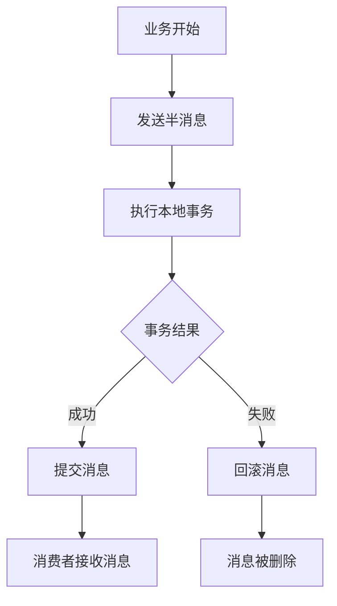

## 前言

在分布式系统中，消息队列扮演着至关重要的角色。它们就像系统间的"邮局"，负责在各个服务之间传递信息和协调工作。📡 然而，当我们需要确保一系列操作要么全部成功，要么全部失败时，普通的消息传递机制就显得力不从心了。这就是事务性消息大显身手的舞台！

::: tip
事务性消息是消息队列系统中的高级特性，它允许我们将消息发送与业务事务绑定，确保业务流程的原子性和一致性。
:::

今天，我想和大家聊聊消息队列中的事务性消息这个话题，探讨它是如何帮助我们构建更加可靠的分布式系统的。

## 为什么需要事务性消息？

想象一下这样一个场景：用户下单后，我们需要扣减库存、创建订单记录、发送通知邮件等多个步骤。在传统架构中，这些操作可能分散在不同的服务中：

```
用户下单 → 订单服务 → 库存服务 → 通知服务
```

如果订单服务成功创建订单后，库存服务却因为某种原因失败了，就会出现数据不一致的情况——订单存在了，但库存没有扣减。😱

普通的消息队列可以保证消息的投递，但无法保证消息发送前的业务操作和消息投递的原子性。这就是事务性消息要解决的问题。

## 事务性消息的工作原理

事务性消息的核心思想是将"业务操作"和"消息发送"放在同一个事务中，确保它们要么全部成功，要么全部失败。

### 两阶段提交模式

大多数消息队列系统采用两阶段提交模式来实现事务性消息：

1. **准备阶段**：发送方将消息标记为"待发送"状态，但不立即投递给消费者。
2. **提交阶段**：当业务操作成功提交后，将消息状态更新为"已发送"，投递给消费者。

以RocketMQ为例，事务性消息的流程如下：



### 事务性消息的状态管理

事务性消息通常有以下几种状态：

- `TransactionStatus.UNKNOWN`：未知状态，需要检查
- `TransactionStatus.COMMIT_MESSAGE`：提交消息，消费者可以消费
- `TransactionStatus.ROLLBACK_MESSAGE`：回滚消息，消息将被删除

## 实现事务性消息的挑战

虽然事务性听起来很美好，但在实际实现中，我们会面临不少挑战：

### 1. 幂等性问题

由于网络问题或其他原因，消息可能会被重复投递。如果消费者没有正确处理幂等性，可能会导致数据不一致。

**解决方案**：
- 为每个消息生成唯一ID
- 在消费前检查该ID是否已被处理
- 使用数据库唯一约束防止重复操作

### 2. 事务超时

如果业务事务执行时间过长，可能会导致事务性消息超时，从而被系统回滚。

**解决方案**：
- 设置合理的超时时间
- 将长事务拆分为多个短事务
- 使用补偿事务处理超时情况

### 3. 分布式事务的复杂性

事务性消息本质上是分布式事务的一种实现，它仍然面临着分布式系统的所有挑战，如网络分区、节点故障等。

## 主流消息队列的事务性消息实现

### RocketMQ的事务性消息

RocketMQ提供了完整的事务性消息支持，其核心API如下：

```java
// 发送事务性消息
TransactionSendResult result = producer.sendMessageInTransaction(msg, arg);

// 事务监听器
public interface TransactionListener {
    // 执行本地事务
    LocalTransactionState executeLocalTransaction(Message msg, Object arg);
    
    // 检查事务状态
    LocalTransactionState checkLocalTransaction(MessageExt msg);
}
```

### RabbitMQ的事务性消息

RabbitMQ通过Publisher Confirms机制实现类似的事务性保证：

```java
// 启用发布者确认
channel.confirmSelect();

// 添加确认监听器
channel.addConfirmListener(new ConfirmListener() {
    // 消息确认回调
    public void handleAck(long deliveryTag, boolean multiple) {
        // 处理确认逻辑
    }
    
    // 消息拒绝回调
    public void handleNack(long deliveryTag, boolean multiple) {
        // 处理拒绝逻辑
    }
});
```

### Kafka的事务性消息

Kafka从0.11版本开始支持事务性消息：

```java
// 配置事务ID
props.put(ProducerConfig.TRANSACTIONAL_ID_CONFIG, "my-transactional-id");

// 初始化事务
producer.initTransactions();

// 开始事务
producer.beginTransaction();

try {
    // 发送消息
    producer.send(record1);
    producer.send(record2);
    
    // 提交事务
    producer.commitTransaction();
} catch (Exception e) {
    // 中止事务
    producer.abortTransaction();
}
```

## 实际应用场景

### 1. 电商下单流程

在电商系统中，下单流程涉及多个服务：

```
用户下单 → 创建订单 → 扣减库存 → 生成支付单 → 发送通知
```

使用事务性消息可以确保这些操作要么全部成功，要么全部失败，避免出现"订单已创建但库存未扣减"等问题。

### 2. 金融转账

在银行系统中，从账户A转账到账户B需要：

```
检查账户A余额 → 冻结账户A资金 → 增加账户B余额 → 记录转账日志
```

任何一步失败都应该导致整个操作回滚，事务性消息可以很好地保证这种一致性。

### 3. 数据同步

当需要将数据从主系统同步到多个子系统时，事务性消息可以确保所有子系统要么都收到最新数据，都不收到。

## 最佳实践

1. **合理设置超时时间**：根据业务特点设置合理的消息超时时间，避免因事务执行时间过长导致消息回滚。

2. **实现幂等性**：消费者必须实现幂等性，以应对消息重复投递的情况。

3. **监控事务状态**：建立完善的监控机制，及时发现和处理事务异常。

4. **避免长事务**：尽量将事务控制在合理的时间范围内，避免长时间占用资源。

5. **合理使用重试机制**：对于失败的事务，可以实现自动重试机制，但要注意设置重试上限和间隔。

## 结语

事务性消息是分布式系统中解决业务一致性的重要工具。它通过将消息发送与业务事务绑定，确保了一系列操作的原子性。虽然实现事务性消息面临一些挑战，但只要我们掌握了正确的实现方法和最佳实践，就能构建出更加可靠、一致的分布式系统。

在实际应用中，我们需要根据业务场景选择合适的消息队列和事务性消息实现方式，并注意处理可能出现的各种异常情况。只有这样，才能真正发挥事务性消息的价值，为我们的系统保驾护航。

> 正如计算机科学家Leslie Lamport所说："分布式系统的唯一问题就是分布式系统的存在。" 事务性消息为我们提供了一种优雅的方式来应对这一挑战。

希望今天的分享对你有所帮助！如果你有任何问题或想法，欢迎在评论区交流讨论。👋