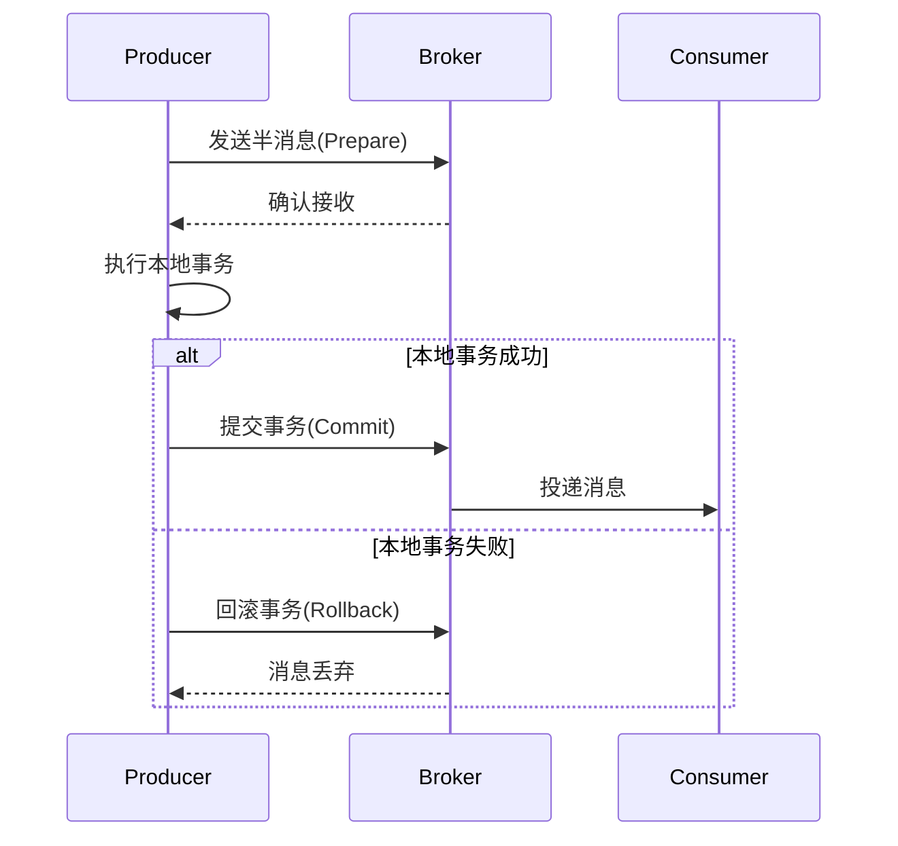

```yaml
---
title: 消息队列事务消息：分布式事务的可靠保障
date: 2023-11-15 14:30:00
permalink: /pages/message-queue-transaction/
categories: 
  - 分布式系统
  - 消息队列
tags:
  - 事务消息
  - RocketMQ
  - 分布式事务
  - 可靠性
author: 
  name: Jorgen
  link: https://github.com/jorgen-zhao
---

## 前言

在分布式系统中，我们经常遇到需要跨服务操作的场景：比如创建订单时需要同时扣减库存、支付时需要更新订单状态。~~传统的两阶段提交协议在分布式环境下简直就是性能杀手~~ 🐢。消息队列的事务消息机制提供了一种优雅的解决方案，既保证了数据一致性，又避免了分布式事务的复杂性。

::: tip
事务消息的本质是"可靠消息+本地事务"的混合模式，通过消息中间件的状态控制来协调分布式操作。
:::

## 什么是事务消息？

事务消息是消息队列提供的一种特殊消息类型，它将本地事务和消息发送绑定为一个原子操作。当本地事务执行成功时，消息才会被真正投递；如果事务失败，消息会被回滚，确保下游服务不会收到不一致的数据。

### 传统方案 vs 事务消息

| 方案 | 一致性 | 性能 | 实现复杂度 |
|------|--------|------|------------|
| 两阶段提交(2PC) | 强一致 | 低 | 高 |
| TCC | 最终一致 | 中 | 极高 |
| **事务消息** | **最终一致** | **高** | **中** |

## RocketMQ事务消息实战

### 核心流程



### 实现步骤

#### 1. 发送半消息

```java
// 发送半消息
TransactionSendResult result = producer.sendMessageInTransaction(
    new Message("ORDER_TOPIC", "order-123".getBytes()), 
    new OrderTransactionListener(), 
    "order-data"
);
```

#### 2. 实现本地事务监听器

```java
public class OrderTransactionListener implements TransactionListener {
    
    @Override
    public LocalTransactionState executeLocalTransaction(Message msg, Object arg) {
        try {
            // 1. 执行本地业务逻辑
            Order order = parseOrderData(arg);
            orderService.createOrder(order);
            
            // 2. 返回事务状态
            return LocalTransactionState.COMMIT_MESSAGE;
        } catch (Exception e) {
            return LocalTransactionState.ROLLBACK_MESSAGE;
        }
    }

    @Override
    public LocalTransactionState checkLocalTransaction(MessageExt msg) {
        // Broker回查消息状态
        String orderId = new String(msg.getBody());
        if (orderService.existsOrder(orderId)) {
            return LocalTransactionState.COMMIT_MESSAGE;
        }
        return LocalTransactionState.ROLLBACK_MESSAGE;
    }
}
```

#### 3. 消费端处理

```java
consumer.subscribe("ORDER_TOPIC", "*");
consumer.registerMessageListener((MessageListenerConcurrently) (msgs, context) -> {
    for (MessageExt msg : msgs) {
        try {
            // 处理业务逻辑
            Order order = parseOrder(msg.getBody());
            paymentService.processPayment(order);
            return ConsumeConcurrentlyStatus.CONSUME_SUCCESS;
        } catch (Exception e) {
            return ConsumeConcurrentlyStatus.RECONSUME_LATER;
        }
    }
});
```

## 关键注意事项

### 1. 回查机制
- Broker会定期回查未确定状态的消息
- 需要保证业务逻辑的幂等性
- 回查超时时间默认15分钟（可通过`transactionTimeout`配置）

### 2. 死信队列处理
```java
// 配置死信队列参数
consumer.setConsumeFromWhere(ConsumeFromWhere.CONSUME_FROM_FIRST_OFFSET);
consumer.registerMessageListener((MessageListenerOrderly) (msgs, context) -> {
    // 处理失败后发送到死信队列
    if (failCount > 3) {
        producer.send(new Message("DLQ_TOPIC", msg.getBody()));
        return ConsumeOrderlyStatus.COMMIT;
    }
    return ConsumeOrderlyStatus.SUSPEND_CURRENT_QUEUE_A_MOMENT;
});
```

### 3. 性能优化点
- 合理设置`transactionTimeout`避免长时间阻塞
- 使用批量消息减少网络IO
- 对业务关键消息开启`retryTimesWhenSendFailed`重试机制

## 适用场景分析

### ✅ 强烈推荐场景
- 订单创建与库存扣减
- 支付与订单状态变更
- 跨系统数据同步

### ❌ 不适用场景
- 对实时性要求极高的场景（如股票交易）
- 需要强一致性的金融交易
- 单体应用内的操作

## 结语

事务消息作为分布式事务的"轻量级解决方案"，在保证业务最终一致性的同时，提供了优秀的性能表现。通过RocketMQ的事务消息机制，我们能够以较低的成本实现跨服务的可靠操作。

> **经验总结**：在实施事务消息时，一定要做好幂等性设计，并合理配置回查参数。对于关键业务，建议结合本地事务表进行二次兜底。

::: right
"分布式系统的本质是管理不确定性，而事务消息是我们手中的一张确定性底牌"
:::
```