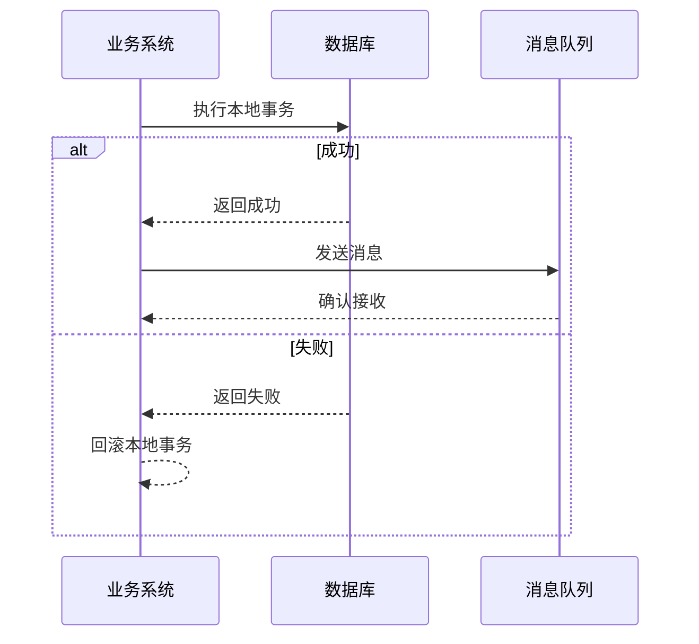

## 前言

大家好，我是Jorgen！今天想和大家聊一个在消息队列使用中非常关键但又容易被忽视的话题——事务性处理。🤔

在分布式系统开发中，我们经常需要处理跨服务的数据一致性问题。消息队列作为解耦系统、削峰填谷的重要工具，其事务性处理能力直接关系到系统的可靠性。然而，很多同学在使用消息队列时，往往只关注基本的消息发送和接收，而忽略了事务性处理这个核心问题。

::: tip
消息队列的事务性处理，本质上是在保证消息可靠投递的同时，确保业务操作与消息处理的原子性。
:::

今天，我们就来深入探讨消息队列的事务性处理，从理论基础到实践应用，全方位解析这个重要概念。

## 消息队列事务性处理的核心挑战

在深入了解解决方案之前，我们先来分析一下消息队列事务性处理面临的核心挑战：

### 业务操作与消息投递的原子性问题

在典型的业务场景中，我们经常需要执行以下操作：
1. 执行本地数据库操作
2. 发送消息到队列

这两个操作需要保证原子性——要么全部成功，要么全部失败。如果只成功了一部分，就会导致数据不一致。



### 消息重复投递问题

在分布式系统中，网络不稳定、服务重启等情况都可能导致消息重复投递。如何保证消息处理的幂等性，是一个重要挑战。

### 消息丢失问题

消息从发送到消费的整个链路中，任何一个环节都可能出现问题导致消息丢失，如网络中断、服务宕机等。

## 主流消息队列的事务性解决方案

针对上述挑战，不同的消息队列产品提供了各自的事务性解决方案。下面我们来分析几种主流方案：

### RabbitMQ的事务性处理

RabbitMQ提供了两种事务性机制：

#### 1. TX模式

RabbitMQ的TX模式通过`channel.txSelect()`、`channel.txCommit()`和`channel.txRollback()`三个方法实现事务控制。

```java
// 开启事务
channel.txSelect();

try {
    // 执行本地数据库操作
    databaseService.updateOrder(order);
    
    // 发送消息
    channel.basicPublish("", "order_queue", null, message.getBytes());
    
    // 提交事务
    channel.txCommit();
} catch (Exception e) {
    // 回滚事务
    channel.txRollback();
    // 处理异常
}
```

**优点**：
- 实现简单直观
- 保证了本地事务和消息发送的原子性

**缺点**：
- 性能开销大，每条消息都需要等待事务确认
- 不适合高吞吐量场景

#### 2. Publisher Confirm机制

为了解决TX模式的性能问题，RabbitMQ提供了Publisher Confirm机制：

```java
// 开启confirm模式
channel.confirmSelect();

// 添加confirm监听器
channel.addConfirmListener((deliveryTag, multiple) -> {
    // 消息确认成功
}, (deliveryTag, multiple) -> {
    // 消息确认失败，可以重试或记录日志
});

// 执行本地数据库操作
databaseService.updateOrder(order);

// 发送消息
channel.basicPublish("", "order_queue", null, message.getBytes());

// 等待确认
channel.waitForConfirms();
```

### Kafka的事务性处理

Kafka从0.11版本开始正式支持事务，提供了更强大的事务能力：

#### 1. 事务API使用

```java
// 配置生产者事务
properties.put("transactional.id", "my-transactional-id");

// 初始化事务
producer.initTransactions();

try {
    // 开始事务
    producer.beginTransaction();
    
    // 执行本地数据库操作
    databaseService.updateOrder(order);
    
    // 发送消息
    producer.send(new ProducerRecord<>("order_topic", "order_key", orderData));
    
    // 提交事务
    producer.commitTransaction();
} catch (Exception e) {
    // 中止事务
    producer.abortTransaction();
}
```

#### 2. 事务原理

Kafka的事务原理基于以下机制：

1. **事务协调器**：每个事务协调器负责管理一组生产者的事务状态
2. **事务日志**：记录事务的提交和回滚状态
3. **幂等生产者**：避免消息重复发送

### RocketMQ的事务性处理

RocketMQ提供了完整的事务消息机制，是业界较为成熟的事务性解决方案：

#### 1. 事务消息流程

RocketMQ的事务消息采用"两阶段提交"模式：

1. **发送半消息**：先发送一条标记为"待确认"的消息
2. **执行本地事务**：执行业务逻辑
3. **提交或回滚**：根据本地事务结果，提交或回滚消息

```java
// 发送半消息
SendResult sendResult = producer.send(new Message("order_topic", "order_key", orderData), 
    new SendCallback() {
        @Override
        public void onSuccess(SendResult sendResult) {
            // 执行本地事务
            LocalTransactionState state = executeLocalTransaction(orderData);
            // 提交事务状态
            producer.sendTransactionResult(
                new Transaction(sendResult.getMsgId(), state)
            );
        }
        
        @Override
        public void onException(Throwable e) {
            // 处理异常
        }
    });
```

#### 2. 事务回查机制

如果消息发送方在指定时间内未提交事务状态，RocketMQ会主动回查消息状态：

```java
@Override
public LocalTransactionState executeLocalTransaction(Message msg, Object arg) {
    OrderData orderData = (OrderData) arg;
    
    try {
        // 执行本地事务
        databaseService.updateOrder(orderData);
        return LocalTransactionState.COMMIT_MESSAGE;
    } catch (Exception e) {
        // 事务失败
        return LocalTransactionState.ROLLBACK_MESSAGE;
    }
}

@Override
public LocalTransactionState checkLocalTransaction(MessageExt msg) {
    // 回查本地事务状态
    String orderId = msg.getKeys();
    OrderStatus status = databaseService.getOrderStatus(orderId);
    
    if (status == OrderStatus.SUCCESS) {
        return LocalTransactionState.COMMIT_MESSAGE;
    } else if (status == OrderStatus.FAILED) {
        return LocalTransactionState.ROLLBACK_MESSAGE;
    } else {
        return LocalTransactionState.UNKNOW;
    }
}
```

## 事务性处理的最佳实践

在实际项目中，如何正确使用消息队列的事务性能力呢？以下是一些最佳实践：

### 1. 根据业务场景选择合适的方案

不同的业务场景对事务性要求不同：

- **金融、电商等关键业务**：必须保证强一致性，建议使用RocketMQ或Kafka的事务机制
- **日志、监控等非关键业务**：可以采用最终一致性，通过重试和补偿机制保证数据正确性

### 2. 处理消息重复问题

无论使用哪种消息队列，都需要考虑消息重复问题。常见的解决方案包括：

1. **业务幂等设计**：在消费端实现幂等处理
2. **唯一键约束**：在数据库层面使用唯一键约束
3. **去重表**：维护一个已处理消息的记录表

```java
// 幂等消费示例
public void consumeOrder(Message message) {
    String orderId = message.getKeys();
    
    // 检查是否已处理
    if (processedOrderRepository.existsById(orderId)) {
        return; // 已处理，直接返回
    }
    
    // 处理订单
    orderService.processOrder(orderId);
    
    // 记录已处理
    processedOrderRepository.save(new ProcessedOrder(orderId));
}
```

### 3. 合理设置事务超时时间

事务超时时间设置过短可能导致事务未完成就被回滚；设置过长则可能影响系统恢复能力。应根据业务执行时间合理设置。

### 4. 实现完善的监控和告警

对事务性消息的处理状态进行监控，及时发现并处理异常情况：

- 事务成功率监控
- 事务超时监控
- 消积消息监控
- 回查失败监控

## 结语

通过今天的分享，我们深入探讨了消息队列的事务性处理，从核心挑战到主流解决方案，再到最佳实践。~~说实话，这个主题一开始我也觉得有点复杂，但深入理解后发现它真的很重要！~~

在分布式系统开发中，消息队列的事务性处理能力直接关系到系统的可靠性和数据一致性。不同的消息队列产品提供了各自的事务性解决方案，我们需要根据业务场景选择合适的方案，并正确处理消息重复、超时等问题。

> 消息队列的事务性处理不是银弹，而是分布式系统一致性保障的重要手段。合理使用事务性能力，结合业务场景设计，才能构建出真正可靠的系统。

希望今天的分享对大家有所帮助！如果你有任何问题或建议，欢迎在评论区留言交流。我们下期再见！😊

::: right
"在分布式系统中，没有银弹，只有权衡与选择"
:::