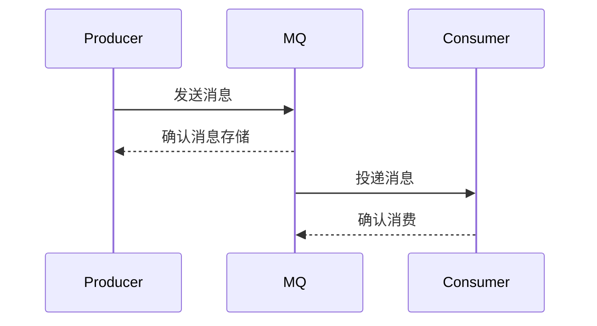
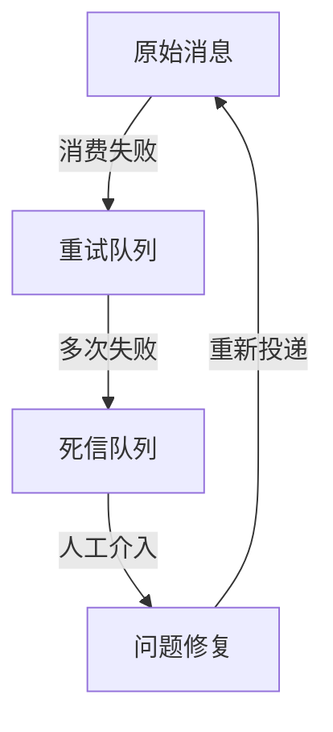

```yaml
---
title: 消息队列的可靠性保障机制
date: 2023-10-15 14:30:00
categories: 
  - 消息队列
tags:
  - 可靠性
  - 消息持久化
  - 事务消息
author: 
  name: Jorgen
  link: https://github.com/jorgen-zhao
---

## 前言

在分布式系统中，消息队列作为核心组件承担着系统解耦、流量削峰、异步通信等重要职责。然而~~消息丢了算谁的？~~，消息的可靠性往往是开发者最容易忽视却又最关键的痛点。当支付订单因消息丢失导致重复创建，当用户因通知延迟而投诉不断，我们才意识到：**没有可靠的消息传递，再优雅的架构也只是空中楼阁**。

本文将深入探讨消息队列的可靠性保障机制，帮助大家构建坚如磐石的异步通信系统。

::: tip
> "可靠性不是技术选择，而是系统设计的基本要求" —— 来自某大型电商系统踩坑实录
:::

## 1. 消息丢失的三重门

在讨论解决方案前，我们需要先了解消息可能丢失的三个关键环节：

### 1.1 生产端丢失
- **场景**：生产者发送消息时网络抖动或应用崩溃
- **后果**：消息直接从生产端消失，消费者永远无法处理
- **典型表现**：日志显示发送成功，但实际消息未到达MQ

### 1.2 存储端丢失
- **场景**：MQ服务器宕机或磁盘故障
- **后果**：未持久化的消息随服务重启而消失
- **典型表现**：消费者突然停止消费某类消息

### 1.3 消费端丢失
- **场景**：消费者处理消息后未确认就崩溃
- **后果**：消息被重复消费或彻底丢失
- **典型表现**：消费者重启后某些消息被重复处理

## 2. 可靠性保障三板斧

### 2.1 生产端可靠性：发送确认机制



**关键实现**：
1. **同步确认**：发送后阻塞等待MQ返回确认结果
2. **异步回调**：通过回调机制处理确认结果
3. **重试策略**：对于未确认的消息实现指数退避重试

**代码示例（RabbitMQ）**：
```java
// 同步确认发送
channel.basicPublish("", "queue", null, message.getBytes());
// 等待确认
channel.waitForConfirmsOrDie(5_000);
```

### 2.2 存储端可靠性：持久化策略

**核心机制**：
1. **消息持久化**：将消息写入磁盘而非内存
2. **集群镜像**：通过多副本保证数据不丢失
3. **事务日志**：预写日志(WAL)确保数据一致性

**持久化级别对比**：
| 级别 | 存储方式 | 可靠性 | 性能影响 |
|------|----------|--------|----------|
| 内存 | 内存存储 | 低 | 高 |
| 持久化 | 磁盘存储 | 高 | 中 |
| 镜像集群 | 多节点磁盘 | 极高 | 低 |

### 2.3 消费端可靠性：消费确认机制

**三种确认模式**：
1. **自动确认**：MQ默认投递即认为成功
2. **手动确认**：消费者处理完成后显式确认
3. **批量确认**：处理一批消息后统一确认

**最佳实践**：
```java
// 消费者手动确认
channel.basicConsume("queue", false, (consumerTag, delivery) -> {
    try {
        // 处理消息
        processMessage(delivery.getBody());
        // 手动确认
        channel.basicAck(delivery.getEnvelope().getDeliveryTag(), false);
    } catch (Exception e) {
        // 拒绝消息并重回队列
        channel.basicNack(delivery.getEnvelope().getDeliveryTag(), false, true);
    }
}, consumerTag -> {});
```

## 3. 高级可靠性模式

### 3.1 事务消息

::: theorem
**事务消息**：通过两阶段提交(2PC)机制，确保消息发送与业务事务的原子性
:::

**工作流程**：
1. 发送半消息（标记为待确认）
2. 执行本地业务事务
3. 根据事务结果：
   - 成功：确认消息投递
   - 失败：回滚消息

**典型实现**：RocketMQ的事务消息机制

### 3.2 死信队列(DLQ)

**作用**：处理无法正常消费的消息，避免消息丢失

**处理流程**：


**配置示例**：
```yaml
# 消费者配置
max.retries: 3
retry.queue: retry-queue
dead.letter.queue: dlq-queue
```

## 4. 可靠性设计原则

### 4.1 幂等性设计
- **核心**：同一消息多次处理结果一致
- **实现**：
  - 唯一ID去重
  - 数据库唯一约束
  - Redis分布式锁

### 4.2 顺序性保证
- **分区顺序**：单分区内的消息有序
- **全局顺序**：牺牲性能换取严格顺序

### 4.3 监控告警体系
- **关键指标**：
  - 消息积压量
  - 消息重试率
  - 死信队列增长速度
- **告警策略**：
  - 消息积压超过阈值
  - 重试率异常升高
  - 死信队列持续增长

## 5. 主流MQ可靠性对比

| 特性 | RabbitMQ | Kafka | RocketMQ |
|------|----------|-------|----------|
| 持久化机制 | 持久化日志 | 分区副本 | 本地事务 |
| 事务支持 | 事务插件 | 事务API | 原生事务 |
| 死信队列 | 支持 | 支持 | 支持 |
| 顺序性 | 单队列有序 | 分区内有序 | 全局有序 |
| 适用场景 | 企业级应用 | 大数据流处理 | 金融级交易 |

## 结语

消息队列的可靠性不是单一技术能解决的问题，而是需要从**生产、存储、消费**三个维度构建完整保障体系。在实际项目中：

1. **根据业务需求选择合适的可靠性级别**，不必过度设计
2. **建立完善的监控和告警机制**，及时发现异常
3. **定期进行故障演练**，验证可靠性方案的有效性

> "在分布式系统中，我们无法保证绝对不丢消息，但必须确保每次丢失都是可预期的、可恢复的"

希望本文能帮助大家在设计消息系统时，少走一些弯路，构建真正可靠的异步通信基础设施。记住：**可靠性不是奢侈品，而是分布式系统的刚需**。

<!-- more -->
```