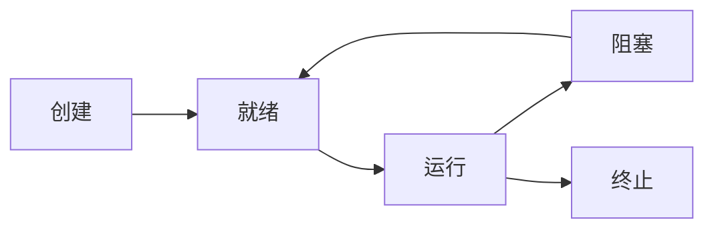

## 前言

在《计算机系统漫游》中我们了解了计算机系统的整体架构，但操作系统最核心的魔法发生在资源调度层面。想象一下，当你在浏览器听音乐的同时编辑文档，后台还有下载任务在进行，这一切看似无缝的体验背后，是操作系统对`进程`和`线程`的精密调度。今天我们就来揭开这个多任务处理的神秘面纱。

::: tip
"进程是资源分配的基本单位，线程是CPU调度的基本单位" —— 操作系统经典定义
:::

## 进程：程序的执行实体

### 进程的概念
当你双击一个应用程序，操作系统会创建一个`进程`来容纳这个程序的所有活动。每个进程都拥有独立的：
- 地址空间
- 文件描述符
- 安全凭证
- 资源配额

### 进程的状态变迁


`🏗` 进程就像一个独立的"集装箱"，装载着程序运行所需的一切资源。操作系统通过进程控制块(PCB)管理每个进程的状态信息。

## 线程：轻量级的执行单元

### 为什么需要线程？
`🤔` 如果进程已经足够，为什么还要线程？因为创建进程的成本太高！而线程：
- 共享进程地址空间
- 拥有独立的栈和寄存器
- 创建/切换开销比进程小10-100倍

### 线程 vs 进程
| 特性         | 进程                  | 线程                  |
|--------------|-----------------------|-----------------------|
| 资源分配     | 独立地址空间          | 共享进程地址空间      |
| 切换开销     | 高（涉及内存映射）    | 低（仅需切换寄存器）  |
| 通信方式     | 管道/消息队列/共享内存 | 全局变量/共享内存     |
| 健壮性       | 一个崩溃不影响其他    | 一个崩溃可能导致整个进程崩溃 |

## 进程调度算法

操作系统就像交通警察，需要智能调度进程使用CPU。常见算法有：

### 先来先服务 (FCFS)
```plaintext
进程A(5ms) -> 进程B(3ms) -> 进程C(2ms)
平均等待时间: (0+5+8)/3 = 4.33ms
```

### 最短作业优先 (SJF)
```plaintext
进程B(3ms) -> 进程C(2ms) -> 进程A(5ms)
平均等待时间: (0+3+5)/3 = 2.67ms
```

### 时间片轮转 (RR)
每个进程分配固定时间片，超时则让出CPU：
```
时间片=2ms: 
A(2) -> B(2) -> C(2) -> A(2) -> B(1) -> C(0)
```

`💡` 现代操作系统通常采用多级反馈队列调度，结合多种算法优势。

## 多线程编程的挑战

虽然线程带来性能提升，但也引入了并发问题：

### 竞争条件
```c++
int counter = 0;
void increment() {
    counter++; // 非原子操作！
}
```

### 解决方案
- 互斥锁 (Mutex)
- 信号量 (Semaphore)
- 条件变量 (Condition Variable)

> "在多线程编程中，忘记加锁就像在高速公路上逆行，不出事则已，一出就是大事。"

## 结语

进程和线程是操作系统实现多任务并发的基石。理解它们的工作原理，不仅能帮助我们写出更高效的程序，更能让我们欣赏到操作系统设计中的精妙智慧。下次当你享受多任务处理的便利时，不妨想想背后那些默默工作的调度算法和线程切换机制。

::: right
"真正的魔法不在于硬件有多快，而在于操作系统如何让硬件高效协作"
:::
```