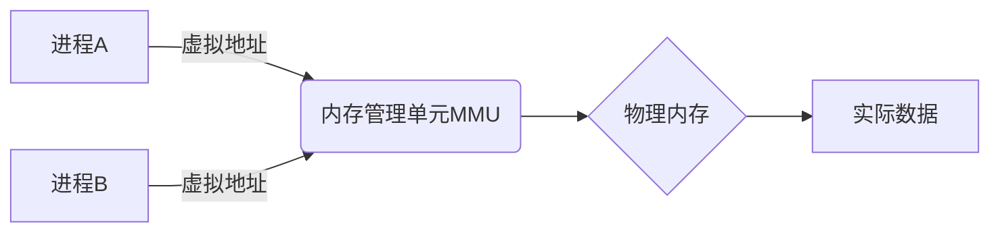

```markdown
---
title: 内存管理：操作系统的核心资源分配机制
date: 2023-10-15 20:00:00
permalink: /pages/3f8a2c/
categories: 
  - operating_system
tags:
  - 内存管理
  - 虚拟内存
  - 页面置换
author: 
  name: Jorgen
  link: https://github.com/jorgen-zhao
---

<!-- more -->

## 前言

在探索操作系统的奇妙旅程中，我们已经了解了计算机系统的整体架构（计算机系统漫游）和进程线程的核心调度机制。但~~如果进程没有内存，就像厨师没有厨房~~，操作系统还需要一个关键组件来管理计算机最珍贵的资源之一——内存。今天我们就来聊聊内存管理这个让"多道程序"得以实现的魔法。

::: tip
内存管理是操作系统最核心的功能之一，它决定了程序如何高效、安全地使用物理内存资源
:::

## 内存管理的基本概念

### 物理内存与虚拟内存

想象一下，物理内存就像计算机的"工作台"，而虚拟内存则是为每个进程准备的"私人工作室"。操作系统通过内存管理机制，将这两个空间巧妙地连接起来：



### 内存管理的三大目标

1. **抽象性**：让程序以为自己拥有连续的内存空间（实际可能是碎片化的）
2. **保护性**：防止进程越界访问其他进程的内存
3. **共享性**：允许多个进程共享代码段和数据段

## 内存分配机制

### 连续分配

最简单的分配方式，就像给每个进程分配一整块连续的"蛋糕"：

- **固定分区**：系统启动时划分好固定大小的区域
- **动态分区**：根据进程需求动态分配

但~~这种方式就像给不同体型的人穿统一码数的衣服~~，会产生严重的碎片问题！

### 非连续分配

现代操作系统采用的解决方案，允许进程在物理内存中非连续存放：

#### 分页机制

将内存划分为固定大小的块（页框），进程空间也划分为同样大小的页：

```
进程虚拟地址空间：
| 页0 | 页1 | 页2 | 页3 | ... |

物理内存：
| 页框2 | 页框5 | 页框0 | 页框7 | ...
```

#### 分段机制

按程序逻辑划分（代码段、数据段、栈段），更符合程序员思维：

```
进程地址空间：
| 代码段 | 数据段 | 堆段 | 栈段 |
```

## 虚拟内存：内存管理的终极形态

### 按需分页

现代操作系统的王牌技术，核心思想是：

> **只加载程序实际用到的页面到内存**

这就像读书时只翻开正在看的页面，而不是把整本书都摊在桌上。

### 页面置换算法

当内存不足时，操作系统需要选择哪个页面"牺牲"出去：

| 算法 | 特点 | 适用场景 |
|------|------|----------|
| FIFO | 先进先出，实现简单 | 页面访问模式随机时效果差 |
| LRU | 最近最少使用，效果好 | 实现复杂，需要硬件支持 |
| Clock | 近似LRU，平衡性能与开销 | 通用场景的最佳选择 |

::: theorem
Belady异常现象：在某些情况下，分配更多物理内存反而会导致缺页率升高！
:::

## 内存管理的其他技术

### 交换技术

将进程整个在内存和磁盘之间移动，就像"季节性搬家"：

```
内存 <-> 磁盘交换空间
```

### 覆盖技术

程序主动管理内存，将不同执行阶段的数据覆盖加载（古老技术，现代由虚拟内存替代）

## 结语

内存管理是操作系统最精妙的设计之一，它通过虚拟内存技术，让有限的物理内存资源能够支撑起无限多的程序运行。当我们写代码时使用的简单指针，背后是操作系统复杂的地址转换和页面置换机制在默默工作。

> 正如哲学家维特根斯坦所说："语言的界限就是世界的界限"，而内存管理的界限，就是计算机世界的运行边界。

未来，随着量子计算和新型存储介质的发展，内存管理还将迎来新的革命。但无论如何变化，高效、安全、公平地分配资源这一核心思想将永远不变。

::: right
—— 操作系统设计者的永恒追求
:::
```