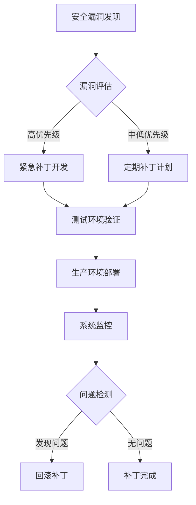

## 前言

在当今数字化时代，操作系统作为计算机系统的核心，其安全性直接关系到整个信息系统的安全。随着网络攻击手段的不断升级和漏洞利用技术的日益复杂，仅仅依赖传统的安全防护措施已经难以应对日益严峻的安全挑战。🛡️

> "安全不是一蹴而就的，而是一个持续的过程，需要不断加固、测试和改进。" —— 安全领域的永恒真理

本文将深入探讨操作系统安全加固与漏洞防护的关键技术，帮助构建更加坚不可摧的系统防线。

## 操作系统安全加固的基本原则

安全加固是指通过一系列技术手段，减少系统攻击面，提高系统抗攻击能力的过程。在进行安全加固时，我们需要遵循以下基本原则：

### 最小权限原则

::: theorem
最小权限原则要求系统中的每个用户、程序和进程只能拥有完成其任务所必需的最小权限。
:::

实施最小权限原则可以有效减少潜在攻击者可以利用的权限范围，即使系统被攻破，也能限制其造成的损害。

### 深度防御原则

::: tip
深度防御原则强调通过多层、多维度的安全措施来保护系统，而不是依赖单一的安全机制。
:::

深度防御通常包括网络层、主机层、应用层和数据层等多个层面的防护措施。

### 默认拒绝原则

::: right
"默认拒绝，明确允许" —— 现代安全设计的黄金法则
:::

默认拒绝原则要求系统默认拒绝所有未明确允许的访问请求，只有经过明确授权的访问才能通过。

## 常见的安全加固技术

### 系统组件精简

现代操作系统往往包含大量组件和功能，其中许多可能并不被用户需要。通过移除不必要的组件，可以显著减少系统的攻击面。

```bash
# 示例：移除不必要的软件包
sudo apt-get purge --auto-remove telnetd rsh-server
```

### 服务禁用与最小化

关闭不必要的服务是安全加固的基本步骤。每个运行的服务都可能是潜在的攻击入口。

```bash
# 示例：禁用不必要的服务
sudo systemctl disable bluetooth.service
sudo systemctl disable avahi-daemon.service
```

### 用户账户管理

严格管理用户账户，禁用或删除不必要的账户，设置强密码策略，实施多因素认证等。

```bash
# 示例：禁用不必要的账户
sudo usermod -L games
sudo usermod -L nobody
```

### 文件系统权限加固

设置严格的文件系统权限，确保敏感文件只能被授权用户访问。

```bash
# 示例：设置关键文件的权限
sudo chmod 600 /etc/shadow
sudo chmod 640 /etc/sudoers
```

### 内核参数优化

通过调整内核参数，增强系统的安全性和稳定性。

```bash
# 示例：设置内核安全参数
echo "net.ipv4.conf.all.send_redirects = 0" >> /etc/sysctl.conf
echo "net.ipv4.conf.default.send_redirects = 0" >> /etc/sysctl.conf
```

## 漏洞防护机制

### 漏洞扫描与评估

定期进行漏洞扫描，及时发现系统中存在的安全漏洞。

```bash
# 示例：使用Nessus进行漏洞扫描
sudo nessuscli scan new --target-ip 192.168.1.0/24
```

### 入侵检测与防御系统

部署入侵检测系统(IDS)和入侵防御系统(IPS)，实时监控和阻止可疑活动。

```bash
# 示例：配置Snort规则
alert tcp any any -> any 80 (msg:"Possible SQL Injection attempt"; content:"union"; nocase; sid:1000001; rev:1;)
```

### 应用白名单机制

实施应用程序白名单，只允许经过授权的应用程序运行。

```bash
# 示例：使用AppArmor配置文件
sudo aa-enforce /etc/apparmor.d/usr.bin.firefox
```

### 沙箱技术

使用沙箱技术隔离不可信的应用程序，限制其对系统资源的访问。

```bash
# 示例：使用Firejail运行应用程序
firejail --private --net=none firefox
```

## 系统补丁管理策略

### 定期更新机制

建立定期的系统更新机制，及时安装安全补丁。

```bash
# 示例：自动更新系统
sudo apt-get update && sudo apt-get upgrade -y
```

### 补丁测试流程

在生产环境部署补丁前，应在测试环境中进行充分测试，确保补丁不会引入新的问题。

### 回滚计划

为每个重要补丁制定回滚计划，以便在补丁引入问题时能够快速恢复系统。

### 补丁管理工具

使用专业的补丁管理工具，如WSUS、Patch Manager等，简化补丁管理流程。



## 实际案例分析

### Equifax数据泄露事件

2017年，Equifax遭遇严重的数据泄露事件，影响了约1.43亿用户。调查发现，攻击者利用了Apache Struts框架中的一个已知漏洞（CVE-2017-5638）。

**教训**：
- 及时应用安全补丁至关重要
- 需要建立全面的漏洞管理流程
- 网络分段可以限制横向移动

### SolarWinds供应链攻击

2020年，SolarWinds公司遭受供应链攻击，攻击者通过在其Orion软件中植入恶意代码，影响了多个政府和大型企业。

**教训**：
- 供应链安全同样重要
- 需要加强对第三方软件的安全审查
- 需要实施更严格的访问控制和监控

## 未来发展趋势

### 人工智能在安全加固中的应用

人工智能和机器学习技术正在被越来越多地应用于安全加固，用于异常检测、威胁预测和自动化响应。

### 零信任架构的普及

零信任架构正在成为安全加固的新范式，它假设网络内部和外部都存在威胁，需要持续验证每个访问请求。

### 硬件级安全增强

随着TPM（可信平台模块）、SGX（软件保护扩展）等硬件安全技术的发展，操作系统安全加固将更加依赖硬件级的安全特性。

## 结语

操作系统安全加固与漏洞防护是一个持续的过程，需要综合运用多种技术和策略。通过遵循最小权限原则、深度防御原则和默认拒绝原则，结合系统组件精简、服务禁用与最小化、用户账户管理、文件系统权限加固和内核参数优化等技术，可以显著提高系统的安全性。

同时，通过漏洞扫描、入侵检测、应用白名单和沙箱技术等机制，可以有效防范已知和未知的安全威胁。建立完善的补丁管理策略，确保系统及时更新，也是安全加固的重要环节。

> "安全不是一次性的项目，而是持续的过程。只有不断加固、测试和改进，才能在日益复杂的威胁环境中保护系统的安全。"

---

希望本文能够帮助您更好地理解和实施操作系统安全加固与漏洞防护。如果您有任何问题或建议，欢迎在评论区留言讨论！🤝