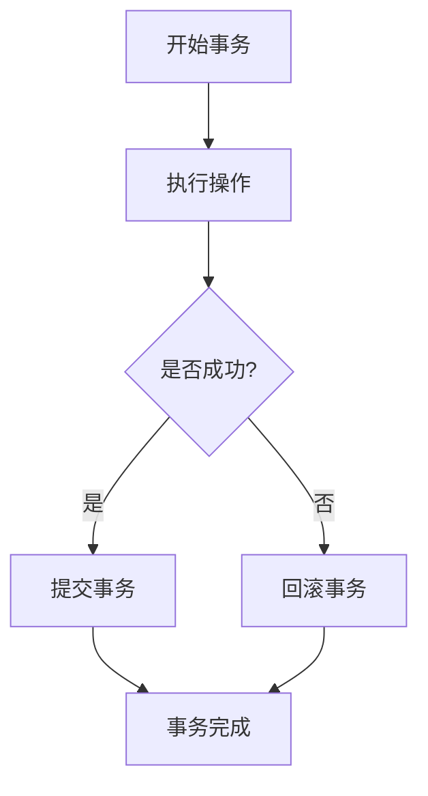

## 前言

在我多年的操作系统学习和实践中，我逐渐认识到一个事实：**可靠性**是衡量一个操作系统质量的关键指标之一。🤔 我们常常关注操作系统的性能、功能丰富度或安全性，但往往忽视了系统在面对各种故障时如何保持服务连续性的能力。想象一下，当你的银行系统突然崩溃，或者医院的医疗设备操作系统失效时，后果将不堪设想。这就是为什么操作系统的可靠性与容错机制如此重要。

::: tip
可靠性不是偶然实现的，而是通过精心设计的容错机制和架构来确保的。
:::

在本文中，我将深入探讨操作系统中实现可靠性的各种技术和机制，带你了解操作系统如何从多个层面构建坚不可摧的防线。

## 可靠性的基本概念

在深入技术细节之前，我们需要先明确几个基本概念：

- **可靠性（Reliability）**：系统在规定条件下和规定时间内无故障运行的概率。
- **可用性（Availability）**：系统在任意时刻能够正常工作的概率。
- **容错性（Fault Tolerance）**：系统在出现某些故障时仍能继续提供正确服务的能力。

::: theorem
可靠性、可用性和容错性共同构成了系统高可用性的三大支柱，它们相互关联但又各有侧重。
:::

## 操作系统中的故障类型

为了设计有效的容错机制，我们首先需要了解操作系统可能面临的故障类型：

### 1. 硬件故障

硬件故障是最常见的故障类型，包括：

- CPU故障
- 内存故障（位翻转、芯片损坏等）
- 存储设备故障（硬盘坏道、SSD磨损等）
- 网络设备故障
- 电源故障

### 2. 软件故障

软件故障通常源于：

- 操作系统内核缺陷
- 驱动程序错误
- 应用程序bug
- 配置错误
- 资源耗尽（内存、CPU、文件描述符等）

### 3. 人为故障

人为因素导致的故障：

- 操作失误
- 恶意攻击
- 不当的系统配置

## 操作系统容错机制

### 1. 冗余设计

冗余是提高可靠性的基本策略，操作系统中的冗余设计包括：

- **硬件冗余**：如RAID磁盘阵列、双电源供应、冗余网络接口等。
- **软件冗余**：如热备节点、集群系统中的主备切换。

::: tip
冗余设计不是简单的复制，而是需要精心设计的协同工作机制，确保在主组件失效时，冗余组件能够无缝接管。
:::

### 2. 检测与恢复机制

#### 故障检测

操作系统通过以下机制检测故障：

- **心跳检测**：定期检查关键组件是否正常响应
- **超时机制**：对关键操作设置超时阈值
- **校验和**：对内存和存储数据进行校验
- **看门狗定时器**：监控系统运行状态

#### 故障恢复

检测到故障后，操作系统可以采取多种恢复策略：

- **进程重启**：对失效的应用程序或服务进行重启
- **组件替换**：用冗余组件替换失效组件
- **系统回滚**：恢复到已知的稳定状态
- **数据恢复**：从备份中恢复损坏的数据

### 3. 事务机制

事务是确保数据一致性的重要机制，操作系统中的事务机制包括：

- **文件系统事务**：确保文件操作的原子性
- **日志结构**：记录系统操作以便恢复
- **检查点（Checkpoint）**：定期保存系统状态，以便从故障点恢复

### 4. 资源隔离与保护

资源隔离是防止故障扩散的关键技术：

- **进程隔离**：通过虚拟内存和权限控制限制进程间相互影响
- **容器隔离**：使用命名空间和控制组限制资源使用
- **微内核设计**：将核心功能最小化，减少故障影响范围

## 高可用操作系统架构

### 1. 集群架构

集群系统通过多台服务器协同工作提供高可用服务：

- **主从复制**：主节点处理请求，从节点保持同步，主节点故障时从节点接管
- **多主复制**：多个节点同时处理请求，通过共识协议保证一致性
- **无状态设计**：将状态存储在外部共享存储中，节点可以随时替换

### 2. 容错文件系统

容错文件系统通过多种技术确保数据可靠性：

- **日志结构文件系统**：先写入日志再应用到文件系统，确保操作可恢复
- **写时复制（Copy-on-Write）**：修改数据时创建副本，原数据保持不变
- **快照技术**：定期保存文件系统状态，便于恢复到历史状态

### 3. 实时操作系统特性

对于需要高可靠性的实时系统，操作系统需要提供：

- **确定性调度**：保证关键任务在确定时间内完成
- **优先级继承**：防止低优先级任务阻塞高优先级任务
- **资源预留**：为关键任务预留足够的资源

## 实际案例与最佳实践

### 1. Linux的可靠性机制

Linux操作系统通过多种机制提供可靠性：

- **内核模块动态加载**：可以单独更新有问题的模块，无需重启整个系统
- **内核oops处理**：捕获内核错误并尝试恢复
- **cgroups和namespaces**：提供资源隔离和限制
- **systemd的自动重启**：对关键服务提供自动重启机制

### 2. Windows的可靠性机制

Windows操作系统采用：

- **Windows错误报告（WER）**：收集系统崩溃信息并尝试自动修复
- **驱动程序签名**：确保驱动程序的完整性和安全性
- **系统还原点**：允许系统回滚到之前的状态
- **故障转移集群**：提供高可用服务

### 3. 最佳实践总结

基于上述分析，我们可以总结出提高操作系统可靠性的最佳实践：

1. **设计冗余**：在关键组件上实现冗余
2. **监控与检测**：建立完善的监控系统，及时发现故障
3. **自动化恢复**：尽可能实现故障的自动检测和恢复
4. **定期测试**：定期进行故障恢复演练
5. **渐进式更新**：采用蓝绿部署或金丝雀发布等策略，减少更新风险

## 结语

操作系统的可靠性与容错机制是一个复杂而迷人的领域。🏗️ 它融合了计算机科学、系统工程和概率论等多个学科的知识。随着云计算、边缘计算等技术的发展，对系统可靠性的要求越来越高。

> 可靠性不是一蹴而就的，它需要在系统设计的每一个环节都加以考虑，从硬件选择到软件架构，从开发流程到运维监控。

作为系统设计师和开发者，我们应该将可靠性视为一等公民，在设计和实现系统的每一个环节都思考：如果这里出现故障，系统会如何应对？只有经过这样反复的思考和验证，我们才能构建真正可靠、可用的系统。

在未来的文章中，我将继续深入探讨操作系统的其他重要主题，带大家一起探索这个充满挑战和机遇的领域。💪🏻