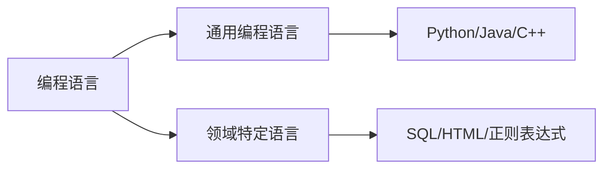

## 前言

作为一名热爱编程语言探索的开发者，我常常思考：为什么有些代码看起来如此优雅自然，而另一些却显得笨拙冗长？答案可能隐藏在一种特殊的语言设计哲学中——**领域特定语言(Domain-Specific Languages, DSL)**。🤔 在我浏览编程语言相关文章时，发现这个重要概念竟然没有被深入探讨！今天我们就来揭开DSL的神秘面纱，看看它如何成为解决特定问题的"魔法棒"。

::: tip
DSL不是一种新的编程语言类型，而是一种设计思想：为特定领域问题创建专用语言，让表达更自然、更高效。
:::

## 什么是领域特定语言？

简单来说，DSL是为解决特定领域问题而设计的语言，它专注于该领域的表达能力和效率。与通用编程语言(GPL)不同，DSL不追求"大而全"，而是追求"小而精"。



### DSL的两种形态

1. **外部DSL(External DSL)**
   - 独立于宿主语言的语法
   - 需要专门的解析器
   - 例子：SQL、正则表达式、Makefile

2. **内部DSL(Internal DSL)**
   - 嵌入在宿主语言中
   - 利用宿主语言的语法特性
   - 例子：Flask路由定义、Rspec测试框架

## 为什么DSL如此重要？

### 1. 提高表达力

想象一下用SQL查询数据库与用Java代码写查询的对比：

```sql
-- SQL (DSL)
SELECT name, email 
FROM users 
WHERE age > 30 AND status = 'active'
```

```java
// Java (GPL)
List<User> result = new ArrayList<>();
for (User user : users) {
    if (user.getAge() > 30 && user.getStatus().equals("active")) {
        result.add(new User(user.getName(), user.getEmail()));
    }
}
```

### 2. 降低认知负担

DSL让领域专家(非程序员)也能直接参与系统构建：

```yaml
# Kubernetes YAML (DSL)
apiVersion: apps/v1
kind: Deployment
metadata:
  name: nginx-deployment
spec:
  replicas: 3
  selector:
    matchLabels:
      app: nginx
  template:
    metadata:
      labels:
        app: nginx
    spec:
      containers:
      - name: nginx
        image: nginx:1.14.2
        ports:
        - containerPort: 80
```

### 3. 提高开发效率

DSL通常有更简洁的语法和更少的样板代码：

```javascript
// JavaScript测试框架(内部DSL)
describe('User Authentication', () => {
  it('should allow valid login', () => {
    expect(login('user', 'pass')).toBe(true);
  });
});
```

## 设计DSL的艺术与科学

### 设计原则

1. **领域聚焦**：只解决特定领域问题
2. **表达优先**：让代码自然表达领域概念
3. **渐进式复杂**：从简单开始逐步扩展
4. **可扩展性**：允许领域演化

### 实现技术栈

| 技术类型 | 适用场景 | 例子 |
|---------|---------|------|
| 解析器生成器 | 复杂语法 | ANTLR, Yacc |
| 模板引擎 | 简单模板 | Jinja2, Handlebars |
| 宏系统 | 内部DSL | Rust宏, LISP宏 |
| 函数组合 | 流式DSL | JavaScript函数链 |

## 实战案例：构建一个简单的任务DSL

让我们设计一个任务管理DSL：

```ebnf
// 任务DSL语法
task = "TASK" name "DOES" action "EVERY" interval "UNTIL" condition
name = [a-zA-Z]+
action = [a-zA-Z ]+
interval = number "DAYS" | "WEEKLY" | "MONTHLY"
condition = [a-zA-Z ]+
```

实现示例：

```python
# Python解析器实现
class TaskDSL:
    def __init__(self, text):
        self.text = text
    
    def parse(self):
        tokens = self.text.split()
        if tokens[0] != "TASK":
            raise ValueError("Invalid task definition")
        
        name = tokens[1]
        action = " ".join(tokens[3:tokens.index("EVERY")])
        interval = tokens[tokens.index("EVERY")+1]
        condition = " ".join(tokens[tokens.index("UNTIL")+1:])
        
        return {
            "name": name,
            "action": action,
            "interval": interval,
            "condition": condition
        }

# 使用DSL
task_text = "TASK backup DOES backup database EVERY WEEKLY UNTIL space available"
task = TaskDSL(task_text).parse()
print(task)
```

## DSL的挑战与陷阱

### 1. 学习曲线

::: theorem
DSL需要用户学习新语法，过度复杂的DSL会提高使用门槛
:::

### 2. 工具链支持

缺乏IDE支持、调试工具和成熟的库生态

### 3. 维护成本

DSL需要专门的维护团队，且与领域变化保持同步

### 4. 性能考虑

DSL解析可能带来额外开销，需要权衡表达力与性能

## 未来展望

随着AI和低代码平台的兴起，DSL正在迎来新的发展机遇：

1. **AI辅助DSL设计**：利用大语言模型自动生成DSL
2. **可视化DSL**：通过图形界面构建DSL
3. **云原生DSL**：为云服务设计的专用DSL
4. **量子计算DSL**：为量子算法设计的专用语言

> DSL不是取代通用编程语言，而是作为其重要补充，让不同领域的表达更加自然高效。正如著名计算机科学家Martin Fowler所说："每个优秀的应用程序都应该包含一个嵌入式DSL"。

## 结语

通过今天的探索，我们揭开了DSL的神秘面纱。它不仅是编程语言设计的高级技巧，更是连接问题域与解决方案的桥梁。~~下次当你发现某个领域代码总是写得磕磕绊绊时，不妨考虑设计一个专属DSL来解放创造力！~~ 🚀

记住，好的DSL就像一把量身定制的钥匙，能精准打开特定领域的大门。希望这篇文章能激发你在自己的项目中尝试DSL设计的灵感！