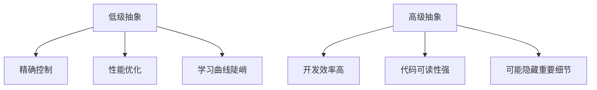

## 前言

作为一名热爱编程语言设计的开发者，我经常思考：为什么有些编程语言让我们感觉如鱼得水，而另一些则让我们举步维艰？🤔 答案往往隐藏在这些语言精心设计的抽象层次和巧妙应用的设计模式中。

今天，我想和大家一起探索编程语言设计中两个核心概念：抽象层次与设计模式。它们就像是编程语言世界的"建筑蓝图"和"装饰风格"，共同塑造了我们的编程体验。

::: tip
抽象层次是编程语言设计的核心，它决定了我们思考问题的方式和表达能力的上限。而设计模式则是解决常见问题的优雅方案，它们让语言既强大又易用。
:::

## 抽象层次的魅力

### 什么是抽象层次？

抽象层次是指编程语言提供的不同级别的抽象，从低级的机器指令到高级的领域特定概念。每一层抽象都隐藏了底层细节，让我们能够专注于更高层次的问题。

想象一下，如果我们必须用机器码编写一个网页应用，那将是多么恐怖的事情！🤣 幸好，我们有高级语言提供的多层抽象：

1. **硬件层**：直接操作CPU指令和内存地址
2. **系统调用层**：通过操作系统接口访问硬件
3. **标准库层**：提供常用功能的预实现代码
4. **语言特性层**：语言内置的高级构造和控制流
5. **领域特定层**：针对特定领域的定制抽象

### 抽象层次的设计原则

在设计编程语言的抽象层次时，我总结了几个关键原则：

| 原则 | 描述 | 示例 |
|------|------|------|
| **渐进式披露** | 只在需要时暴露复杂性 | Python的列表推导式简化了循环操作 |
| **最小惊讶** | 遵循直觉，减少意外 | JavaScript的"=="与"==="设计差异 |
| **组合优于继承** | 通过组合构建复杂功能 | Go的接口组合设计 |
| **表达力与简洁性平衡** | 既要有表达力又不能过于复杂 | Rust的借用检查器 |

### 抽象层次的权衡

每种抽象层次都有其优缺点：



::: theorem
抽象层次的设计是编程语言艺术的核心。一个好的抽象层次应该让开发者能够自然地表达问题，而不必过多关注底层实现细节。
:::

## 设计模式在语言设计中的应用

### 为什么语言设计需要模式？

设计模式最初是面向对象设计中的最佳实践，但在编程语言设计中同样适用。它们提供了经过验证的解决方案，帮助我们构建既灵活又可维护的语言特性。

### 常见的语言设计模式

#### 1. 工厂模式

工厂模式用于创建对象，而无需指定具体的类。在语言设计中，这可以表现为构造函数或创建特定类型实例的语法。

```javascript
// JavaScript中的工厂函数
function createPerson(name, age) {
    return {
        name: name,
        age: age,
        introduce() {
            return `Hello, I'm ${this.name} and I'm ${this.age} years old.`;
        }
    };
}

const person = createPerson("Alice", 30);
```

#### 2. 策略模式

策略模式允许在运行时选择算法。在语言设计中，这可以表现为高阶函数或函数式编程特性。

```python
# Python中的策略模式
def calculate_total(prices, tax_strategy):
    total = sum(prices)
    return tax_strategy(total)

def no_tax(amount):
    return amount

def vat_tax(amount):
    return amount * 1.2

prices = [100, 200, 300]
print(calculate_total(prices, no_tax))  # 600
print(calculate_total(prices, vat_tax))  # 720
```

#### 3. 观察者模式

观察者模式定义了对象之间一对多的依赖关系，当一个对象状态改变时，所有依赖它的对象都会得到通知。这在事件驱动的语言设计中非常常见。

```javascript
// JavaScript中的观察者模式
class Subject {
    constructor() {
        this.observers = [];
    }
    
    addObserver(observer) {
        this.observers.push(observer);
    }
    
    notify(data) {
        this.observers.forEach(observer => observer.update(data));
    }
}

class Observer {
    update(data) {
        console.log(`Received update: ${data}`);
    }
}

const subject = new Subject();
const observer = new Observer();
subject.addObserver(observer);
subject.notify("Hello, observers!");
```

#### 4. 适配器模式

适配器模式允许不兼容的接口能够一起工作。在语言设计中，这可以表现为类型转换或包装器。

```python
# Python中的适配器模式
class OldSystem:
    def legacy_method(self):
        return "Legacy system response"

class NewInterface:
    def modern_method(self):
        return "Modern system response"

class Adapter:
    def __init__(self, old_system):
        self.old_system = old_system
    
    def modern_method(self):
        return self.old_system.legacy_method()

# 使用适配器
old_system = OldSystem()
adapter = Adapter(old_system)
print(adapter.modern_method())  # 输出: Legacy system response
```

### 设计模式的高级应用

现代编程语言中，设计模式已经融入了语言本身：

1. **Rust的模式匹配**：将策略模式内置于语言语法中
2. **Go的接口**：实现了组合优于继承的设计原则
3. **Python的装饰器**：提供了一种优雅的横切关注点实现方式
4. **JavaScript的Promise/async-await**：简化了异步编程的观察者模式

::: tip
最好的设计模式是那些已经融入语言特性中的模式。当模式成为语言的一部分时，开发者无需显式地实现它们，代码变得更加简洁和直观。
:::

## 构建多层次的抽象体系

### 设计层次化的抽象

一个强大的编程语言通常提供多个层次的抽象，让开发者可以根据需求选择合适的抽象级别。

以Python为例：

1. **最低层**：C扩展，直接操作内存
2. **标准库层**：如`datetime`模块
3. **语言特性层**：如列表推导式、生成器
4. **高级抽象层**：如Pandas库的数据处理抽象
5. **领域特定层**：如Django的Web框架抽象


### 抽象层次的过渡与互操作

多层次的抽象体系需要良好的过渡机制：

```python
# 从低级到高级的抽象过渡
# 1. 原始数据操作
data = [1, 2, 3, 4, 5]

# 2. 使用内置函数
squared = list(map(lambda x: x**2, data))

# 3. 使用列表推导式（更高级的抽象）
squared = [x**2 for x in data]

# 4. 使用函数式抽象
from functools import reduce
product = reduce(lambda x, y: x * y, data)

# 5. 使用领域特定抽象
import numpy as np
data_array = np.array(data)
stats = {
    'mean': np.mean(data_array),
    'std': np.std(data_array)
}
```

### 抽象层次的性能考量

在设计多层次抽象时，性能是一个重要考量：

- **抽象开销**：每层抽象都可能带来性能损失
- **优化机会**：高级抽象有时能提供更好的优化空间
- **控制权移交**：允许开发者适时切换到低级抽象

```rust
// Rust中的性能控制
// 高级抽象：迭代器
let numbers = vec![1, 2, 3, 4, 5];
let doubled: Vec<i32> = numbers.iter().map(|x| x * 2).collect();

// 低级抽象：原始循环（性能关键代码）
let mut doubled = Vec::with_capacity(numbers.len());
for i in 0..numbers.len() {
    doubled.push(numbers[i] * 2);
}
```

## 实战案例：设计一个具有多层次的微型语言

让我们通过设计一个简单的领域特定语言(DSL)来实践这些概念。

### 语言设计目标

设计一个用于数据处理的微型DSL，支持从低级到高级的多种抽象层次。

### 实现步骤

#### 1. 定义核心抽象层次

```javascript
// 最低层：原始数据操作
const data = [1, 2, 3, 4, 5];

// 中级层：基本操作
const doubled = data.map(x => x * 2);

// 高级层：组合操作
const result = data
    .filter(x => x > 2)
    .map(x => x * 2)
    .reduce((acc, x) => acc + x, 0);
```

#### 2. 实现DSL语法

```javascript
// 创建DSL解析器
class DataProcessorDSL {
    constructor(data) {
        this.data = data;
        this.operations = [];
    }
    
    filter(predicate) {
        this.operations.push({ type: 'filter', predicate });
        return this;
    }
    
    map(transform) {
        this.operations.push({ type: 'map', transform });
        return this;
    }
    
    reduce(reducer, initial) {
        this.operations.push({ type: 'reduce', reducer, initial });
        return this;
    }
    
    execute() {
        let result = this.data;
        
        for (const op of this.operations) {
            switch (op.type) {
                case 'filter':
                    result = result.filter(op.predicate);
                    break;
                case 'map':
                    result = result.map(op.transform);
                    break;
                case 'reduce':
                    result = result.reduce(op.reducer, op.initial);
                    break;
            }
        }
        
        return result;
    }
}

// 使用DSL
const processor = new DataProcessorDSL([1, 2, 3, 4, 5]);
const result = processor
    .filter(x => x > 2)
    .map(x => x * 2)
    .reduce((acc, x) => acc + x, 0);
    
console.log(result);  // 输出: 18 (3*2 + 4*2 = 6 + 8 + 4)
```

#### 3. 添加更高级的抽象

```javascript
// 扩展DSL，添加更高级的抽象
DataProcessorDSL.prototype.sum = function() {
    return this.reduce((acc, x) => acc + x, 0);
};

DataProcessorDSL.prototype.average = function() {
    const sum = this.sum();
    return sum / this.data.length;
};

// 使用高级抽象
const processor = new DataProcessorDSL([1, 2, 3, 4, 5]);
const sum = processor.filter(x => x > 2).sum();
const avg = processor.average();

console.log(`Sum: ${sum}, Average: ${avg}`);
```

### 设计模式在DSL中的应用

在这个DSL设计中，我们应用了多种设计模式：

1. **建造者模式**：通过链式调用构建复杂操作
2. **模板方法模式**：定义了操作执行的基本流程
3. **策略模式**：不同的操作（filter、map、reduce）是不同的策略
4. **装饰器模式**：通过方法扩展添加新功能

## 结语

编程语言的抽象层次与设计模式是语言设计的艺术与科学的结合。通过精心设计的抽象层次，我们可以让语言既强大又易用；通过巧妙应用设计模式，我们可以构建既灵活又可维护的语言特性。

作为开发者，理解这些概念不仅能帮助我们更好地使用现有语言，还能启发我们设计出更优秀的语言或DSL。记住，最好的语言设计往往是那些让开发者感觉"自然"的设计，就像呼吸一样不知不觉地使用着语言的强大功能。

> 正如编程大师Alan Perlis所言："一种编程语言不会改变你思考问题的方式，但它会给你提供表达新思想的新工具。"

希望这篇文章能帮助你更好地理解编程语言设计中的抽象层次与设计模式。如果你有任何想法或问题，欢迎在评论区分享！🚀

::: right
"编程不仅是科学，也是艺术。"
- Jorgen
:::