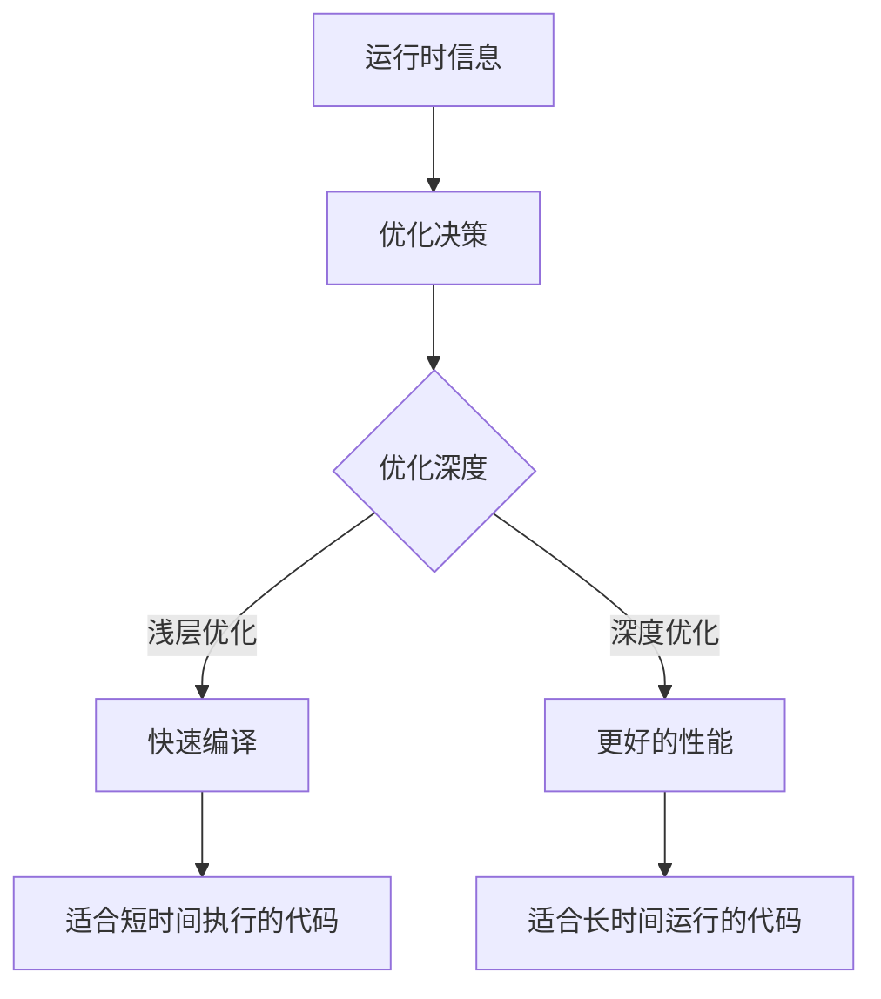

## 前言

作为一个对编程语言底层实现充满好奇的开发者，我一直被一个问题困扰：为什么有些语言能在运行时达到接近C/C++的性能，而另一些则相差甚远？答案之一就是即时编译(Just-In-Time, JIT)技术。🤔

JIT编译器就像一位聪明的魔法师，在程序运行时施展优化魔法，让代码执行得更快。今天，我想和大家一起探索这个令人着迷的技术，了解它是如何工作的，以及为什么现代编程语言越来越依赖它。

## JIT编译的基本概念

::: tip
**即时编译(JIT)** 是一种动态编译技术，它在程序运行时将字节码或解释执行的代码编译为本地机器码，以提高执行效率。
:::

与传统编译器(如C/C++编译器)将源代码一次性编译成机器码不同，JIT编译器在程序运行时进行编译。这种"边运行边编译"的方式让JIT能够获取运行时信息，从而做出更优化的决策。

### JIT与传统编译的区别

| 特性 | 传统编译(AOT) | 即时编译(JIT) |
|------|--------------|--------------|
| 编译时间 | 编译时 | 运行时 |
| 优化依据 | 静态分析 | 运行时行为 |
| 启动速度 | 慢(需要编译) | 快(直接解释) |
| 运行速度 | 快(高度优化) | 逐渐优化 |
| 内存占用 | 低 | 高(需存储中间表示) |

## JIT编译的工作原理

JIT编译器的工作流程可以分为以下几个关键步骤：

### 1. 字节码解释执行

大多数JIT系统首先以解释模式执行代码，这样可以快速启动程序，同时收集运行时信息。

```java
// 示例: Java字节码解释执行
aload_0    // 加载局部变量0(通常是this)
getfield #5 // 获取对象的字段
invokevirtual #10 // 调用虚方法
```

### 2. 热点代码检测

JIT编译器会监控代码执行频率，识别出"热点"代码(频繁执行的代码段)。常见的热点检测技术包括:

- **方法调用计数器**：统计方法被调用的次数
- **循环计数器**：统计循环执行的次数
- **分支频率分析**：记录条件分支的执行路径

### 3. 优化编译

识别出热点代码后，JIT编译器会对其进行优化编译。常见的优化技术包括:

- **内联(Inline)**：将小函数直接展开到调用处
- **逃逸分析**：分析对象是否只在当前方法中使用
- **类型特化**：根据运行时类型生成专门优化的代码
- **死代码消除**：移除永远不会执行的代码

### 4. 代码缓存

优化后的机器码会被缓存，下次执行相同代码时可以直接使用，无需重新编译。

## JIT优化技术详解

### 1. 类型特化

在动态类型语言中，JIT编译器可以基于运行时类型信息生成专门优化的代码。

```javascript
// JavaScript中的类型特化示例
function add(a, b) {
  // JIT可能为不同类型组合生成专门版本
  if (typeof a === 'number' && typeof b === 'number') {
    // 数值加法特化版本
    return a + b;
  } else {
    // 通用版本
    return String(a) + String(b);
  }
}
```

### 2. 内联优化

内联可以减少方法调用的开销，并暴露更多优化机会。

```java
// 内联前
public int calculate() {
  return getValue() * 2;
}

// 内联后
public int calculate() {
  return (this.value * 2); // 直接内联getValue()的结果
}
```

### 3. 循环优化

JIT编译器可以识别循环模式并进行特殊优化:

- **循环展开**：减少循环控制开销
- **范围检查消除**：移除数组访问的边界检查
- **强度削弱**：将复杂计算替换为简单操作

### 4. 分支预测优化

现代CPU使用分支预测来提高执行效率。JIT编译器可以通过重排代码和插入分支提示来帮助CPU更好地预测。

## 主流JIT实现

### 1. HotSpot JVM

Java HotSpot虚拟机使用两级JIT编译系统:

- **C1编译器**：快速编译，基本优化
- **C2编译器**：深度优化，耗时较长

HotSpot还实现了**分层编译**策略，根据代码执行热度决定使用哪个编译器。

### 2. V8 JavaScript引擎

Google V8引擎的JIT系统包括:

- **Ignition**：解释器
- **TurboFan**：优化编译器
- **SparkPlug**：介于解释和编译之间的快速编译器

V8还实现了**隐藏类(Hidden Classes)**技术，优化JavaScript对象的属性访问。

### 3. .NET CLR

.NET运行时使用**RyuJIT**编译器，支持:

- **方法级JIT**：按需编译方法
- **NGen**：预编译技术(类似AOT)
- **Profile-Guided Optimization(PGO)**：基于使用模式的优化

### 4. PyPy

Python的PyPy实现使用**RPython**编写自己的JIT编译器，实现了:

- **对象模型优化**
- **特殊化策略**
- **内存管理优化**

## JIT的挑战与局限性

尽管JIT技术强大，但它也面临一些挑战:

### 1. 启动时间与内存占用

JIT编译需要额外的时间和内存资源，可能导致:

- **冷启动延迟**：程序开始运行时较慢
- **内存消耗**：需要存储编译后的代码和优化信息

### 2. 优化决策的复杂性

JIT编译器需要在编译时间和优化效果之间找到平衡:



### 3. 优化失效风险

某些优化可能基于不完整的运行时信息，导致:

- **性能倒退**：某些情况下优化后性能反而下降
- **代码膨胀**：过度优化导致代码体积增大

## JIT的未来发展趋势

随着硬件和软件技术的发展，JIT编译也在不断演进:

### 1. 硬件感知的JIT

现代CPU提供了丰富的硬件特性，JIT编译器可以:

- 利用**SIMD指令**进行并行计算
- 利用**缓存层次结构**优化数据访问
- 利用**分支预测器**优化控制流

### 2. 机器学习辅助的JIT

机器学习技术可以帮助JIT编译器做出更好的优化决策:

- **预测代码执行模式**
- **选择最优优化策略**
- **动态调整优化级别**

### 3. 跨语言的JIT技术

JIT技术正在突破语言边界，实现更广泛的优化:

- **WebAssembly JIT**：为Web应用提供接近原生的性能
- **容器化JIT**：在容器环境中优化资源使用
- **分布式JIT**：在多节点环境中协同优化

## 结语

JIT编译技术是现代编程语言性能提升的关键，它巧妙地结合了解释执行的灵活性和编译执行的高效性。🚀

作为一名开发者，理解JIT技术不仅能帮助我们写出更高效的代码，还能让我们更深入地理解编程语言的工作原理。下次当你惊叹于某些语言惊人的性能时，不妨想想背后可能就有一位默默工作的JIT魔法师在施展优化魔法！

> "优秀的程序员不是写出最快的代码，而是写出能被JIT优化器理解的代码。" —— 编程箴言

---

你对JIT技术有什么看法或者经验分享吗？欢迎在评论区留言讨论！😊