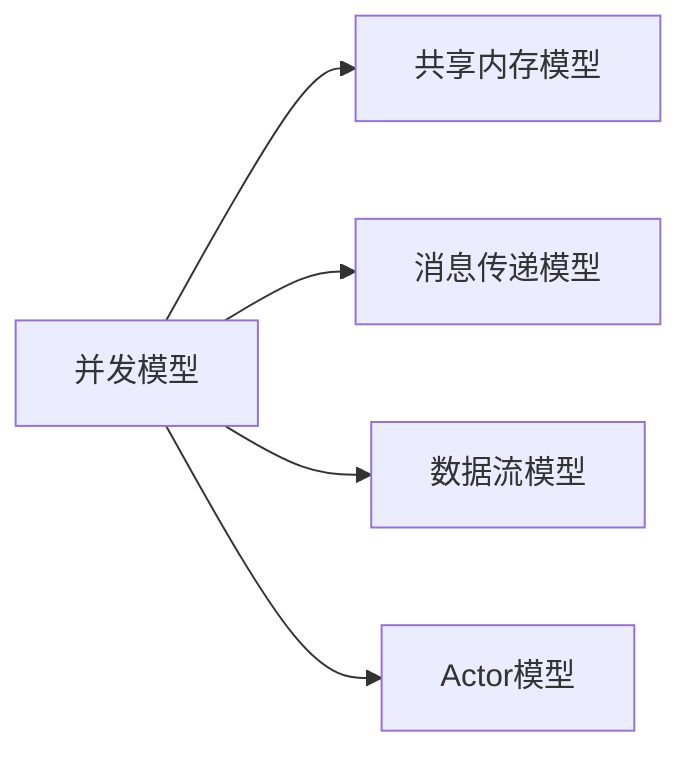

## 前言

在摩尔定律逐渐失效的今天，程序员不得不面对一个残酷的现实：单核性能提升已接近物理极限。而现代CPU的发展方向转向了多核并行，这使得**并发编程**从高级特性变成了必备技能。🏗️

> "并发不是关于性能，而是关于结构。好的并发程序结构自然能带来性能提升。" —— Rob Pike

本文将深入探讨编程语言中各种并发模型的设计哲学与实现机制，帮助开发者理解如何构建高效、可靠的并行系统。

---

## 并发模型的基本概念

### 什么是并发？

**并发**（Concurrency）是指程序处理多个任务的能力，这些任务可能在重叠的时间段内执行，但不一定同时进行。与**并行**（Parallelism）不同，并行强调的是同时执行多个任务。



### 为什么需要并发模型？

1. **充分利用多核CPU**：现代CPU拥有多个核心，并发模型能将任务分配到不同核心执行
2. **提高系统响应性**：避免因I/O操作阻塞整个程序
3. **简化复杂问题**：将大问题分解为可独立处理的子任务

---

## 主流并发模型解析

### 1. 共享内存模型

共享内存是最传统的并发模型，多个线程通过读写共享内存区域进行通信。

#### 特点
- 优点：通信简单直接，性能开销小
- 缺点：需要同步机制（锁、原子操作）防止竞态条件

#### 语言实现
- **Java**：`synchronized`关键字、`volatile`变量、`java.util.concurrent`包
- **C++**：`std::mutex`、`std::atomic`
- **Go**：`sync.Mutex`、`sync/atomic`包

```go
// Go中的共享内存示例
var counter int64
var wg sync.WaitGroup

func increment() {
    defer wg.Done()
    atomic.AddInt64(&counter, 1)
}
```

### 2. 消息传递模型

消息传递模型中，并发单元通过显式消息传递而非共享内存进行通信。

#### 特点
- 优点：天然避免竞态条件，系统更健壮
- 缺点：通信开销较大，编程模型更抽象

#### 语言实现
- **Erlang/Elixir**：Actor模型，轻量级进程和消息邮箱
- **Go**：`channel`机制
- **Rust**：`std::sync::mpsc`（多生产者单消费者通道）

```go
// Go中的channel示例
func worker(id int, jobs <-chan int, results chan<- int) {
    for j := range jobs {
        fmt.Printf("worker %d processing job %d\n", id, j)
        results <- j * 2
    }
}
```

### 3. Actor模型

Actor模型是消息传递的一种高级形式，每个Actor是独立的计算实体，通过异步消息通信。

#### 特点
- 优点：高度可扩展，容错性好
- 缺点：编程模型复杂，调试困难

#### 语言实现
- **Erlang/Elixir**：OTP框架
- **Akka**（Scala/Java）
- **Orleans**（C#）

### 4. 协程模型

协程是一种轻量级线程，由用户态调度而非操作系统内核调度。

#### 特点
- 优点：极低的创建和切换开销，高并发性能
- 缺点：需要语言运行时支持

#### 语言实现
- **Go**：`goroutine`（初始栈KB级，可动态扩展）
- **Kotlin**：协程
- **Python**：`asyncio`库

```python
# Python协程示例
import asyncio

async def fetch_data(url):
    print(f"Fetching {url}")
    await asyncio.sleep(1)  # 模拟I/O操作
    return f"Data from {url}"

async def main():
    tasks = [fetch_data(f"url_{i}") for i in range(10)]
    results = await asyncio.gather(*tasks)
    print(results)
```

---

## 并发模型的选择与权衡

| 模型类型 | 适用场景 | 优势 | 劣势 |
|---------|---------|------|------|
| 共享内存 | CPU密集型任务 | 性能高 | 竞态条件风险大 |
| 消息传递 | 分布式系统 | 天然分布式 | 通信开销大 |
| Actor模型 | 高容错系统 | 故障隔离 | 编程复杂 |
| 协程 | I/O密集型任务 | 轻量级 | 需要语言支持 |

💡 **选择建议**：
- 对于**单机多核**场景：Go的goroutine+channel组合通常是最佳选择
- 对于**分布式系统**：Actor模型提供更好的容错性
- 对于**遗留系统改造**：共享内存模型更易集成

---

## 并发编程的挑战与最佳实践

### 主要挑战

1. **竞态条件**：多个线程同时访问共享资源
2. **死锁**：线程互相等待对方释放资源
3. **活锁**：线程不断改变状态但无法前进
4. **饥饿**：某些线程长时间得不到执行机会

### 最佳实践

1. **最小化共享状态**：尽量减少共享数据的范围
2. **使用不可变数据**：避免修改共享状态
3. **避免嵌套锁**：降低死锁风险
4. **使用高级并发原语**：如Go的`select`、Java的`CompletableFuture`

```go
// 避免竞态条件的Go示例
type SafeCounter struct {
    mu    sync.Mutex
    count int
}

func (c *SafeCounter) Increment() {
    c.mu.Lock()
    defer c.mu.Unlock()
    c.count++
}
```

---

## 未来趋势

随着硬件发展，并发模型也在不断演进：

1. **SIMT（单指令多线程）**：GPU编程模型影响CPU设计
2. **无锁数据结构**：减少锁竞争，提高并发性能
3. **分布式计算**：云原生环境下的并发模型
4. **量子计算**：全新的并行计算范式

🤔 "未来的编程语言需要将并发作为一等公民，而不是事后添加的补丁。"

---

## 结语

并发编程是现代软件开发的核心能力，选择合适的并发模型能显著提升系统性能和可靠性。理解不同模型的设计哲学和适用场景，是构建高效并发系统的关键。

> "并发不是银弹，而是必须掌握的工具。掌握它，你就能构建真正现代化的软件系统。" —— Jorgen

---

### 推荐阅读

1. 《Go语言并发编程实战》
2. 《Erlang/OTP并发编程》
3. 《多核程序设计》（C++并发编程经典）
4. 《数据密集型应用系统设计》

希望本文能帮助你更好地理解和应用并发编程技术！🚀