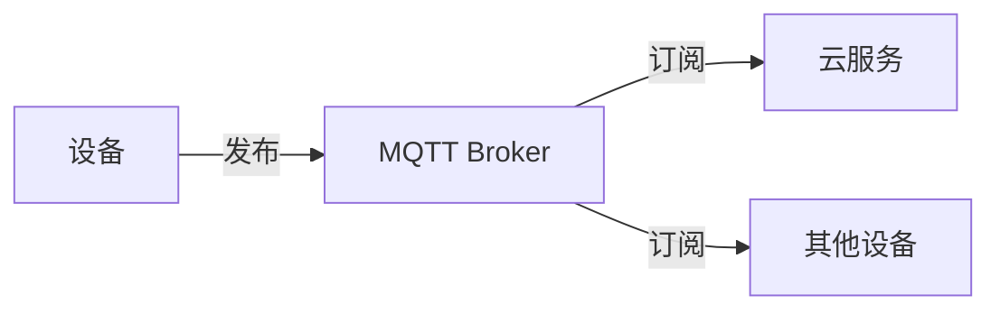
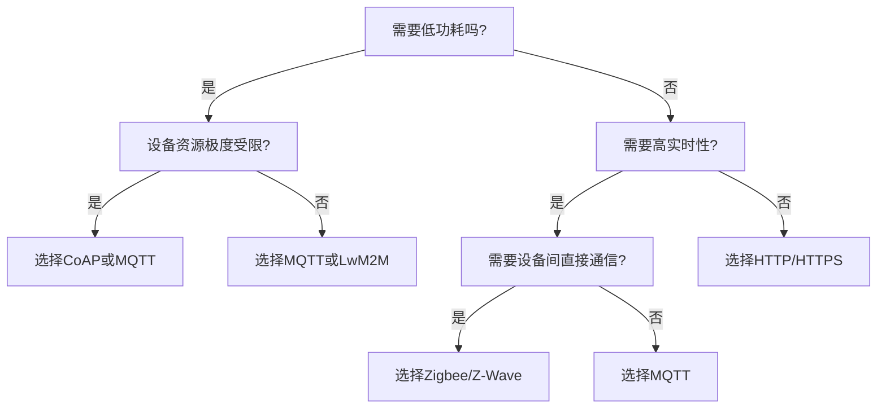

## 前言

最近我正在深入研究物联网(IoT)领域的通信协议，说实话，这个领域的选择真的让人眼花缭乱！🤯 从家里的智能灯泡到工业级的传感器网络，不同的物联网场景需要不同的通信协议。虽然我之前写过关于WebSocket、SSE等实时通信协议的文章，但专门针对物联网场景的通信协议选择指南确实缺失了。

今天，我想和大家一起探索物联网世界中的通信协议，帮助大家在面对各种IoT项目时，能够做出明智的协议选择决策。

## 物联网通信协议概述

物联网通信协议主要分为三大类：

1. **设备到云(Device-to-Cloud)协议**：用于将设备数据上传到云端服务
2. **设备到设备(Device-to-Device)协议**：用于设备间的直接通信
3. **本地网络协议**：用于设备在本地网络中的通信

每种协议都有其适用场景和优缺点，选择合适的协议对项目的成功至关重要。

## 主流物联网通信协议对比

### MQTT (Message Queuing Telemetry Transport)

MQTT是物联网领域最常用的协议之一，专为低带宽、高延迟或不稳定的网络环境设计。

**优点**：
- 轻量级协议，头部仅2字节
- 支持发布/订阅模式
- 低带宽消耗
- 支持QoS级别(0,1,2)
- 广泛的设备和平台支持

**缺点**：
- 需要中间代理(Broker)
- 不适合高频率小数据包场景
- 安全性相对较弱

**适用场景**：
- 传感器网络
- 智能家居
- 远程监控
- 资源受限的设备

### CoAP (Constrained Application Protocol)

CoAP是专为资源受限设备设计的Web协议，基于REST架构。

**优点**：
- 基于HTTP语义，易于理解
- 支持多播
- 内置发现机制
- 低资源消耗
- DTLS支持加密

**缺点**：
- 不适合高数据量传输
- 实现相对复杂
- 生态系统不如MQTT成熟

**适用场景**：
- 传感器网络
- 智能城市
- 环境监测
- 资源极度受限的设备

### HTTP/HTTPS

传统的Web协议，在物联网中也有广泛应用。

**优点**：
- 无需中间代理
- 广泛的设备和平台支持
- 生态系统成熟
- 安全性高

**缺点**：
- 协议开销大
- 不适合低带宽环境
- 不适合频繁通信
- 无状态特性不适合持续连接

**适用场景**：
- 智能家居控制
- Web界面控制设备
- 定期数据上传
- 需要高安全性的场景

### LwM2M (Lightweight M2M)

专为物联网设备管理设计的协议，由OMA标准组织制定。

**优点**：
- 设备管理功能丰富
- 支持固件升级
- 资源模型标准化
- 安全性高
- 支持多路径传输

**缺点**：
- 实现复杂
- 学习曲线陡峭
- 生态系统相对较小

**适用场景**：
- 大规模设备管理
- 需要远程配置和固件升级
- 工业物联网
- 运营商网络

### Zigbee/Z-Wave

专为低功耗无线个人区域网设计的协议栈。

**优点**：
- 低功耗
- 自组网能力
- 网状网络拓扑
- 专有协议，干扰小

**缺点**：
- 需要专用硬件
- 传输距离有限
- 生态系统相对封闭

**适用场景**：
- 智能家居
- 工业自动化
- 医疗设备
- 智能建筑

## 协议选择决策树

选择物联网通信协议时，可以按照以下决策流程进行：

## 不同物联网场景的协议推荐

### 智能家居场景

智能家居设备通常需要：
- 低功耗
- 易于安装
- 成本低廉
- 一定的安全性

**推荐协议**：
- **入门级**：Zigbee或Z-Wave
- **高级**：MQTT + Home Assistant
- **云集成**：HTTP/HTTPS + 云平台API

::: tip
智能家居建议采用混合协议策略：本地使用Zigbee/Z-Wave，云通信使用MQTT，控制接口使用HTTP/HTTPS。
:::

### 工业物联网(IIoT)场景

工业物联网需要：
- 高可靠性
- 实时性
- 安全性
- 大规模设备管理

**推荐协议**：
- **设备管理**：LwM2M
- **数据传输**：MQTT + QoS 1/2
- **实时控制**：CoAP或专有工业协议
- **云集成**：HTTPS

### 智能城市场景

智能城市需要：
- 大规模部署
- 低功耗
- 多种设备类型
- 长期运行

**推荐协议**：
- **传感器网络**：LoRaWAN + MQTT
- **智能路灯**：Zigbee或NB-IoT
- **交通控制**：5G + 专用协议
- **数据中心**：HTTP/REST API

### 可穿戴设备场景

可穿戴设备需要：
- 极低功耗
- 与手机通信
- 实时数据传输
- 小型化

**推荐协议**：
- **设备间通信**：BLE
- **与手机通信**：MQTT或CoAP
- **云同步**：HTTP/HTTPS

## 协议实施最佳实践

### 安全性考虑

物联网安全至关重要，以下是安全建议：

1. **使用TLS/DTLS加密**：所有敏感数据传输都应加密
2. **设备认证**：实施证书或令牌认证机制
3. **最小权限原则**：设备只应有必要的访问权限
4. **定期更新**：保持协议和固件更新

### 性能优化

1. **数据压缩**：减少传输数据量
2. **批量传输**：合并小数据包
3. **智能重试**：实现指数退避重试机制
4. **本地缓存**：在设备端缓存数据，减少网络请求

### 资源管理

1. **连接管理**：实现连接池和心跳机制
2. **内存优化**：限制缓冲区大小，避免内存泄漏
3. **电池管理**：优化通信频率，延长电池寿命

## 未来发展趋势

物联网通信协议正在快速发展，以下是几个重要趋势：

1. **5G与物联网融合**：5G网络将提供更好的物联网支持
2. **边缘计算**：更多处理将在边缘设备上完成
3. **AIoT(人工智能+物联网)**：智能决策将更多地在设备端进行
4. **IPv6的普及**：为海量物联网设备提供足够地址空间

## 结语

物联网通信协议的选择没有"一刀切"的解决方案，需要根据具体场景、设备特性和业务需求来决定。通过理解不同协议的特性和适用场景，我们可以为物联网项目选择最合适的通信方案。

作为物联网开发者，我们应该持续关注协议的发展趋势，并保持对新技术的学习态度。毕竟，在这个快速变化的领域，今天的最佳实践可能明天就会被新技术所取代。🚀

> 记住，最好的协议是适合你具体需求的协议，而不是最流行的协议。在物联网的世界里，"合适"永远比"流行"更重要。

---

希望这篇文章能帮助你在物联网项目中做出明智的协议选择。如果你有任何问题或想分享你的经验，欢迎在评论区留言！😊