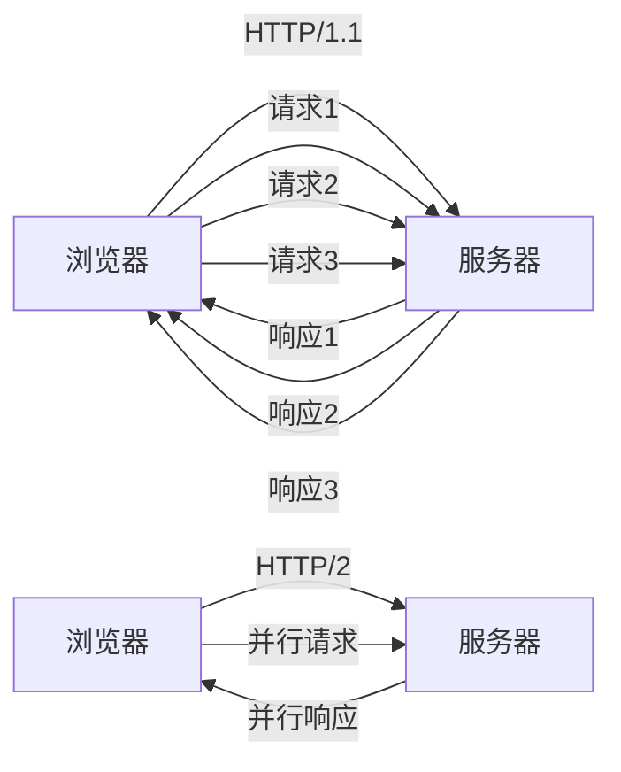

## 前言

在之前的文章中，我已经介绍了 WebSocket 和 MQTT 这两种重要的网络通信协议。WebSocket 为我们提供了实时双向通信的能力，而 MQTT 则在物联网领域大放异彩。然而，当我们浏览网页、加载资源时，还有一位默默无闻的英雄在背后工作——那就是 HTTP/2。

::: tip
HTTP/2 不是 HTTP/1.1 的简单升级，而是一次彻底的重构，旨在解决 Web 性能瓶颈，为现代互联网应用提供更高效、更快速的数据传输方式。
:::

作为一名前端开发者，我每天都在与 HTTP 打交道，但直到深入了解 HTTP/2 后，我才真正理解了现代 Web 是如何实现如此流畅的用户体验的。今天，我想和大家分享 HTTP/2 的核心特性和它如何改变了我们的 Web 开发方式。

## HTTP/2 的前世今生

在 HTTP/2 出现之前，HTTP/1.1 已经统治了互联网二十多年。HTTP/1.1 虽然简单可靠，但随着 Web 应用的复杂化，它逐渐暴露出一些性能瓶颈：

- **队头阻塞**：在同一个 TCP 连接中，前一个请求未完成，后续请求必须等待
- **多个 TCP 连接**：浏览器为每个域名建立多个连接（通常为6个），增加了服务器负担
- **头部冗余**：HTTP 头部在每次请求中重复发送，浪费带宽
- **不支持服务器推送**：服务器无法主动向客户端推送资源

这些问题在移动互联网时代变得更加突出，因为移动网络通常具有更高的延迟和更不稳定的连接。为了解决这些问题，Google 在 2012 年推出了 SPDY 协议，作为 HTTP 的替代方案，并最终将其贡献给 IETF，形成了 HTTP/2 标准。

HTTP/2 于 2015 年正式发布，至今已成为现代 Web 的基础。根据 W3Techs 的数据，截至 2023 年，超过 60% 的网站已经支持 HTTP/2。

## HTTP/2 的核心特性

HTTP/2 引入了许多革命性的特性，彻底改变了 Web 通信的方式。让我们逐一探讨这些特性：

### 1. 二进制分帧层 📡

HTTP/2 最大的变化之一是引入了二进制分帧层。与 HTTP/1.1 的纯文本不同，HTTP/2 将所有传输的信息分割为更小的消息和帧，并对它们采用二进制格式编码。

- **帧**：HTTP/2 中通信的最小单位，每个帧包含帧头，至少标识出该帧所属的流
- **消息**：逻辑上的 HTTP 消息，例如一个请求或一个响应，由一个或多个帧组成
- **流**：一个已建立的 TCP 连接内的双向字节流，可以承载一条或多条双向消息

::: theorem
二进制分帧层使得 HTTP/2 能够在一个 TCP 连接上并行处理多个请求和响应，彻底解决了 HTTP/1.1 的队头阻塞问题。
::`

### 2. 多路复用 🚀

多路复用是 HTTP/2 最核心的特性之一。它允许在单个 TCP 连接上同时并行处理多个请求和响应，而无需按照请求顺序一一响应。



这意味着，即使某个请求的处理时间较长，也不会阻塞其他请求的处理。这对于现代 Web 应用至关重要，因为一个典型的网页可能需要加载数十个资源（CSS、JavaScript、图片等）。

### 3. 头部压缩 🗜️

HTTP/2 使用 HPACK 算法对 HTTP 头部进行压缩，大大减少了头部的大小和传输开销。

- 在 HTTP/1.1 中，每个请求和响应都会重复发送相同的头部信息
- HPACK 通过维护一个共享的字典，只发送头部字段的差异部分
- 支持动态更新字典，适应不断变化的头部字段

对于移动用户来说，这尤其重要，因为它可以显著减少数据传输量，降低流量费用，提高页面加载速度。

### 4. 服务器推送 🚀

服务器推送是 HTTP/2 的另一个革命性特性，允许服务器在客户端请求之前主动向客户端推送资源。

例如，当浏览器请求 HTML 文件时，服务器可以预测浏览器接下来可能需要的 CSS 和 JavaScript 文件，并主动将这些文件推送到浏览器缓存中，而无需浏览器再次请求。

::: tip
服务器推送可以减少一个完整的请求-响应周期，从而显著提高页面加载速度。但需要注意，不恰当的推送可能会浪费带宽，因此需要谨慎使用。
:::

### 5. 流量控制 ⚖️

HTTP/2 提供了基于流的流量控制机制，允许接收方动态调整接收窗口大小，防止发送方发送过多数据导致接收方不堪重负。

这对于处理不同能力的客户端（如移动设备）特别有用，可以根据客户端的实际接收能力调整数据传输速率。

## HTTP/2 的实际应用

了解了 HTTP/2 的特性后，我们来看看如何在实际项目中充分利用这些特性：

### 1. 启用 HTTP/2

大多数现代 Web 服务器（如 Nginx、Apache、Node.js）都支持 HTTP/2。启用 HTTP/2 通常只需要简单的配置：

**Nginx 配置示例**:
```nginx
listen 443 ssl http2;
ssl_certificate /path/to/cert.pem;
ssl_certificate_key /path/to/key.pem;
```

**Node.js (http2 模块)**:
```javascript
const http2 = require('http2');
const fs = require('fs');

const server = http2.createSecureServer({
  key: fs.readFileSync('server-key.pem'),
  cert: fs.readFileSync('server-cert.pem')
});

server.on('stream', (stream, headers) => {
  // 处理请求
});
```

### 2. 优化资源加载

HTTP/2 的多路复用特性改变了我们对资源加载的优化策略：

- **减少域名数量**：在 HTTP/1.1 中，我们通常建议将静态资源分散到不同域名以突破浏览器连接限制。但在 HTTP/2 下，将资源放在同一域名下更高效，因为可以充分利用多路复用
- **合并文件不再是必须**：虽然合并文件仍然可以减少请求数，但在 HTTP/2 下，这种优化的重要性大大降低
- **使用服务器推送**：对于关键资源，可以考虑使用服务器推送技术，提前将资源推送到客户端

### 3. 利用 ALPN 协商

ALPN (Application-Layer Protocol Negotiation) 是 TLS 的扩展，允许客户端和服务器在握手阶段协商使用哪个应用层协议（如 HTTP/1.1 或 HTTP/2）。确保你的服务器配置支持 ALPN，以便与客户端协商使用最高效的协议。

## HTTP/2 的局限性

尽管 HTTP/2 带来了许多改进，但它并不是万能的：

1. **TCP 队头阻塞**：虽然 HTTP/2 解决了 HTTP 层的队头阻塞，但如果底层 TCP 连丢包，整个连接仍然会阻塞
2. **部署复杂性**：要充分利用 HTTP/2，需要 HTTPS，这增加了部署的复杂性
3. **浏览器兼容性**：虽然现代浏览器都支持 HTTP/2，但某些旧版浏览器可能不支持

为了解决这些问题，QUIC 协议（基于 UDP）应运而生，它进一步解决了 TCP 队头阻塞问题，并提供了更快的连接建立速度。QUIC 已经成为 HTTP/3 的基础协议。

## 结语

HTTP/2 的出现是 Web 发展史上的一个重要里程碑，它通过二进制分帧、多路复用、头部压缩等创新特性，极大地提高了 Web 通信的效率和性能。

作为一名 Web 开发者，了解 HTTP/2 的工作原理和最佳实践，不仅有助于我们构建更快速、更高效的应用，也能让我们更好地理解现代 Web 的底层架构。

随着 HTTP/3 的兴起，Web 通信技术仍在不断发展。但无论技术如何演进，理解 HTTP/2 的核心思想将始终是我们构建高性能 Web 应用的基础。

> "协议是互联网的基石，理解它们就是理解了互联网的工作方式。"

---

*如果你对 HTTP/2 或其他网络协议有任何疑问或见解，欢迎在评论区留言交流！*
