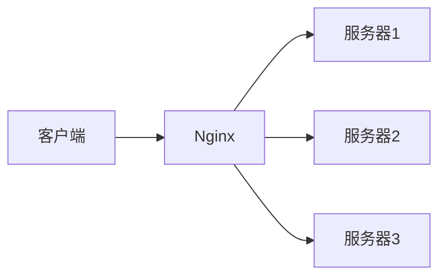
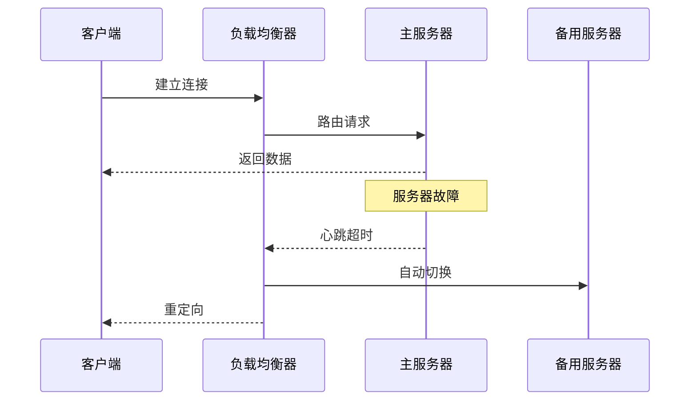

## 前言

在构建实时通信系统时，我们往往更关注协议本身的选择（WebSocket、SSE、gRPC等）和性能优化，却常常忽略了一个关键问题：**当用户量从百人扩展到万人时，如何确保系统依然稳定可靠？** 🤔

::: tip
"真正的系统健壮性不在于单点性能有多强，而在于当流量洪峰来临时，系统能否像弹性橡胶一样吸收冲击并保持服务连续性。"
:::

本文将深入探讨通信协议的负载均衡与高可用设计，帮助你的实时通信系统从"能用"迈向"好用"。

## 为什么负载均衡对实时通信如此重要？

实时通信系统具有两大特性：**长连接**和**低延迟**，这给负载均衡带来了特殊挑战：

1. **会话粘性问题**  
   WebSocket/gRPC等长连接一旦建立，后续数据必须路由到同一后端服务器，否则会导致连接断开。

2. **状态同步复杂性**  
   分布式节点间的状态同步（如在线状态、消息队列）需要额外机制保障一致性。

3. **流量突发性**  
   在线会议、游戏等场景下，流量可能在几秒内激增10倍以上。

> 📊 数据：未实施负载均衡的系统在用户量超过500时，连接断开率可达30%以上

## 不同协议的负载均衡策略

### WebSocket 负载均衡



**关键点：**
- 使用IP哈希算法确保同一客户端始终连接到同一服务器
- 配置`proxy_http_version 1.1`和`proxy_set_header Upgrade $http_upgrade`
- 心跳检测机制实现健康检查

```nginx
# Nginx配置示例
upstream websocket_backend {
    ip_hash;  # 会话粘性
    server 10.0.0.1:8080;
    server 10.0.0.2:8080;
    server 10.0.0.3:8080;
}

server {
    location /ws {
        proxy_pass http://websocket_backend;
        proxy_http_version 1.1;
        proxy_set_header Upgrade $http_upgrade;
        proxy_set_header Connection "Upgrade";
        proxy_read_timeout 86400s;
    }
}
```

### gRPC 负载均衡

gRPC原生支持多种负载均衡策略：

1. **轮询（Round Robin）**  
   适用于无状态服务，如数据查询API

2. **最少请求（Least Request）**  
   动态选择当前负载最轻的节点

3. **区域感知（Pick First）**  
   优先选择同区域节点，降低延迟

```go
// gRPC客户端负载均衡配置
conn, err := grpc.Dial(
    "dns://my-service.example.com",
    grpc.WithDefaultServiceConfig(`{
        "loadBalancingConfig": [{
            "round_robin": {}
        }]
    }`),
)
```

## 高可用设计核心要素

### 1. 冗余架构设计

::: theorem
N+1冗余原则：系统容量应满足日常需求的N倍，并至少有1个冗余节点
:::

**实践方案：**
- 应用层：至少部署3个节点（2个运行+1个备用）
- 数据层：主从复制+自动故障转移
- 网络层：多线路BGP接入

### 2. 会话保持机制

| 策略 | 适用场景 | 优点 | 缺点 |
|------|----------|------|------|
| IP哈希 | 静态IP客户端 | 实现简单 | 动态IP失效 |
| Cookie粘性 | Web应用 | 兼容性好 | 依赖客户端 |
| 会话复制 | 关键业务 | 无单点故障 | 网络开销大 |

### 3. 故障转移策略



## 实战案例：高可用WebSocket系统

### 架构设计

```
                        [客户端]
                            |
                    [负载均衡层]
                    |   |   |
            [Nginx] [HAProxy] [F5]
                    |   |   |
        [应用服务器集群] [Redis集群]
        |   |   |   |   |   |
    [WebSocket节点] [状态同步] [消息队列]
```

### 关键实现

1. **健康检查机制**
```python
# Python健康检查示例
def health_check():
    while True:
        for node in nodes:
            try:
                requests.get(f"http://{node}/health", timeout=1)
                node.status = "healthy"
            except:
                node.status = "unhealthy"
                trigger_failover(node)
        time.sleep(5)
```

2. **状态同步方案**
```bash
# Redis Pub/Sub实现状态同步
redis-cli PUBLISH node_status "node1:offline"
redis-cli SUBSCRIBE node_status
```

## 性能优化技巧

1. **连接复用**  
   使用长连接池减少握手开销，典型场景下可减少40%延迟

2. **流量整形**  
   实现令牌桶算法控制突发流量
   ```go
   // Go实现令牌桶
   type TokenBucket struct {
       capacity int
       tokens   int
       rate     time.Duration
       mutex    sync.Mutex
   }
   ```

3. **智能路由**  
   基于用户地理位置选择最优节点
   ```nginx
   map $geoip_city_code $backend {
       default backend_default;
       "BJ" backend_beijing;
       "SH" backend_shanghai;
   }
   ```

## 个人建议

1. **渐进式演进**  
   从简单的轮询负载开始，随着业务增长逐步升级到复杂策略

2. **监控先行**  
   在实施负载均衡前，必须建立完善的监控体系：
   - 连接数监控
   - 延迟分布
   - 错误率追踪
   - 节点健康度

3. **混沌工程实践**  
   定期进行故障演练，测试系统在节点故障时的表现

## 结语

实时通信系统的负载均衡与高可用设计不是简单的技术叠加，而是需要**系统性思维**和**持续优化**的过程。记住：

> "优秀的架构师不是在解决问题，而是在预防问题发生。"

通过合理的负载均衡策略和冗余设计，你的系统将能够从容应对从百人到百万用户的增长曲线，真正实现"一次构建，长期稳定"的目标。

::: right
"可扩展性不是设计出来的，而是通过无数次的故障测试打磨出来的。"
:::