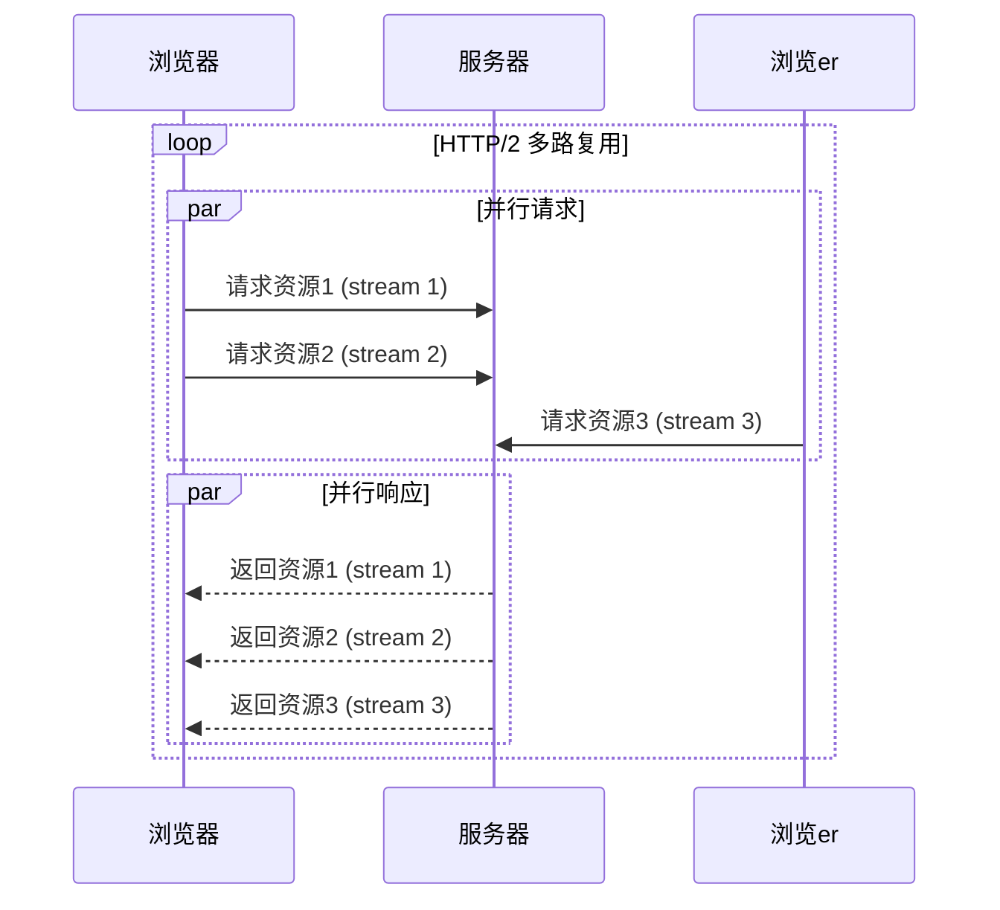

## 前言

在之前的文章中，我已经介绍了 WebSocket 和 MQTT 这两种重要的实时通信协议。WebSocket 为我们提供了全双工的实时通信能力，而 MQTT 则以其轻量级特性在物联网领域大放异彩。🚀

但是，当我们谈论现代 Web 应用时，还有一个非常重要的协议家族常常被忽略——那就是 HTTP/2 和 HTTP/3。它们不仅仅是 HTTP 协议的简单版本更新，更是对整个 Web 架构的重新思考。今天，我想和大家一起深入探讨这两个协议，看看它们如何改变我们的 Web 开发方式。

::: tip
HTTP/2 和 HTTP/3 的出现，解决了 HTTP/1.1 中存在的许多性能瓶颈，为现代 Web 应用提供了更快、更高效的通信基础。
:::

## HTTP/2：多路复用的革命

HTTP/2 是 HTTP 协议的重大更新，于 2015 年正式发布。它引入了许多革命性的特性，彻底改变了浏览器和服务器之间的通信方式。

### 多路复用（Multiplexing）

🏗 **HTTP/1.1 的限制**

在 HTTP/1.1 中，浏览器对同一域名下的并发连接数有限制（通常为 6 个）。这意味着如果页面需要加载 20 个资源，浏览器需要排队发送请求，导致页面加载速度变慢。

```mermaid
sequenceDiagram
    participant 浏览器
    participant 服务器
    loop HTTP/1.1 请求-响应
        浏览器->>服务器: 请求资源1
        服务器-->>浏览器: 返回资源1
        浏览器->>服务器: 请求资源2
        服务器-->>浏览器: 返回资源2
        ...
    end
```

🚀 **HTTP/2 的解决方案**

HTTP/2 引入了二进制分帧层，允许在单个 TCP 连接上并行处理多个请求和响应，彻底解决了队头阻塞问题。



### 头部压缩

HTTP/2 使用 HPACK 算法对请求头进行压缩，大大减少了数据传输量。在 HTTP/1.1 中，每个请求都可能包含大量重复的头部信息，而在 HTTP/2 中，这些信息只需发送一次。

### 服务器推送

服务器推送允许服务器在客户端请求之前主动发送资源。例如，当客户端请求 HTML 时，服务器可以主动推送 CSS 和 JS 文件，减少客户端等待时间。

::: theorem
HTTP/2 的核心优势在于它解决了 HTTP/1.1 中的队头阻塞问题，通过多路复用实现了真正的并行请求处理。
:::

## HTTP/3：QUIC 的崛起

虽然 HTTP/2 解决了许多 HTTP/1.1 的问题，但它仍然依赖于 TCP 协议，而 TCP 本身也存在一些性能瓶颈，特别是在移动网络环境下。为了解决这些问题，HTTP/3 应运而生。

### 从 TCP 到 QUIC

HTTP/3 最大的变化是放弃了 TCP，转而使用基于 UDP 的 QUIC（Quick UDP Internet Connections）协议。QUIC 结合了 TCP 的可靠性和 UDP 的低延迟特性。

🤔 **为什么需要 QUIC？**

1. **连接建立更快**：QUIC 使用 0-RTT（零往返时间）握手，可以立即发送数据，大大减少了连接建立时间
2. **更好的移动性**：当网络切换时，QUIC 连接可以无缝迁移，而 TCP 需要重新建立连接
3. **内置加密**：QUIC 默认加密，类似于 HTTPS，但性能更高
4. **避免队头阻塞**：QUIC 在应用层解决了队头阻塞问题，即使某些数据包丢失，也不会影响其他数据包的传输

### HTTP/3 的核心特性

1. **基于 UDP**：摆脱了 TCP 的限制，提供了更好的性能和可靠性
2. **0-RTT 和 1-RTT 握手**：显著减少了连接建立时间
3. **连接迁移**：支持网络切换时保持连接
4. **前向纠错**：通过冗余数据包恢复丢失的数据

## HTTP/2 与 HTTP/3 的对比

| 特性 | HTTP/2 | HTTP/3 |
|------|--------|--------|
| 底层协议 | TCP | QUIC (基于 UDP) |
| 连接建立时间 | 1-RTT | 0-RTT / 1-RTT |
| 队头阻塞 | 在 TCP 层存在 | 在应用层解决 |
| 加密 | 可选 (推荐 HTTPS) | 默认加密 |
| 连接迁移 | 不支持 | 支持 |
| 移动网络性能 | 一般 | 优秀 |

## 实际应用中的选择

### 何时选择 HTTP/2？

HTTP/2 已经被广泛支持，并且在大多数情况下表现良好。如果你的应用主要面向桌面用户，或者你的服务器环境不支持 HTTP/3，HTTP/2 是一个很好的选择。

### 何时选择 HTTP/3？

HTTP/3 特别适合以下场景：

1. **移动应用**：网络切换频繁，HTTP/3 的连接迁移特性非常有用
2. **高延迟网络**：QUIC 的 0-RTT 握手可以显著减少等待时间
3. **需要高可靠性的应用**：QUIC 的前向纠错机制提供了更好的数据传输可靠性

## 如何启用 HTTP/2 和 HTTP/3？

### 服务器端配置

大多数现代 Web 服务器都支持 HTTP/2：

**Nginx**
```nginx
listen 443 ssl http2;
```

**Apache**
```apache
Protocols h2 h2c http/1.1
```

HTTP/3 的支持相对较新，需要特定版本的 Nginx 或 Caddy：

**Caddy (自动支持 HTTP/3)**
```caddyfile
example.com {
    tls your-email@example.com
}
```

### 浏览器支持

目前，所有主流浏览器都支持 HTTP/2，而 HTTP/3 的支持也在不断增加：

- Chrome：支持 HTTP/3
- Firefox：支持 HTTP/3
- Safari：部分支持 HTTP/3
- Edge：支持 HTTP/3

## 结语

HTTP/2 和 HTTP/3 的出现，标志着 Web 协议的又一次重大进步。它们不仅解决了 HTTP/1.1 中的性能瓶颈，还为未来的 Web 应用奠定了更坚实的基础。

> 正如 WebSocket 和 MQTT 各自在实时通信领域扮演着重要角色一样，HTTP/2 和 HTTP/3 则是现代 Web 应用的基石。理解这些协议的工作原理，对于我们构建高性能、低延迟的 Web 应用至关重要。

在未来的 Web 开发中，随着 HTTP/3 的普及，我们可能会看到更多基于 QUIC 协议的创新应用。作为开发者，我们应该持续关注这些技术的发展，并将其应用到实际项目中，为用户提供更好的体验。

::: right
"协议的演进，始终围绕着如何在有限的带宽下，实现更快、更可靠的数据传输。"
:::