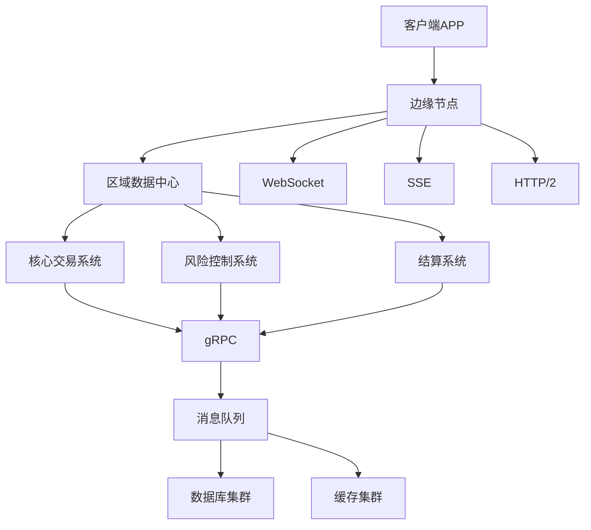
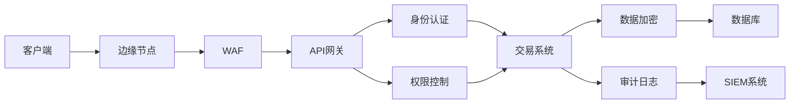

## 前言

随着金融科技的迅猛发展，实时通信已成为现代金融系统的核心需求。从股票交易系统到支付平台，从区块链应用到智能投顾，金融科技对通信协议提出了比普通应用更为严苛的要求：超低延迟、高可靠性、强安全性和监管合规性。

::: tip
在金融科技领域，通信协议的选择不仅关乎性能，更直接影响交易安全、用户体验和合规风险。
:::

## 金融通信的特殊挑战

金融科技应用面临的通信挑战远超普通Web应用：

### 1. 极低延迟需求
- 股票交易系统要求毫秒级响应
- 高频交易需要在微秒级别完成通信
- 市场数据推送需要实时性保证

### 2. 高可靠性要求
- 交易确认不能丢失
- 系统需要99.999%的可用性
- 网络中断必须有快速恢复机制

### 3. 安全与合规
- 传输数据必须端到端加密
- 需要完整的审计日志
- 符合金融行业监管要求（如PCI DSS、GDPR等）

### 4. 大规模并发
- 支付系统需要处理每秒数万笔交易
- 用户量可能达到数百万级别
- 节点间通信复杂度高

## 金融科技中的通信协议选择

### WebSocket：实时交易的首选

WebSocket因其全双工通信特性，成为金融实时交易系统的首选协议。

```javascript
// WebSocket在金融交易中的应用示例
const tradingSocket = new WebSocket('wss://api.financial-platform.com/trading');

tradingSocket.onopen = function(event) {
  // 订阅市场数据
  tradingSocket.send(JSON.stringify({
    action: 'subscribe',
    channels: ['market-data', 'order-book'],
    symbols: ['AAPL', 'GOOGL', 'MSFT']
  }));
};

tradingSocket.onmessage = function(event) {
  const data = JSON.parse(event.data);
  // 处理实时市场数据
  processMarketData(data);
  
  // 处理交易确认
  if (data.type === 'trade-confirmation') {
    updateOrderStatus(data);
  }
};
```

**优势**：
- 低延迟双向通信
- 支持消息推送
- 减少HTTP轮询开销

**挑战**：
- 需要实现断线重连机制
- 连接管理复杂度高
- 安全性需要额外加强

### gRPC：高性能微服务通信

在金融科技平台的微服务架构中，gRPC因其高性能和强类型定义成为服务间通信的理想选择。

```protobuf
// 金融交易服务的Protocol Buffer定义
syntax = "proto3";

service TradingService {
  rpc PlaceOrder (OrderRequest) returns (OrderResponse);
  rpc GetOrderStatus (OrderStatusRequest) returns (OrderStatusResponse);
  rpc CancelOrder (CancelOrderRequest) returns (CancelOrderResponse);
}

message OrderRequest {
  string user_id = 1;
  string symbol = 2;
  int32 quantity = 3;
  double price = 4;
  OrderType order_type = 5;
}

enum OrderType {
  MARKET = 0;
  LIMIT = 1;
  STOP_LOSS = 2;
}
```

**优势**：
- 基于HTTP/2，多路复用
- 强类型接口定义
- 支持流式传输
- 高性能二进制序列化

**应用场景**：
- 交易服务与结算服务通信
- 风险控制服务与交易系统交互
- 跨区域数据中心同步

### SSE：市场数据推送

对于单向的市场数据推送，Server-Sent Events (SSE) 提供了轻量级的解决方案。

```javascript
// SSE在金融数据推送中的应用
const marketDataEventSource = new EventSource('https://data.financial-platform.com/market-stream');

marketDataEventSource.addEventListener('market-data', function(event) {
  const data = JSON.parse(event.data);
  updateMarketData(data);
});

marketDataEventSource.addEventListener('trade-execution', function(event) {
  const trade = JSON.parse(event.data);
  displayTradeExecution(trade);
});

// 处理连接中断
marketDataEventSource.onerror = function(err) {
  console.error('SSE连接错误:', err);
  // 实现重连逻辑
  setTimeout(() => {
    marketDataEventSource.close();
    marketDataEventSource = new EventSource('https://data.financial-platform.com/market-stream');
  }, 3000);
};
```

**优势**：
- 轻量级实现
- 自动重连机制
- 服务器可推送事件类型
- 较低的开销

**适用场景**：
- 股票价格实时更新
- 外汇汇率变化通知
- 加密货币市场数据推送

## 金融通信的安全考量

### 1. 传输层安全

金融通信必须使用TLS 1.3或更高版本：

```nginx
# Nginx配置金融通信安全
server {
    listen 443 ssl http2;
    server_name api.financial-platform.com;
    
    ssl_certificate /path/to/financial-platform.crt;
    ssl_certificate_key /path/to/financial-platform.key;
    
    ssl_protocols TLSv1.2 TLSv1.3;
    ssl_ciphers 'ECDHE-ECDSA-AES256-GCM-SHA384:ECDHE-RSA-AES256-GCM-SHA384';
    ssl_prefer_server_ciphers off;
    
    # 启用OCSP装订
    ssl_stapling on;
    ssl_stapling_verify on;
    
    # 限制TLS版本和密码套件
    ssl_session_cache shared:SSL:10m;
    ssl_session_timeout 1d;
    ssl_session_tickets off;
}
```

### 2. 应用层安全

金融应用需要额外的安全措施：

```python
# 金融API的安全中间件示例
from fastapi import FastAPI, Request, HTTPException
from fastapi.security import APIKeyHeader
import time
import hashlib
import hmac

app = FastAPI()

# API密钥验证
api_key_header = APIKeyHeader(name="X-API-Key")

@app.middleware("http")
async def add_security_headers(request: Request, call_next):
    # 添加安全响应头
    response = await call_next(request)
    response.headers["X-Content-Type-Options"] = "nosniff"
    response.headers["X-Frame-Options"] = "DENY"
    response.headers["X-XSS-Protection"] = "1; mode=block"
    response.headers["Strict-Transport-Security"] = "max-age=63072000; includeSubDomains; preload"
    return response

@app.middleware("http")
async def rate_limit(request: Request, call_next):
    # 实现API调用速率限制
    client_ip = request.client.host
    current_time = time.time()
    
    # 检查速率限制
    if not check_rate_limit(client_ip, current_time):
        raise HTTPException(status_code=429, detail="请求过于频繁")
    
    response = await call_next(request)
    return response

def verify_signature(request_body: str, signature: str, secret: str):
    # 验证请求签名
    expected_signature = hmac.new(
        secret.encode(),
        request_body.encode(),
        hashlib.sha256
    ).hexdigest()
    
    return hmac.compare_digest(signature, expected_signature)
```

### 3. 审计与监控

金融系统需要全面的审计和监控：

```go
// 金融交易审计日志示例
package audit

import (
	"encoding/json"
	"log"
	"time"
)

type AuditEvent struct {
	Timestamp   time.Time         `json:"timestamp"`
	UserID      string            `json:"user_id"`
	Action      string            `json:"action"`
	Resource    string            `json:"resource"`
	IPAddress   string            `json:"ip_address"`
	DeviceID    string            `json:"device_id"`
	Details     map[string]string `json:"details"`
	Result      string            `json:"result"`
	RiskScore   int               `json:"risk_score"`
}

func LogTradeEvent(userID, action, resource, ip, deviceID string, details map[string]string, result string, riskScore int) {
	event := AuditEvent{
		Timestamp:   time.Now(),
		UserID:      userID,
		Action:      action,
		Resource:    resource,
		IPAddress:   ip,
		DeviceID:    deviceID,
		Details:     details,
		Result:      result,
		RiskScore:   riskScore,
	}
	
	eventJSON, _ := json.Marshal(event)
	log.Printf("[AUDIT] %s", string(eventJSON))
	
	// 发送到审计系统
	sendToAuditSystem(event)
}
```

## 金融通信协议的容错与降级

### 1. 断线重连机制

```javascript
// 金融WebSocket断线重连实现
class FinancialWebSocket {
  constructor(url, options = {}) {
    this.url = url;
    this.reconnectAttempts = 0;
    this.maxReconnectAttempts = options.maxReconnectAttempts || 5;
    this.reconnectInterval = options.reconnectInterval || 1000;
    this.subscriptions = new Set();
    this.isConnecting = false;
    this.socket = null;
    
    this.connect();
  }
  
  connect() {
    if (this.isConnecting) return;
    
    this.isConnecting = true;
    
    try {
      this.socket = new WebSocket(this.url);
      
      this.socket.onopen = () => {
        console.log('WebSocket连接已建立');
        this.reconnectAttempts = 0;
        this.isConnecting = false;
        
        // 重新订阅之前订阅的频道
        this.resubscribe();
      };
      
      this.socket.onclose = (event) => {
        console.log('WebSocket连接已关闭:', event.code, event.reason);
        this.isConnecting = false;
        this.handleReconnect();
      };
      
      this.socket.onerror = (error) => {
        console.error('WebSocket错误:', error);
        this.isConnecting = false;
      };
      
      this.socket.onmessage = (event) => {
        this.handleMessage(event.data);
      };
    } catch (error) {
      console.error('WebSocket连接失败:', error);
      this.isConnecting = false;
      this.handleReconnect();
    }
  }
  
  handleReconnect() {
    if (this.reconnectAttempts < this.maxReconnectAttempts) {
      this.reconnectAttempts++;
      const delay = this.reconnectInterval * Math.pow(2, this.reconnectAttempts - 1);
      console.log(`尝试重新连接... (${this.reconnectAttempts}/${this.maxReconnectAttempts}), 延迟: ${delay}ms`);
      
      setTimeout(() => {
        this.connect();
      }, delay);
    } else {
      console.error('达到最大重连次数，停止重连');
      this.onMaxReconnectReached && this.onMaxReconnectReached();
    }
  }
  
  subscribe(channel, callback) {
    this.subscriptions.add({ channel, callback });
    
    if (this.socket && this.socket.readyState === WebSocket.OPEN) {
      this.socket.send(JSON.stringify({
        action: 'subscribe',
        channel: channel
      }));
    }
  }
  
  resubscribe() {
    this.subscriptions.forEach(({ channel }) => {
      this.socket.send(JSON.stringify({
        action: 'subscribe',
        channel: channel
      }));
    });
  }
  
  handleMessage(data) {
    try {
      const message = JSON.parse(data);
      
      // 处理不同类型的消息
      switch (message.type) {
        case 'market-data':
          this.handleMarketData(message);
          break;
        case 'trade-execution':
          this.handleTradeExecution(message);
          break;
        case 'order-update':
          this.handleOrderUpdate(message);
          break;
        default:
          console.warn('未知的消息类型:', message.type);
      }
    } catch (error) {
      console.error('处理消息时出错:', error);
    }
  }
  
  // 消息处理方法
  handleMarketData(data) {
    this.subscriptions.forEach(({ channel, callback }) => {
      if (channel === 'market-data') {
        callback(data);
      }
    });
  }
  
  handleTradeExecution(data) {
    this.subscriptions.forEach(({ channel, callback }) => {
      if (channel === 'trade-execution') {
        callback(data);
      }
    });
  }
  
  handleOrderUpdate(data) {
    this.subscriptions.forEach(({ channel, callback }) => {
      if (channel === 'order-update') {
        callback(data);
      }
    });
  }
}
```

### 2. 降级策略

金融系统需要实现多级降级策略：

```javascript
// 金融通信降级策略
class CommunicationManager {
  constructor() {
    this.primaryChannel = 'websocket';
    this.fallbackChannels = ['sse', 'long-polling', 'http-polling'];
    this.currentChannel = this.primaryChannel;
    this.channelStatus = {};
    this.healthCheckInterval = 30000; // 30秒
    this.init();
  }
  
  init() {
    // 初始化所有通道状态
    [this.primaryChannel, ...this.fallbackChannels].forEach(channel => {
      this.channelStatus[channel] = this.checkChannelHealth(channel);
    });
    
    // 定期健康检查
    setInterval(() => {
      this.performHealthCheck();
    }, this.healthCheckInterval);
  }
  
  performHealthCheck() {
    [this.primaryChannel, ...this.fallbackChannels].forEach(channel => {
      const isHealthy = this.checkChannelHealth(channel);
      
      if (isHealthy !== this.channelStatus[channel]) {
        this.channelStatus[channel] = isHealthy;
        console.log(`${channel} 通道状态变化: ${isHealthy ? '健康' : '不健康'}`);
        
        // 如果当前使用的通道不健康，尝试切换
        if (channel === this.currentChannel && !isHealthy) {
          this.switchToHealthyChannel();
        }
      }
    });
  }
  
  checkChannelHealth(channel) {
    // 实现各通道的健康检查逻辑
    switch (channel) {
      case 'websocket':
        return this.checkWebSocketHealth();
      case 'sse':
        return this.checkSSEHealth();
      case 'long-polling':
        return this.checkLongPollingHealth();
      case 'http-polling':
        return this.checkHTTPPollingHealth();
      default:
        return false;
    }
  }
  
  switchToHealthyChannel() {
    // 按优先级尝试切换到健康的通道
    for (const channel of [this.primaryChannel, ...this.fallbackChannels]) {
      if (this.channelStatus[channel]) {
        console.log(`切换到 ${channel} 通道`);
        this.currentChannel = channel;
        this.switchChannel(channel);
        return;
      }
    }
    
    console.error('所有通信通道均不可用');
    this.onAllChannelsDown && this.onAllChannelsDown();
  }
  
  switchChannel(newChannel) {
    // 实现通道切换逻辑
    console.log(`正在从 ${this.currentChannel} 切换到 ${newChannel}`);
    
    // 保存当前状态
    const state = this.getCurrentState();
    
    // 关闭当前通道
    this.closeCurrentChannel();
    
    // 打开新通道
    this.openChannel(newChannel);
    
    // 恢复状态
    this.restoreState(state);
  }
  
  // 通信方法
  send(data) {
    switch (this.currentChannel) {
      case 'websocket':
        return this.sendViaWebSocket(data);
      case 'sse':
        return this.sendViaSSE(data);
      case 'long-polling':
        return this.sendViaLongPolling(data);
      case 'http-polling':
        return this.sendViaHTTPPolling(data);
      default:
        throw new Error('当前没有可用的通信通道');
    }
  }
  
  subscribe(channel, callback) {
    switch (this.currentChannel) {
      case 'websocket':
        return this.subscribeViaWebSocket(channel, callback);
      case 'sse':
        return this.subscribeViaSSE(channel, callback);
      case 'long-polling':
        return this.subscribeViaLongPolling(channel, callback);
      case 'http-polling':
        return this.subscribeViaHTTPPolling(channel, callback);
      default:
        throw new Error('当前没有可用的通信通道');
    }
  }
}
```

## 案例分析：全球支付平台的通信架构

### 背景

某全球支付平台需要处理来自200+国家和地区的实时交易，每秒处理超过10万笔交易，同时确保低延迟、高可用性和安全性。

### 通信架构设计



### 关键技术选型

1. **客户端-边缘节点通信**：
   - 移动APP：WebSocket + 自动降级到SSE
   - Web应用：WebSocket + HTTP/2长连接
   - IoT设备：MQTT over WebSocket

2. **边缘节点-数据中心通信**：
   - 主要通信：HTTP/2 + gRPC
   - 实时数据推送：SSE
   - 交易确认：WebSocket

3. **数据中心内部通信**：
   - 微服务间：gRPC
   - 事件驱动：Kafka
   - 数据同步：Redis Pub/Sub

### 性能优化措施

1. **全球边缘节点部署**：
   - 在30+国家部署边缘节点
   - 智能路由选择最近节点
   - CDN加速静态资源

2. **协议优化**：
   - gRPC启用HTTP/2多路复用
   - WebSocket压缩消息头
   - 自定义二进制协议减少数据量

3. **连接管理**：
   - 连接池复用
   - 心跳保活机制
   - 智能断线重连

### 安全架构



## 未来展望

金融科技通信协议的发展趋势：

### 1. WebTransport的应用

WebTransport作为HTTP/3的新协议，将提供更高效的通信能力：

```javascript
// WebTransport在金融通信中的应用示例
async function initWebTransport() {
  try {
    const transport = new WebTransport('https://api.financial-platform.com/trading');
    
    // 等待连接建立
    await transport.ready;
    console.log('WebTransport连接已建立');
    
    // 创建双向数据流
    const sendStream = transport.sendDatagrams();
    const receiveStream = transport.receiveDatagrams();
    
    // 发送交易数据
    const tradeData = new TextEncoder().encode(JSON.stringify({
      action: 'place-order',
      symbol: 'AAPL',
      quantity: 100,
      price: 150.25
    }));
    
    await sendStream.send(tradeData);
    
    // 接收响应
    for await (const datagram of receiveStream) {
      const response = new TextDecoder().decode(datagram);
      console.log('收到响应:', response);
    }
    
  } catch (error) {
    console.error('WebTransport连接失败:', error);
    // 降级到WebSocket
    initWebSocket();
  }
}
```

### 2. 量子加密通信

随着量子计算的发展，量子加密通信将成为金融安全的重要保障：

```python
# 量子密钥分发(QKD)示例
import qkd
import numpy as np

def setup_quantum_channel():
    # 初始化量子信道
    alice = qkd.Party("Alice", role="sender")
    bob = qkd.Party("Bob", role="receiver")
    
    # 建立量子密钥分发
    key = alice.establish_key(bob, length=256)
    
    return key

def secure_communication(message, key):
    # 使用量子密钥加密消息
    cipher = qkd.Encrypt(key)
    encrypted = cipher.encrypt(message)
    
    return encrypted

def decrypt_message(encrypted, key):
    # 使用量子密钥解密消息
    decipher = qkd.Decrypt(key)
    decrypted = decipher.decrypt(encrypted)
    
    return decrypted
```

### 3. AI驱动的通信优化

人工智能将被用于优化金融通信性能和安全性：

```python
# AI驱动的通信优化示例
import tensorflow as tf
from sklearn.ensemble import IsolationForest

class CommunicationOptimizer:
    def __init__(self):
        self.latency_model = self.build_latency_model()
        self.anomaly_detector = IsolationForest()
        self.communication_patterns = {}
    
    def build_latency_model(self):
        # 构建网络延迟预测模型
        model = tf.keras.Sequential([
            tf.keras.layers.Dense(64, activation='relu', input_shape=(10,)),
            tf.keras.layers.Dense(32, activation='relu'),
            tf.keras.layers.Dense(1)
        ])
        
        model.compile(optimizer='adam', loss='mse')
        return model
    
    def predict_latency(self, network_conditions):
        # 预测网络延迟
        conditions = np.array(network_conditions).reshape(1, -1)
        predicted_latency = self.latency_model.predict(conditions)
        return predicted_latency[0][0]
    
    def detect_anomalies(self, traffic_data):
        # 检测通信异常
        anomalies = self.anomaly_detector.fit_predict(traffic_data)
        return anomalies
    
    def optimize_route(self, source, destination):
        # 基于AI优化通信路由
        routes = self.get_available_routes(source, destination)
        
        best_route = None
        min_latency = float('inf')
        
        for route in routes:
            conditions = self.get_network_conditions(route)
            predicted_latency = self.predict_latency(conditions)
            
            if predicted_latency < min_latency:
                min_latency = predicted_latency
                best_route = route
        
        return best_route
```

## 结语

金融科技领域的通信协议选择是一个复杂而关键的决策过程。在实际应用中，我们需要综合考虑性能、可靠性、安全性和合规性等多个维度。

> 金融通信协议的选择不仅是技术决策，更是业务决策。正确的协议选择可以显著提升交易效率、增强用户体验，同时满足严格的监管要求。

随着技术的不断发展，新的通信协议和优化方案不断涌现，金融科技从业者需要持续学习和适应这些变化，构建更加安全、高效、可靠的金融通信系统。

在未来的金融科技发展中，通信协议将继续扮演核心角色，推动金融创新和数字化转型。无论是区块链、量子计算还是AI，都需要强大的通信基础设施作为支撑。因此，深入理解金融通信协议的原理和应用，将成为金融科技从业者的核心竞争力之一。