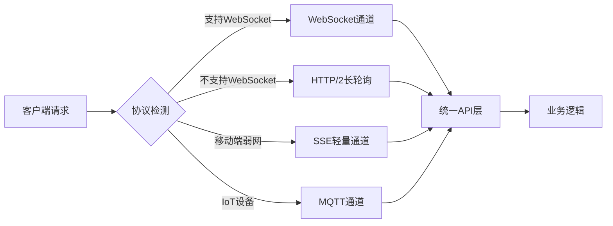
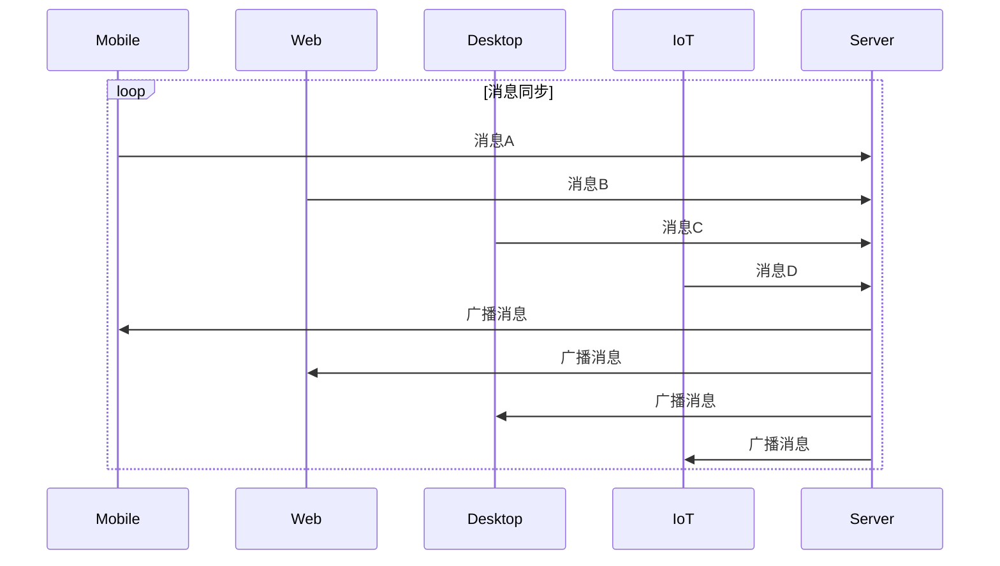
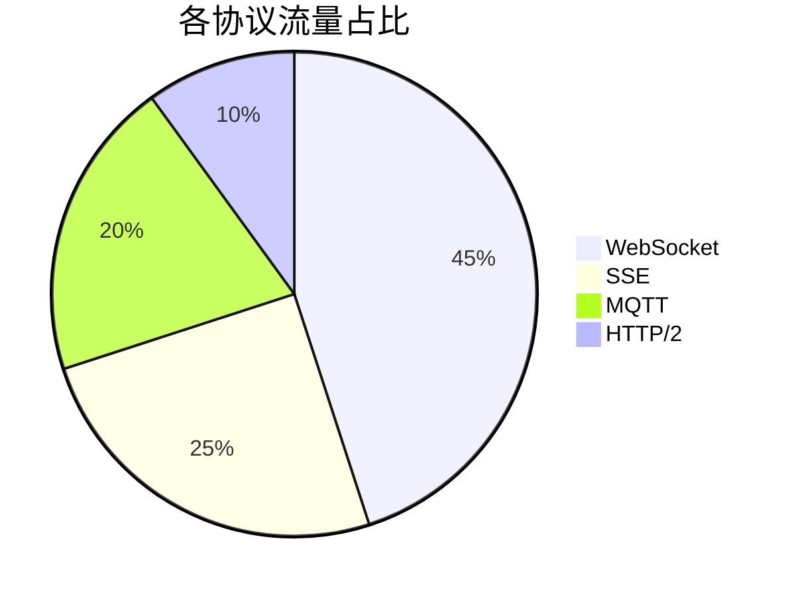

## 前言

在当今多端开发盛行的时代，一个应用可能需要同时支持Web浏览器、iOS/Android移动端、桌面应用甚至IoT设备。📱💻🌐 然而，不同平台对通信协议的支持程度差异巨大，这给开发者带来了严峻挑战。本文将深入探讨跨平台通信协议兼容性的核心问题，并提供系统性解决方案。

::: tip
> "真正的技术挑战不在于实现功能，而在于让功能在任何地方都能稳定运行"
> —— 来自多端开发者的集体吐槽
:::

## 跨平台兼容性挑战

### 1. 协议支持差异

| 平台           | WebSocket | SSE | gRPC | HTTP/3 | MQTT |
|----------------|-----------|-----|------|--------|------|
| 现代浏览器     | ✅        | ✅  | ❌   | ✅     | ❌   |
| iOS/Safari     | ✅        | ✅  | ❌   | ✅     | ❌   |
| Android WebView| ✅        | ⚠️  | ❌   | ⚠️     | ❌   |
| 桌面应用       | ✅        | ✅  | ✅   | ✅     | ✅   |
| IoT设备        | ❌        | ❌  | ❌   | ❌     | ✅   |

⚠️ **关键痛点**：移动端WebView对gRPC和HTTP/3的支持严重滞后，IoT设备几乎不支持现代实时协议

### 2. 网络环境限制

移动端特有的网络环境：
- 省电模式下的连接限制
- 运营商代理对长连接的干扰
- 弱网环境下的协议行为差异

### 3. 安全策略差异

不同平台的安全策略：
- iOS ATS (App Transport Security) 限制
- Android 7.0+ 对HTTP明文协议的禁止
- 企业防火墙对非标准端口的封锁

## 兼容性解决方案架构

### 1. 协议适配层设计



### 2. 降级策略实现

```javascript
// 协议选择伪代码
function selectProtocol(userAgent, networkInfo) {
  if (isIoTDevice(userAgent)) return 'mqtt';
  if (isMobile(userAgent) && networkInfo.isWeak) return 'sse';
  if (supportsWebSocket(userAgent)) return 'websocket';
  return 'http2-polling';
}
```

### 3. 跨平台SDK封装

核心设计原则：
- **统一API**：所有平台使用相同的接口
- **自动适配**：根据环境自动选择最优协议
- **透明降级**：上层代码无需关心底层协议切换

```typescript
// 统一通信SDK示例
class CrossPlatformClient {
  connect() {
    const protocol = this.detectBestProtocol();
    switch(protocol) {
      case 'websocket':
        return new WebSocketAdapter();
      case 'sse':
        return new SSEAdapter();
      case 'mqtt':
        return new MQTTAdapter();
    }
  }
}
```

## 实战案例：跨平台实时聊天应用

### 技术栈选择
- **Web端**：WebSocket + HTTP/3备用
- **移动端**：SSE + WebSocket降级
- **桌面端**：gRPC + WebSocket
- **IoT设备**：MQTT + LwM2M

### 关键实现细节

#### 1. 连接健康检测

```javascript
// 跨平台心跳检测
function heartbeat(connection) {
  if (connection.protocol === 'mqtt') {
    // MQTT使用QoS 1消息
    connection.publish('ping', '', { qos: 1 });
  } else {
    // 其他协议使用自定义ping
    connection.send(JSON.stringify({ type: 'ping' }));
  }
}
```

#### 2. 消息队列设计



#### 3. 离线消息处理

```typescript
// 离线消息队列
class OfflineMessageQueue {
  async store(message: Message) {
    // IndexedDB (Web) / SQLite (移动端) / 文件系统 (IoT)
    await this.platformStorage.save(message);
  }
  
  async sync() {
    const offlineMessages = await this.platformStorage.getAll();
    for (const msg of offlineMessages) {
      await this.transport.send(msg);
    }
  }
}
```

## 性能优化策略

### 1. 协议压缩优化

| 协议   | 压缩方案          | 典型压缩比 |
|--------|-------------------|------------|
| WebSocket | Per-Message Deflate | 70%        |
| SSE    | Gzip              | 60%        |
| MQTT   | Snappy            | 50%        |
| HTTP/2 | Brotli            | 75%        |

### 2. 连接池管理

```javascript
// 智能连接池
class ConnectionPool {
  constructor() {
    this.pool = new Map();
  }
  
  acquire(endpoint) {
    if (!this.pool.has(endpoint)) {
      const connection = this.createConnection(endpoint);
      this.pool.set(endpoint, connection);
    }
    return this.pool.get(endpoint);
  }
  
  release(endpoint) {
    const connection = this.pool.get(endpoint);
    if (connection.idleTime > MAX_IDLE_TIME) {
      connection.close();
      this.pool.delete(endpoint);
    }
  }
}
```

## 安全加固方案

### 1. 跨平台安全策略

| 安全措施          | Web端          | 移动端        | 桌面端        | IoT设备       |
|-------------------|---------------|--------------|--------------|--------------|
| 证书验证          | ✅             | ✅            | ✅            | ⚠️            |
| 消息签名          | ✅             | ✅            | ✅            | ❌            |
| 端到端加密        | ✅             | ✅            | ✅            | ⚠️            |
| 设备指纹          | Cookie+FP      | Keychain      | 系统证书     | 设备ID       |

### 2. 协议安全配置

```yaml
# WebSocket安全配置
websocket:
  protocols:
    - "chat.v1"
  subprotocols:
    - "secure-chat"
  options:
    perMessageDeflate: true
    serverNoContextTakeover: true
    clientNoContextTakeover: true
```

## 部署与监控

### 1. 协议流量分析



### 2. 跨平台监控指标

```typescript
// 统一监控接口
interface PlatformMetrics {
  connectionLatency: number;
  messageThroughput: number;
  errorRate: number;
  protocolSwitchCount: number;
  batteryImpact: number; // 移动端特有
}
```

## 结语

跨平台通信协议兼容性是现代分布式系统的核心挑战之一。通过**协议适配层**、**智能降级策略**和**统一SDK**三层架构，我们可以构建真正无缝的多端实时应用。🚀

> 技术没有银弹，但好的架构可以让我们在面对平台差异时游刃有余。记住：**兼容性不是妥协，而是专业性的体现**。

未来，随着WebTransport等新协议的普及，以及IoT生态的成熟，跨平台通信将迎来新的机遇。持续关注标准演进，保持架构灵活性，才能在多端开发浪潮中立于不败之地。

---

**延伸阅读**：
- [《实时通信协议性能基准测试》](/pages/xxxxxx/)
- [《边缘计算环境下的通信协议选择》](/pages/xxxxxx/)
- [《微服务架构中的通信协议优化》](/pages/xxxxxx/)