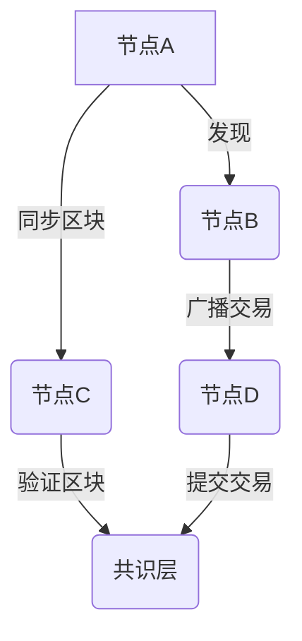

## 前言

最近我一直在研究区块链技术，深入探索这个充满创新和挑战的领域。在这个过程中，我发现一个有趣的现象：大多数区块链开发者和用户都专注于共识机制、智能合约和代币经济模型，却很少深入探讨支撑整个网络运行的通信协议。🤔

区块链网络本质上是一个分布式系统，节点之间的通信效率、可靠性和安全性直接决定了整个网络的性能。今天，我想和大家一起探讨区块链通信协议这一重要但常被忽视的话题。

## 区块链通信协议的重要性

区块链网络中的通信协议承担着至关重要的角色，它不仅仅是简单的数据传输，而是去中心化网络的生命线。没有高效可靠的通信协议，再好的共识机制也难以发挥作用。

::: tip
区块链通信协议需要满足几个关键需求：去中心化、抗审查性、容错性、低延迟和高吞吐量。这些需求常常相互矛盾，需要在设计时做出权衡。
:::

## 主流区块链通信协议分析

### P2P网络协议

大多数区块链采用P2P网络架构，节点之间直接通信，无需中心服务器。常见的P2P协议包括：

- **Kademlia DHT**：以太坊等区块链使用的分布式哈希表，用于节点发现和路由
- **Gossip协议**：比特币等使用的节点信息传播机制
- **libp2p**：IPFS和许多新兴区块链采用的模块化P2P协议栈

### 共识通信协议

共识机制中的节点间通信是区块链网络的核心：

- **PBFT**：实用拜占庭容错，联盟链常用
- **PoW**：工作量证明，比特币使用
- **PoS**：权益证明，以太坊2.0等使用
- **DPoS**：委托权益证明，EOS等使用

每种共识机制都有其特定的通信协议和消息格式，这些协议直接影响网络性能。

### 区块同步协议

区块链需要高效的区块同步机制，以确保新节点快速加入网络：

- **快速同步**：如以太坊的"状态同步"
- **区块下载**：比特币的区块获取机制
- **轻客户端协议**：如SPV(简单支付验证)协议

## 区块链通信协议的挑战与优化

### 带宽与存储挑战

区块链网络面临显著的带宽和存储挑战：

- 区块链数据量持续增长
- 全节点需要存储完整历史数据
- P2P网络中的带宽消耗巨大

| 优化策略 | 描述 | 适用场景 |
|---------|------|---------|
| 分片技术 | 将网络分割成多个子网络 | 高吞吐量需求 |
| 压缩算法 | 减少数据传输量 | 带宽受限环境 |
| 历史数据归档 | 定期归档旧数据 | 存储资源有限 |
| 轻客户端 | 只下载必要数据 | 移动设备/IoT |

### 延迟与性能优化

区块链通信协议需要优化以降低延迟：

- **节点选择策略**：选择地理位置相近的节点
- **数据预取**：提前获取可能需要的数据
- **并行传输**：同时从多个节点获取数据
- **缓存机制**：缓存频繁访问的数据

### 安全性考量

区块链通信协议面临独特的安全挑战：

- **女巫攻击**：攻击者创建大量虚假节点
- **DDoS攻击**：通过大量请求耗尽节点资源
- **中间人攻击**：截获和篡改通信数据
- **网络分区**：网络分裂导致共识问题

::: theorem
区块链通信协议的安全性原则：
1. 验证所有通信来源
2. 加密所有敏感数据
3. 实现抗审查机制
4. 设计容错能力
:::

## 新兴区块链通信协议

### Libp2p协议栈

libp2p是一个模块化的P2P协议栈，被IPFS和许多新兴区块链采用：

- 多种传输协议支持
- 多种身份验证机制
- 可扩展的寻址系统
- 模块化设计，易于定制

### Substrate网络协议

Substrate(构建区块链框架)提供了先进的网络层：

- 基于libp2p
- 支持轻客户端
- 内置同步协议
- 可配置的发现机制

### QUIC与区块链

QUIC协议(基于UDP)为区块链通信带来新可能：

- 减少连接建立延迟
- 改善拥塞控制
- 更好的多路复用
- 内置安全机制

## 区块链通信协议的未来趋势

### 去中心化身份与通信

随着DID(去中心化身份)的发展，区块链通信协议将更好地集成身份验证：

- 基于区块链的身份验证
- 零知识证明保护隐私
- 自主权身份管理

### 跨链通信协议

随着多链生态的发展，跨链通信协议变得日益重要：

- 中继链技术
- 哈希时间锁定合约(HTLC)
- 跨链消息传递协议

### 边缘计算与区块链

将区块链通信与边缘计算结合：

- 边缘节点网络
- 轻量级共识机制
- 本地数据验证

## 结语

区块链通信协议是构建高效、安全去中心化网络的关键。随着区块链技术的不断发展和应用场景的扩展，通信协议也将持续演进和优化。作为开发者和研究者，我们需要深入理解这些协议，并在实际应用中做出明智的选择和优化。

> 区块链不仅是技术的创新，更是通信范式的革命。高效的通信协议是支撑这一革命的基石，值得我们持续关注和投入。

---

未来，我计划深入研究特定区块链项目的通信协议实现，并分享更多关于区块链网络性能优化的实践经验和技巧。如果你对区块链通信协议有任何疑问或见解，欢迎在评论区交流讨论！🚀