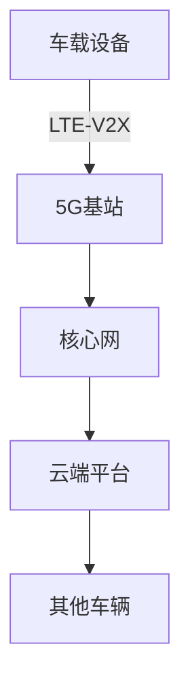
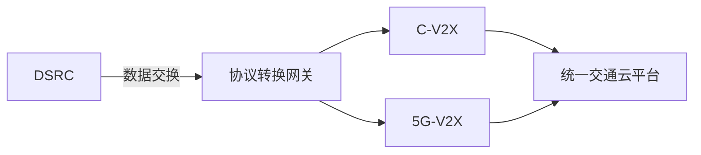

## 前言

随着智能汽车和自动驾驶技术的飞速发展，车联网（V2X，Vehicle-to-Everything）通信已成为现代交通系统的核心技术支柱。🚗💨 当我们的汽车能够相互通信、与道路设施对话、甚至与云端实时交互时，整个交通生态系统正在经历一场革命性的变革。然而，在这场技术盛宴背后，一套高效、可靠、安全的通信协议体系是支撑这一切的隐形骨架。

::: tip
车联网不仅是汽车技术的演进，更是构建未来智能城市、实现零事故交通愿景的关键基础设施。
:::

## 车联网通信的挑战与需求

车联网通信面临着前所未有的技术挑战，这些挑战直接决定了通信协议的设计方向：

### 高可靠性与低延迟
- **毫秒级响应**：碰撞预警系统需要在100毫秒内完成信息传递
- **99.999%可靠性**：关键安全信息传输不容许失败
- **高速移动环境**：车辆相对速度可达300km/h，多普勒效应显著

### 海量连接与带宽需求
- **单区域高密度**：城市道路每平方公里可达数千辆车
- **多模态数据传输**：视频、传感器数据、控制指令混合传输
- **边缘计算支持**：需要协议支持边缘节点高效处理

### 安全与隐私保护
- **身份认证**：防止恶意车辆伪造身份
- **数据加密**：保护行车轨迹等敏感信息
- **隐私保护**：避免车辆位置被追踪

## 主流车联网通信协议解析

### DSRC (专用短程通信)

- **技术特点**：
  - IEEE 802.11p物理层，基于WiFi技术
  - 通信距离300-1000米
  - 带道率3-27Mbps
  - 低延迟（<100ms）

- **应用场景**：
  - 车辆碰撞预警（V2V）
  - 红绿灯信息推送（V2I）
  - 电子收费系统（V2P）

### C-V2X (蜂窝车联网)

- **技术演进**：
  - LTE-V2X（PC5直连通信）
  - 5G-V2X（uRLLC，mMTC增强）
  - 支持5G网络直连（V2N）

- **优势特点**：
  - 更广覆盖范围（可达数公里）
  - 更高带宽（5G峰值20Gbps）
  - 更强移动性支持（500km/h）
  - 与蜂窝网络无缝切换

### 其他新兴协议
- **IEEE 802.11bd**：下一代WiFi直连协议
- **NR-V2X**：5G RAN的V2X增强
- **Satellite-V2X**：卫星通信补充偏远地区覆盖

## 车联网通信协议的安全架构

### 分层安全模型

| 层级 | 安全措施 | 实现方式 |
|------|----------|----------|
| 物理层 | 信号加密 | OFDMA跳频，扩频技术 |
| 链路层 | 身份认证 | 数字证书，挑战响应 |
| 网络层 | 路由安全 | 安全邻居发现，DSR协议 |
| 应用层 | 数据保护 | 同态加密，零知识证明 |

### 关键安全机制

1. **PKI基础设施**：
   - 车辆预装数字证书
   - CA机构颁发身份凭证
   - 证书撤销列表实时同步

2. **隐私保护技术**：
   - 位置模糊化处理
   - 匿名组通信
   - 临时身份标识

3. **入侵检测系统**：
   - 行为异常检测
   - 流量分析监控
   - AI驱动的威胁识别

## 未来发展趋势

### 6G赋能的车联网
- **太赫兹通信**：提供Tbps级带宽
- **超低延迟**：1ms内端到端响应
- **空天地一体化**：卫星-地面-车辆无缝覆盖

### AI与协议融合
- **智能路由选择**：基于实时路况动态调整通信路径
- **自优化协议栈**：AI自动调整通信参数
- **预测性通信**：预判车辆行为提前建立连接

### 跨协议协同架构

## 结语

车联网通信协议正在从单一技术向融合生态系统演进。🚀 随着DSRC、C-V2X、5G-V2X等技术的协同发展，我们正在构建一个连接一切、智能协同的交通新世界。未来，随着6G、AI等技术的深度融合，车联网将不仅改变我们的出行方式，更将重塑整个城市的运行逻辑。

> "在车联网的世界里，每一辆汽车都是一个移动的智能节点，每一次通信都是迈向零事故交通的一小步。"

作为开发者和系统架构师，我们需要深入理解这些协议的底层逻辑，在追求性能的同时，始终将安全与隐私作为不可妥协的基石。毕竟，在智能交通的宏伟蓝图中，每一次可靠的通信都在为更安全、更高效的未来铺路。

---

*注：本文基于当前技术趋势分析，实际协议演进可能随技术发展而变化。*