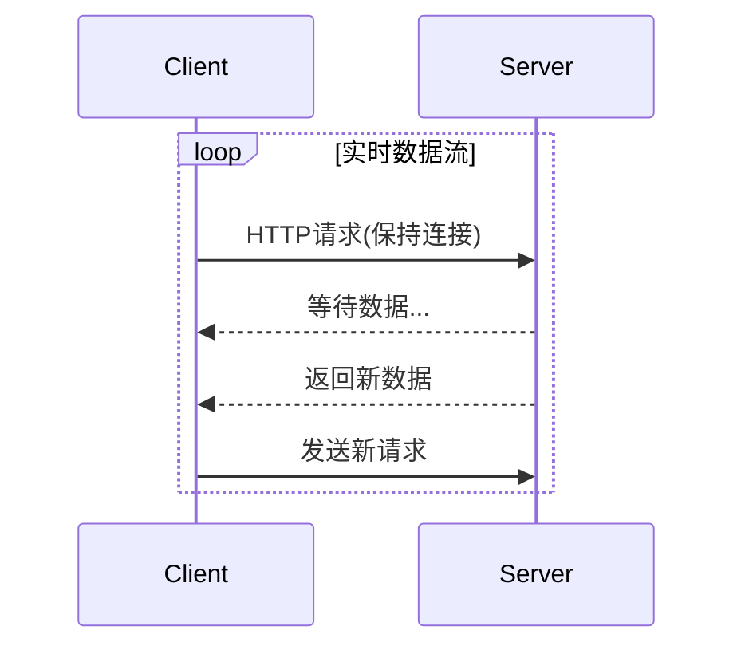

```yaml
---
title: 长轮询：在WebSocket时代之前实现实时通信的古老技艺
date: 2023-11-15 14:30:00
permalink: /pages/protocol-long-polling/
categories: 
  - 网络协议
tags:
  - 实时通信
  - 长轮询
  - HTTP
author: 
  name: Jorgen
  link: https://github.com/jorgen-zhao
---

## 前言

在实时通信技术百花齐放的今天，WebSocket和MQTT已经成为了现代应用中的明星协议。🚀 但当我们回顾技术演进历程时，会发现一个在WebSocket普及前默默支撑着无数实时应用的"老兵"——长轮询（Long Polling）。今天，我想带大家一起重温这项古老而优雅的技术，理解它如何在不支持双向通信的HTTP协议上，巧妙地实现了"伪实时"的奇迹。🔍

::: tip
长轮询本质上是HTTP协议的"创造性滥用"，它通过保持连接打开直到有数据可用，巧妙绕过了HTTP的无状态特性。
:::

---

## 长轮询的工作原理

长轮询的核心思想非常巧妙：**客户端发送请求后，服务器保持连接打开直到有新数据可发送**。让我们通过一个具体流程来理解：

### 基本流程
1. 客户端向服务器发送HTTP请求
2. 服务器**不立即响应**，而是保持连接打开
3. 当服务器有新数据时，立即返回响应
4. 客户端收到响应后立即发送新请求，形成循环



### 与短轮询的对比

| 特性         | 短轮询               | 长轮询                     |
|--------------|----------------------|----------------------------|
| 请求频率     | 高频定时请求         | 数据驱动请求               |
| 服务器负载   | 高(无意义的请求)     | 低(仅在有数据时响应)       |
| 实时性       | 差(固定延迟)         | 中等(取决于服务器响应速度) |
| 资源消耗     | 高(大量连接)         | 中等(连接数减少)           |

---

## 实现细节与挑战

### 服务器端实现要点

在Node.js中实现长轮询服务器的关键代码：

```javascript
// 长轮询服务器示例
app.get('/long-poll', (req, res) => {
  // 1. 存储响应对象
  pendingRes.push(res);
  
  // 2. 设置超时机制
  const timeout = setTimeout(() => {
    res.status(200).json({ data: null, timeout: true });
    const index = pendingRes.indexOf(res);
    if (index > -1) pendingRes.splice(index, 1);
  }, 30000); // 30秒超时
  
  // 3. 当有新数据时触发所有等待的客户端
  function broadcast(data) {
    pendingRes.forEach(res => {
      res.json({ data });
      clearTimeout(res.timeout);
    });
    pendingRes = [];
  }
});
```

### 客户端实现策略

```javascript
// 长轮询客户端实现
function longPoll() {
  fetch('/long-poll')
    .then(response => response.json())
    .then(data => {
      if (data.data) {
        updateUI(data.data); // 更新界面
      }
      // 立即发送新请求
      setTimeout(longPoll, 1000); // 1秒延迟避免服务器过载
    })
    .catch(error => {
      console.error('轮询失败:', error);
      setTimeout(longPoll, 5000); // 错误后5秒重试
    });
}
```

### 主要挑战

1. **连接管理**：需要处理大量并发长连接
2. **超时处理**：设置合理的超时时间避免资源浪费
3. **错误恢复**：网络中断后的重连机制
4. **服务器负载**：连接数随用户量线性增长

---

## 实际应用场景

尽管WebSocket已成为主流，长轮询在以下场景中仍有独特价值：

### 1. 旧系统兼容性

当需要为不支持WebSocket的旧浏览器提供实时功能时，长轮询是完美的降级方案。

> 📡 我曾在遗留项目中改造过一个基于IE8的监控系统，通过长轮询实现了实时告警功能，用户甚至没有察觉到与新版系统的差异。

### 2. 代理环境限制

在企业防火墙严格的环境中，WebSocket端口可能被封锁，而HTTP(80/443)通常保持开放。

### 3. 低频实时需求

对于更新频率较低的应用（如后台任务状态更新），长轮询的简单实现优势明显。

---

## 优缺点分析

### 优势

- **实现简单**：基于标准HTTP，无需特殊协议支持
- **兼容性好**：支持所有浏览器和代理服务器
- **调试友好**：可直接通过浏览器开发者工具查看请求
- **渐进增强**：可作为WebSocket的优雅降级方案

### 劣势

- **资源消耗**：每个连接占用服务器资源
- **延迟较高**：即使很快也有网络往返延迟
- **状态管理复杂**：需要手动处理连接状态
- **可扩展性差**：高并发时服务器压力大

---

## 结语

长轮询作为实时通信技术发展史上的重要里程碑，展现了工程师们在技术限制下的创造力。🌟 尽管现在WebSocket和MQTT已成为主流，但长轮询的思想——"保持连接直到有数据"——仍然影响着现代通信协议的设计。

::: right
"在技术演进中，没有过时的技术，只有不合适的应用场景。"
:::

对于现代开发者，理解长轮询的价值在于：
1. 作为WebSocket的降级方案
2. 在受限网络环境中的备选方案
3. 理解实时通信协议的演进逻辑

下次当你需要实现实时功能时，不妨思考一下：我的场景是否真的需要WebSocket？或许长轮询才是那个恰到好处的优雅解决方案呢？🤔

```