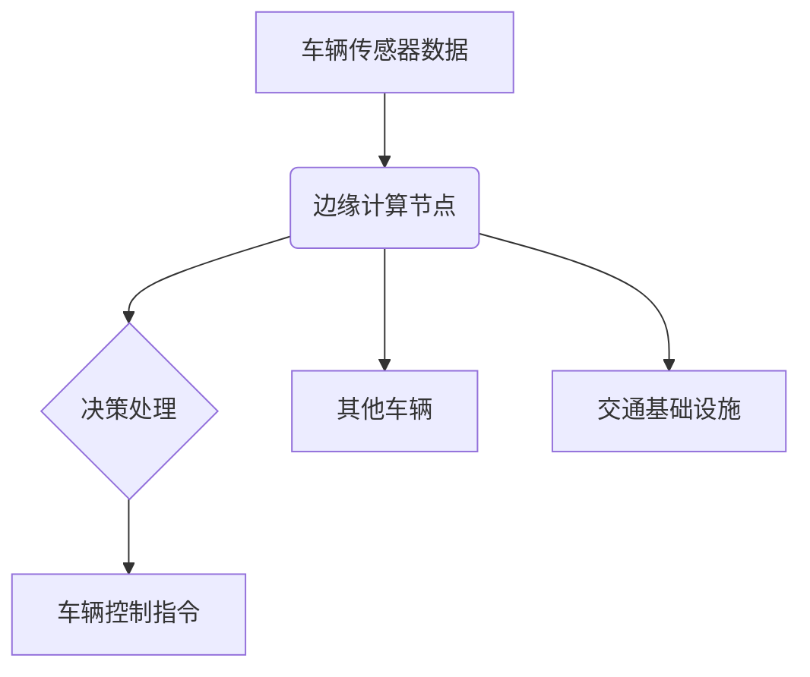

## 前言

最近我一直在研究车联网通信技术，尤其是自动驾驶系统中的通信协议。随着自动驾驶技术的快速发展，车辆之间的通信(V2V)、车辆与基础设施的通信(V2I)变得越来越重要。🚗💨 作为一个对通信协议感兴趣的技术爱好者，我发现虽然市面上有很多关于WebSocket、SSE等实时通信协议的文章，但专门讨论自动驾驶系统通信协议的内容却相对较少。

今天我想和大家分享一下自动驾驶系统中通信协议的关键技术、挑战和未来发展趋势。如果你对车联网、自动驾驶或者通信协议感兴趣，那么这篇文章可能会给你带来一些启发！🤖🚦

## 自动驾驶通信协议的重要性

自动驾驶系统对通信协议有着极高的要求，这不仅仅是因为车辆需要实时交换信息，更因为安全是自动驾驶系统的首要考虑因素。

::: tip
自动驾驶系统需要在毫秒级别内完成信息交换和决策，任何通信延迟或错误都可能导致严重的安全事故。
:::

想象一下这样的场景：你的自动驾驶汽车需要立即知道前方车辆的紧急刹车，或者需要了解交叉路口的交通信号灯状态变化。这些信息必须在极短的时间内可靠地传输，否则后果不堪设想。🚨 这就是为什么自动驾驶通信协议需要具备以下特性：

- **超低延迟**：通常要求在10ms以内完成信息传输
- **高可靠性**：99.999%以上的消息传递成功率
- **高安全性**：防止恶意攻击和数据篡改
- **大容量**：支持车辆周围环境数据的实时传输
- **广泛覆盖**：在城市、郊区、高速公路等不同环境下都能稳定工作

## 主流自动驾驶通信协议

### DSRC (专用短程通信)

DSRC是早期被广泛研究的车联网通信技术，基于IEEE 802.11p标准，工作在5.9GHz频段。

**优点：**
- 通信延迟低（通常在50-100ms）
- 技术相对成熟，有较多实际部署案例
- 支持广播通信，适合车辆间信息共享

**缺点：**
- 通信距离有限（通常在300-1000米）
- 频谱资源有限，可能存在拥堵
- 全球标准不统一，不同地区采用不同频段

### C-V2X (蜂窝车联网)

C-V2X是基于蜂窝网络的车联网通信技术，包括LTE-V2X和5G-V2X两个主要版本。

**优点：**
- 通信距离更远（可达数公里）
- 可以利用现有蜂窝网络基础设施
- 支持更复杂的网络拓扑和通信模式
- 与5G网络深度融合，支持更多应用场景

**缺点：**
- 在网络覆盖不佳的地区可能受限
- 需要依赖基站，可能存在单点故障
- 技术标准仍在不断演进中

### 5G NR-V2X

5G NR-V2X是5G网络中的车联网通信技术，是C-V2X的演进版本。

**优点：**
- 极低延迟（可低于10ms）
- 高可靠性（可达99.999%）
- 支持大规模连接（每平方公里可连接百万设备）
- 支持高精度定位和同步

**缺点：**
- 需要完整的5G网络覆盖
- 终端设备成本较高
- 技术标准仍在完善中

## 自动驾驶通信协议的关键技术

### 低延迟通信技术

自动驾驶系统对延迟极其敏感，因此需要采用多种技术来降低通信延迟：

1. **边缘计算**：在网络边缘部署计算资源，减少数据传输距离
2. **网络切片**：为车联网通信分配专用网络资源
3. **多路径传输**：同时利用多条路径传输数据，提高可靠性
4. **预取和缓存**：提前获取和存储可能需要的信息

### 高可靠性技术

确保通信可靠性是自动驾驶通信协议的核心挑战之一：

1. **冗余传输**：通过多个信道重复传输关键信息
2. **自适应编码**：根据信道条件动态调整编码方案
3. **快速切换**：在网络条件变化时快速切换到最佳通信路径
4. **预测性重传**：基于网络状况预测可能发生的丢包并提前重传

### 安全通信技术

自动驾驶通信面临多种安全威胁，需要全面的安全防护：

1. **身份认证**：确保通信双方的真实身份
2. **数据加密**：保护通信内容的机密性
3. **完整性保护**：防止数据被篡改
4. **入侵检测**：及时发现和阻止恶意攻击

::: theorem
自动驾驶通信协议的安全模型需要满足CIA三元组：机密性(Confidentiality)、完整性(Integrity)和可用性(Availability)。
:::

## 自动驾驶通信协议的应用场景

### 车辆协同感知 (V2V)

通过车辆间的通信，实现环境信息的共享和协同感知：

- **前方障碍物预警**：车辆实时分享前方道路状况
- **盲区监测**：分享车辆盲区内的目标信息
- **协同决策**：在复杂交通场景下进行协同决策

### 车路协同 (V2I)

车辆与交通基础设施之间的通信：

- **交通信号灯信息**：获取前方信号灯状态和变化时间
- **道路状况**：获取路面湿滑、施工等信息
- **限速和路线建议**：获取实时交通信息和最优路线

### 车云协同 (V2N)

车辆与云端服务之间的通信：

- **高精度地图更新**：获取最新的地图信息
- **远程诊断和维护**：上传车辆数据进行分析
- **OTA升级**：接收软件更新和功能升级

## 自动驾驶通信协议的挑战与解决方案

### 挑战一：网络覆盖不均

**问题**：在偏远地区或隧道内，网络信号可能不稳定或不存在。

**解决方案**：
- 采用多模通信技术，结合DSRC、C-V2X和卫星通信
- 实现通信模式的智能切换和无缝过渡
- 发展车联网自组织网络，在无基础设施环境下也能通信

### 挑战二：安全性威胁

**问题**：车联网通信面临各种安全威胁，如中间人攻击、数据篡改等。

**解决方案**：
- 建立车联网安全框架，包括身份认证、加密和完整性保护
- 实施入侵检测和防御系统
- 采用区块链技术建立分布式信任机制

### 挑战三：海量数据处理

**问题**：自动驾驶车辆产生大量数据，需要高效处理和传输。

**解决方案**：
- 边缘计算与云计算协同处理
- 数据压缩和过滤技术
- 智能数据优先级管理

## 未来发展趋势

### 6G与自动驾驶通信

随着6G技术的发展，自动驾驶通信将迎来新的机遇：

- **空天地海一体化网络**：实现全场景无缝覆盖
- **超低延迟**：延迟可能降低到1ms以下
- **超高可靠性**：可靠性可能达到99.9999%
- **智能网络**：AI驱动的网络资源优化和自愈能力

### 车联网与元宇宙融合

车联网将与元宇宙技术深度融合：

- **数字孪生**：为物理世界创建数字孪生，用于测试和优化
- **沉浸式远程驾驶**：通过AR/VR技术实现远程驾驶体验
- **虚拟交通系统**：在虚拟环境中模拟和优化交通流量

### AI驱动的自适应通信

人工智能将在自动驾驶通信中发挥越来越重要的作用：

- **智能网络选择**：AI根据场景自动选择最佳通信方式
- **预测性通信**：基于历史数据和当前状态预测通信需求
- **自优化网络**：AI驱动的网络参数自动调整

## 结语

自动驾驶通信协议是实现安全、高效自动驾驶系统的关键技术。随着技术的不断发展，我们将看到更加智能、可靠、安全的通信解决方案出现。🚀

作为技术爱好者，我对自动驾驶通信技术的未来发展充满期待。如果你也对这个领域感兴趣，欢迎一起探讨和学习！👨‍💻🚗💨

> 自动驾驶不仅是技术的革新，更是交通方式的革命。而通信协议，正是这场革命中的神经系统，连接着每一辆智能汽车，构建起未来的智能交通网络。

---

*本文仅代表个人观点，如有不当之处，欢迎批评指正。* 😊