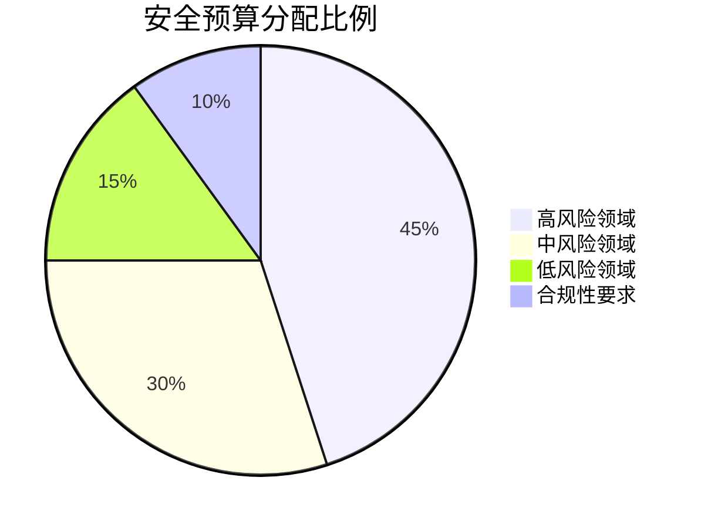

## 前言

在当今复杂多变的安全环境中，组织面临着前所未有的安全挑战。然而，安全资源往往是有限的，如何在有限的预算和人力条件下构建有效的安全防御体系，成为安全领导者必须面对的核心问题。许多组织在安全投入上要么过度投入造成资源浪费，要么投入不足导致安全风险积聚。本文将深入探讨安全预算与资源管理的科学方法，帮助组织构建可持续的安全投入模式。

## 安全预算的挑战与现状

当前组织在安全预算管理上普遍面临以下挑战：

- **安全需求无限与预算有限的矛盾**：随着威胁环境日益复杂，安全需求呈指数级增长，而预算增长却往往滞后。
- **安全投资回报难以量化**：与其他IT投资不同，安全投入的"回报"往往体现在"避免的损失"上，难以直接量化。
- **安全预算分配不均**：常见的是"重技术轻人员"或"重防御轻检测"的失衡现象。
- **安全预算缺乏战略性规划**：许多组织的安全预算仍然是被动响应式的，缺乏前瞻性和战略性。

> 安全预算不应被视为纯粹的"成本中心"，而应被视为"价值中心"，通过科学管理为组织创造实际价值。

## 安全预算的科学分配方法

### 基于风险的预算分配

最科学的安全预算分配方法是基于风险评估的结果：

1. **资产价值评估**：识别和评估组织的关键资产，确定其业务价值和重要性。
2. **威胁分析**：识别针对这些资产的主要威胁及其发生概率。
3. **风险评估**：计算风险值 = 资产价值 × 威胁概率 × 潜在影响。
4. **资源分配**：根据风险值高低，将安全预算优先分配给高风险领域。



### 基于成熟度的预算规划

组织的安全成熟度不同，预算分配策略也应有所区别：

- **初级阶段**：重点投入基础安全控制和合规性建设。
- **中级阶段**：加强检测和响应能力，提升安全运营效率。
- **高级阶段**：构建主动防御体系，推动安全创新和自动化。

### 安全投资组合管理

将安全预算视为投资组合，采用多元化策略：

- **防御性投资**：防火墙、端点保护等基础防护措施。
- **检测性投资**：SIEM、威胁检测系统等安全监控工具。
- **响应性投资**：安全运营中心、事件响应团队等。
- **战略性投资**：安全创新、安全研究等前瞻性项目。

## 人力资源的科学配置

安全预算不仅包括技术投入，更重要的是人力资源的合理配置：

### 安全团队结构优化

根据组织规模和需求，构建适合的安全团队结构：

- **小型组织**：采用"安全冠军"模式，由IT团队中的成员兼任安全职责。
- **中型组织**：组建专职安全团队，涵盖安全架构、安全运维、安全开发等角色。
- **大型组织**：建立完整的安全组织架构，包括安全治理、安全运营、安全研发等部门。

### 安全技能矩阵建设

构建组织所需的安全技能矩阵，确保团队具备全面的安全能力：

| 安全领域 | 初级需求 | 中级需求 | 高级需求 |
|---------|---------|---------|---------|
| 网络安全 | 基础网络防护 | 高级威胁检测 | 网络架构设计 |
| 应用安全 | 安全编码规范 | 应用渗透测试 | 安全架构设计 |
| 数据安全 | 数据分类分级 | 加密技术实施 | 数据生命周期管理 |
| 云安全 | 云安全配置 | 云安全架构 | 云原生安全 |
| 合规管理 | 合规检查 | 合规框架实施 | 合规战略规划 |

### 外部资源整合

合理利用外部资源，弥补内部安全能力的不足：

- **安全服务提供商**：将部分安全运营工作外包给专业服务商。
- **安全咨询**：定期引入外部专家进行安全评估和指导。
- **安全社区**：积极参与安全社区，获取最新威胁情报和最佳实践。

## 安全预算的绩效评估

建立科学的绩效评估体系，确保安全预算投入的有效性：

### 安全度量指标

建立多维度的安全度量指标体系：

1. **技术指标**：
   - 安全漏洞修复时间
   - 安全事件检测时间
   - 安全事件响应时间
   - 安全控制覆盖率

2. **业务指标**：
   - 安全事件造成的业务损失
   - 安全投资回报率(ROI)
   - 安全合规达标率

3. **战略指标**：
   - 安全成熟度提升
   - 安全创新项目数量
   - 安全团队满意度

### 安全预算ROI分析

计算安全投资的回报率：

```
安全ROI = (避免的损失 - 安全投入) / 安全投入 × 100%
```

需要注意的是，安全ROI的计算往往需要考虑长期因素，包括品牌声誉、客户信任等难以量化的价值。

## 安全预算规划的最佳实践

### 前瞻性预算规划

- 采用滚动预算模式，每年进行中期调整。
- 将安全预算与业务发展计划对齐，确保安全投入与业务增长同步。
- 预留应急预算，应对突发安全事件。

### 预算透明度与沟通

- 向管理层和业务部门清晰传达安全投入的价值和必要性。
- 定期发布安全预算报告，展示资金使用情况和成果。
- 建立安全成本模型，帮助各部门理解安全控制的成本效益。

### 持续优化机制

- 定期评估安全预算分配的有效性，根据实际情况进行调整。
- 建立安全预算优化机制，持续提高资金使用效率。
- 关注新兴安全技术，适时引入创新解决方案。

## 结语

安全预算与资源管理是安全战略成功的关键因素。通过科学的风险评估、合理的资源分配、有效的绩效评估和持续优化机制，组织可以在有限的资源条件下构建强大的安全防御体系。安全预算不应被视为单纯的成本，而应被视为组织价值创造的重要投资。只有将安全预算管理纳入组织整体战略，才能实现安全与业务的平衡发展，为组织的长期成功保驾护航。

> 安全投入不是成本，而是保护组织价值和未来发展的必要投资。在资源有限的环境中，科学的安全预算管理将成为组织安全竞争力的关键决定因素。