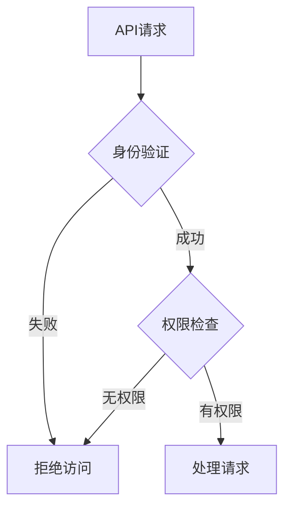

## 前言

在当今数字化转型的浪潮中，应用程序架构正经历着从单体到微服务，再到无服务器的演进。在这个过程中，API（应用程序编程接口）作为不同系统间通信的桥梁，扮演着至关重要的角色。🌉

然而，随着API使用的普及，API安全威胁也日益增多。根据最新的安全报告，超过90%的企业经历了某种形式的API安全事件。作为一个开发者和安全爱好者，我深感我们需要对API安全有更深入的理解。

> "API不是应用的附属品，它们本身就是应用。" —— 安全专家经常提醒我们这句话。

## API安全威胁与风险

### 常见的API安全威胁

::: theorem
API安全威胁可以大致分为以下几类：
1. **身份认证与授权问题**：弱认证机制、过度权限、令牌管理不当
2. **数据安全问题**：敏感数据泄露、缺乏加密传输
3. **业务逻辑漏洞**：速率限制不当、越权访问、参数篡改
4. **实现缺陷**：注入攻击、错误处理不当、信息泄露
:::

### 实际案例分析

让我分享一个我曾经遇到的真实案例：某电商平台通过API暴露了用户订单信息，由于缺乏适当的访问控制，攻击者只需修改订单ID参数，就能获取其他用户的订单详情。🤦‍♂️

这个案例告诉我们，API安全不仅仅是技术问题，更是设计和架构问题。

## API安全最佳实践

### 1. 强大的认证与授权机制

我推荐使用OAuth 2.0和OpenID Connect进行身份验证，并结合基于角色的访问控制(RBAC)或基于属性的访问控制(ABAC)进行授权。

### 2. 输入验证与输出编码

~~我曾经天真地认为，只要在后端做一次输入验证就足够了~~，直到我发现前端验证可以被轻易绕过。现在，我坚持在所有可能的入口点进行输入验证，并对所有输出进行适当的编码。

### 3. 安全的API设计

- 使用RESTful或GraphQL等标准API设计模式
- 实施适当的速率限制和配额控制
- 提供详细的API文档，但不暴露敏感信息
- 使用版本控制管理API变更

### 4. 加密与安全传输

::: tip
始终使用HTTPS/TLS保护API通信，即使是在内部网络中。TLS 1.2或更高版本是最低要求。
:::

## API安全工具与技术

### API安全测试工具

作为一名开发者，我经常使用以下工具进行API安全测试：

1. **OWASP ZAP** - 开源的Web应用和API安全扫描器
2. **Postman** - 除了API测试，还提供安全测试功能
3. **Burp Suite** - 强大的Web和API安全测试平台

### API网关与WAF

API网关是保护API的第一道防线，它可以提供：
- 请求/响应转换
- 认证与授权
- 限流与熔断
- 日志与监控

我推荐使用Kong、Tyk或AWS API Gateway等成熟的API网关解决方案。

## 结语

在API驱动的现代应用架构中，API安全不再是可有可无的选项，而是必须的核心能力。🛡️

通过实施强大的认证机制、严格的输入验证、安全的API设计和适当的安全工具，我们可以构建出既强大又安全的API系统。

记住，安全是一个持续的过程，而不是一次性的项目。定期进行安全审计、漏洞扫描和渗透测试，才能确保我们的API系统始终安全可靠。

> "在API安全领域，预防胜于治疗。构建安全API的成本远低于修复被攻破API的成本。" —— 这是我在安全领域学到的最重要的一课。

希望这篇博客能帮助大家更好地理解和实施API安全实践。如果你有任何问题或经验分享，欢迎在评论区交流！👇