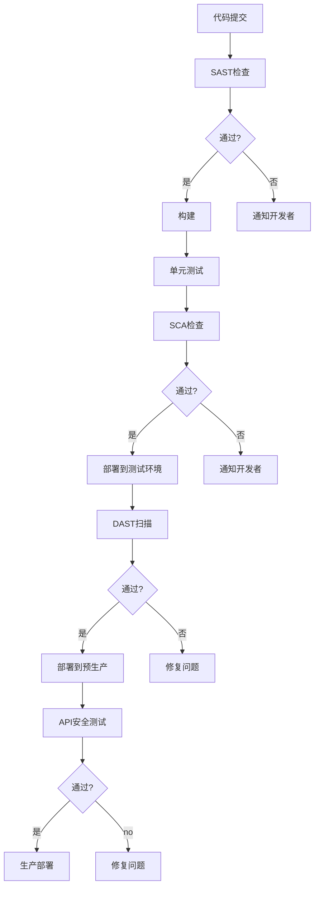

## 前言

在当今快速迭代的软件开发环境中，安全不再是事后补救的选项，而是必须贯穿整个开发流程的核心要素。随着DevOps和CI/CD实践的普及，安全测试自动化已成为构建持续安全防护的关键引擎。然而，许多组织在实施安全测试自动化时面临着工具选择、流程集成和效率提升等多重挑战。

本文将深入探讨安全测试自动化的核心概念、实施策略和最佳实践，帮助您构建高效的安全测试自动化体系，让安全成为软件开发的自然组成部分，而非阻碍。

## 安全测试自动化的价值与挑战

### 为什么需要安全测试自动化？

在传统开发模式中，安全测试往往集中在开发周期的后期，导致发现的安全修复成本高昂，甚至可能延误发布。安全测试自动化能够：

- **早期发现安全缺陷**：在开发早期阶段识别潜在风险，大幅降低修复成本
- **持续监控与反馈**：在每次代码变更时自动执行安全检查，提供即时反馈
- **提高测试覆盖率**：自动化可以执行更全面、更频繁的安全测试
- **标准化安全检查**：确保所有代码都遵循一致的安全标准
- **释放安全专家资源**：将重复性任务自动化，让安全专家专注于复杂问题

### 实施安全测试自动化的常见挑战

尽管价值显著，但安全测试自动化实施过程中仍面临诸多挑战：

- **工具选择困难**：市场上安全测试工具繁多，难以选择适合组织需求的工具
- **测试覆盖率不足**：自动化测试难以覆盖所有安全场景
- **误报率高**：自动化工具可能产生大量误报，消耗团队精力
- **集成复杂**：将安全测试工具无缝集成到现有CI/CD流程中并非易事
- **技能要求高**：实施和维护安全测试自动化需要多领域专业知识

## 安全测试自动化的核心组件

构建有效的安全测试自动化体系需要关注以下几个核心组件：

### 1. 静态应用安全测试 (SAST)

SAST工具在开发过程中分析源代码、字节码或二进制代码，以识别潜在的安全漏洞。

**常用工具**：
- SonarQube/SonarCloud
- Checkmarx
- Veracode
- Semgrep
- ESLint (针对JavaScript)

**实施要点**：
- 配置适当的规则集，平衡检测准确性与误报率
- 将SAST集成到IDE和代码提交前检查
- 建立基线，持续改进规则配置

### 2. 动态应用安全测试 (DAST)

DAST工具通过在运行时测试应用程序来识别安全漏洞，模拟攻击者的行为。

**常用工具**：
- OWASP ZAP
- Burp Suite
- Acunetix
- Nessus
- SQLMap (针对SQL注入)

**实施要点**：
- 在预生产环境进行定期扫描
- 配置适当的扫描策略，避免生产环境干扰
- 结合CI/CD流水线，在部署前执行扫描

### 3. 软件成分分析 (SCA)

SCA工具用于检测开源组件中的已知漏洞和许可证合规性问题。

**常用工具**：
- Snyk
- Black Duck
- Dependency-Check
- OWASP Dependency-Check
- Mend

**实施要点**：
- 在开发早期引入SCA检查
- 建立组件库白名单，控制风险
- 定期更新漏洞数据库

### 4. 运行时应用自我保护 (RASP)

RASP工具在应用程序运行时提供实时保护，检测并阻止攻击。

**常用工具**：
- Contrast Security
- Prevoty
- OpenRASP
- Sqreen

**实施要点**：
- 部署在预生产环境验证效果
- 配置适当的响应策略，平衡安全性与可用性
- 监控攻击尝试，持续优化规则

### 5. API安全测试

随着API成为现代应用的核心，API安全测试变得尤为重要。

**常用工具**：
- Postman (结合Newman)
- SoapUI
- Apigee
- 42Crunch
- OWASP API Security Project

**实施要点**：
- 设计专门的API安全测试用例
- 测试身份验证、授权和数据加密
- 验证API速率限制和输入验证

## 构建安全测试自动化策略

### 1. 分阶段实施策略

根据组织成熟度，可采用分阶段实施策略：

**第一阶段：基础自动化**
- 引入SAST和SCA工具
- 在代码提交前执行基本检查
- 建立安全基线和阈值

**第二阶段：扩展覆盖**
- 添加DAST和API安全测试
- 在CI/CD流水线中集成安全测试
- 实施安全门禁，阻止高风险版本发布

**第三阶段：智能优化**
- 引入RASP技术
- 实施安全测试结果分析和趋势监控
- 建立安全测试自动化优化机制

### 2. CI/CD集成最佳实践

将安全测试自动化无缝集成到CI/CD流程中是成功的关键：

**关键集成点**：
- 代码提交前：SAST和SCA检查
- 构建阶段：静态分析和依赖检查
- 测试环境：DAST和API安全测试
- 部署前：安全合规检查

### 3. 安全测试自动化管理框架

建立有效的管理框架确保安全测试自动化的持续改进：

**1. 工具选择与评估**
- 定义明确的评估标准
- 进行概念验证测试
- 选择适合组织规模和需求的工具

**2. 规则与策略管理**
- 建立安全规则库
- 定期审查和更新规则
- 平衡检测准确性与误报率

**3. 结果管理与响应**
- 建立安全测试结果分析流程
- 实施分级响应机制
- 跟踪修复进度和趋势

**4. 持续改进机制**
- 定期评估自动化效果
- 收集用户反馈
- 优化测试策略和工具配置

## 实施安全测试自动化的组织准备

### 1. 团队角色与职责

成功实施安全测试自动化需要明确团队角色与职责：

| 角色 | 职责 |
|------|------|
| 安全架构师 | 设计安全测试自动化架构和策略 |
| DevOps工程师 | 集成安全工具到CI/CD流水线 |
| 开发者 | 编写安全代码，响应测试结果 |
| 安全工程师 | 配置安全工具，分析复杂问题 |
| QA工程师 | 确保测试覆盖率和质量 |

### 2. 技能培养

安全测试自动化需要跨领域技能培养：

- **开发技能**：理解CI/CD流程，掌握基础脚本编写
- **安全知识**：熟悉常见漏洞类型和防御措施
- **工具使用**：熟练操作各类安全测试工具
- **分析能力**：能够解读测试结果，区分真伪阳性

### 3. 文化转变

安全测试自动化的成功实施需要文化转变：

- **从"安全是安全团队的责任"到"安全是每个人的责任"**
- **从"安全是开发障碍"到"安全是质量保障"**
- **从"被动响应"到"主动预防"**
- **从"一次性测试"到"持续监控"**

## 案例研究：成功实施安全测试自动化的企业

### 案例1：金融科技公司的SAST与DAST集成

某金融科技公司通过以下步骤成功实施了安全测试自动化：

1. **评估与规划**：评估现有流程，制定分阶段实施计划
2. **工具选择**：选择SonarQube作为SAST工具，OWASP ZAP作为DAST工具
3. **流程集成**：将安全测试集成到Jenkins CI/CD流水线
4. **团队培训**：对开发团队进行安全编码和工具使用培训
5. **持续优化**：定期评估测试效果，优化规则配置

**成果**：
- 安全缺陷修复时间缩短70%
- 生产环境安全事件减少60%
- 开发团队安全意识显著提升

### 案例2：电商平台的API安全自动化

某电商平台专注于API安全测试自动化：

1. **API发现与分类**：自动发现和分类所有API端点
2. **安全测试集成**：将Postman和OWASP API Security测试集成到CI流程
3. **运行时保护**：实施RASP技术保护关键API
4. **持续监控**：建立API安全监控仪表板

**成果**：
- API安全漏洞发现率提高85%
- API相关安全事件减少75%
- API开发团队安全编码能力提升

## 未来趋势与展望

安全测试自动化领域正在快速发展，以下趋势值得关注：

### 1. 人工智能与机器学习应用

AI技术正在改变安全测试自动化：

- **智能漏洞检测**：利用机器学习减少误报，提高检测准确率
- **自适应测试**：根据应用特性自动调整测试策略
- **预测性分析**：预测潜在安全风险，提前采取预防措施

### 2. DevSecOps深度融合

安全测试自动化将进一步融入DevSecOps：

- **左移安全**：安全测试更早地进入开发流程
- **安全即代码**：安全策略和规则作为代码管理
- **持续安全验证**：在整个软件生命周期中持续验证安全性

### 3. 云原生安全测试

随着云原生应用的普及，云环境安全测试自动化变得重要：

- **容器安全扫描**：自动检测容器镜像中的安全漏洞
- **Kubernetes安全测试**：验证Kubernetes配置安全性
- **云配置安全评估**：持续监控云资源配置合规性

### 4. 威胁驱动的安全测试

基于威胁情报的安全测试自动化将成为趋势：

- **威胁情报集成**：将外部威胁情报整合到安全测试中
- **攻击路径模拟**：模拟攻击者路径，验证防御有效性
- **风险优先级排序**：根据实际风险调整测试优先级

## 结语

安全测试自动化是构建现代安全开发体系的核心组件。通过系统性地实施安全测试自动化，组织可以在开发早期识别和修复安全缺陷，大幅降低安全风险，同时加速软件交付速度。

成功实施安全测试自动化不仅需要合适的工具和技术，更需要组织文化的转变和跨团队协作。从SAST、DAST到SCA和API安全测试，每个组件都有其独特价值，需要根据组织需求进行合理组合。

随着DevSecOps和AI技术的发展，安全测试自动化将变得更加智能和高效。组织应持续关注这一领域的最新发展，不断优化自身安全测试自动化策略，构建真正安全、可靠的软件系统。

> 安全不是一次性的任务，而是持续的过程。通过自动化安全测试，我们让安全成为软件开发的自然组成部分，而非事后补救的负担。

---

希望本文能帮助您构建有效的安全测试自动化体系。如果您有任何问题或经验分享，欢迎在评论区留言讨论！