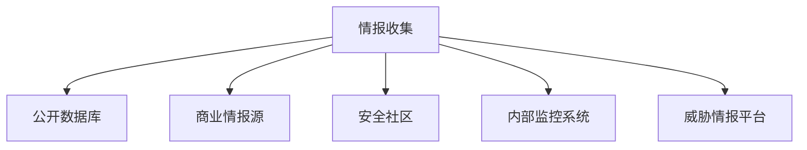
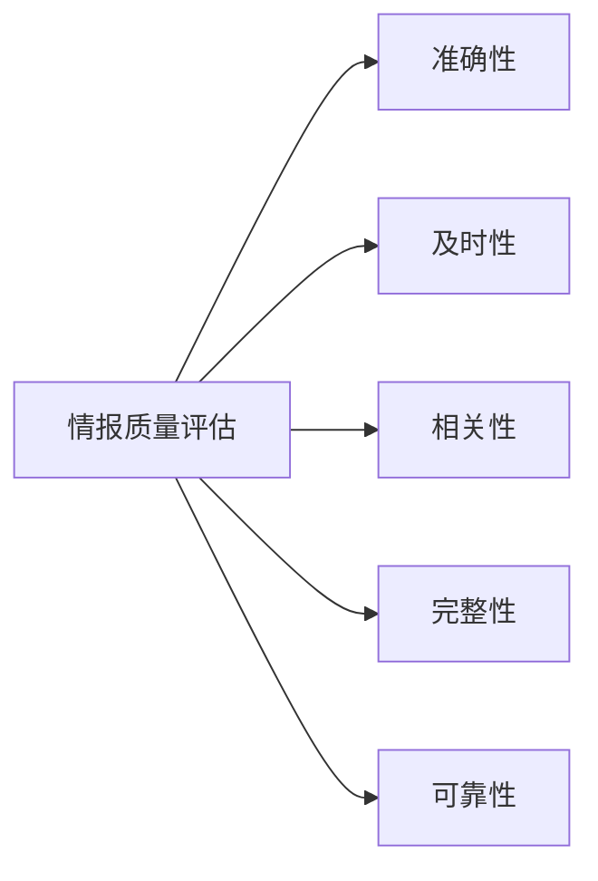

## 前言

在当今复杂的网络安全环境中，企业面临着日益增长的安全威胁。传统的被动防御模式已经难以应对高级持续性威胁(APT)和零日漏洞的攻击。🤔 作为安全从业者，我们如何才能从被动响应转变为主动防御呢？

答案之一就是建立强大的安全漏洞情报体系。📡 安全漏洞情报整合与应用已成为现代安全运营的核心能力，它能够帮助我们提前发现潜在威胁，有效防御已知漏洞，并从海量信息中提取有价值的情报。

在这篇文章中，我将分享如何构建一个完整的漏洞情报整合与应用体系，助力企业实现安全防御的转型升级。

## 漏洞情报概述

### 什么是漏洞情报？

安全漏洞情报是指与系统、应用程序或网络中可能被利用的安全弱点相关的信息。它不仅仅是简单的漏洞列表，而是包含了漏洞的详细信息、利用方式、影响范围以及修复建议等综合信息。

::: tip
**漏洞情报的价值**：有效的漏洞情报能够帮助组织在攻击者利用漏洞之前识别并修复它们，从而大大降低被攻击的风险。
:::

### 漏洞情报的类型

漏洞情报可以根据来源和性质分为多种类型：

1. **公开漏洞情报**：来自CVE、NVD等公开数据库的漏洞信息
2. **商业漏洞情报**：来自商业安全供应商的专业分析报告
3. **社区漏洞情报**：来自安全研究人员和黑客社区的发现
4. **内部漏洞情报**：来自组织内部安全测试和监控的发现
5. **威胁情报**：与特定威胁行为者或攻击活动相关的漏洞信息

## 漏洞情报整合架构

### 情报收集层

情报收集是漏洞情报体系的基础，需要从多个渠道获取信息：



**关键实践**：
- 建立自动化收集机制，确保情报的实时性
- 对收集的情报进行初步筛选，排除噪音和重复信息
- 建立情报质量评估机制，确保情报的可靠性

### 情报处理层

收集到的原始情报需要经过处理才能转化为可用的信息：

1. **标准化**：将不同来源的情报转换为统一格式
2. **去重**：消除重复的情报信息
3. **验证**：确认情报的准确性和可靠性
4. **关联**：将相关联的情报信息进行关联分析

### 情报分析层

处理后的情报需要进一步分析，以提取有价值的信息：

1. **漏洞影响评估**：分析漏洞对组织的潜在影响
2. **利用可能性分析**：评估漏洞被利用的可能性和难度
3. **威胁关联分析**：将漏洞与特定的威胁行为者或攻击活动关联
4. **趋势分析**：识别漏洞利用的趋势和模式

### 情报应用层

分析后的情报需要应用到实际的安全防护中：

1. **漏洞管理**：指导漏洞修复的优先级排序
2. **安全配置**：基于漏洞情报调整安全配置
3. **威胁检测**：更新威胁检测规则和签名
4. **安全培训**：为安全团队提供针对性的培训

## 漏洞情报整合实践

### 情报来源整合

有效的漏洞情报整合需要从多个来源获取信息：

| 情报来源 | 特点 | 适用场景 |
|---------|------|---------|
| CVE/NVD | 权威、全面 | 基础漏洞信息查询 |
| 商业情报源 | 专业、深入 | 企业级漏洞管理 |
| 安全社区 | 及时、前沿 | 新兴威胁发现 |
| 内部系统 | 定制化、实时 | 内部资产风险管理 |
| 威胁情报平台 | 上下文丰富 | 高级威胁防御 |

**整合策略**：
- 建立统一的情报收集接口，支持多种数据源
- 实现情报的自动去重和关联
- 设计灵活的情报存储结构，支持多维度查询

### 情报质量评估

情报质量直接影响安全决策的准确性，需要建立科学的评估机制：



**评估指标**：
- 准确性：情报信息与实际情况的一致程度
- 及时性：情报从产生到可用的时间间隔
- 相关性：情报与组织资产和业务的相关程度
- 完整性：情报信息的全面性和详细程度
- 可靠性：情报来源的可信度和权威性

### 情报关联分析

关联分析是漏洞情报整合的高级应用，能够发现隐藏的威胁模式：

1. **时间关联**：分析漏洞发现、利用和修复的时间规律
2. **空间关联**：分析漏洞在不同系统和网络中的分布
3. **威胁行为者关联**：将特定漏洞与特定攻击者关联
4. **攻击链关联**：构建完整的攻击链，识别关键节点

**技术实现**：
- 使用图数据库存储和查询关联信息
- 应用机器学习算法自动发现关联模式
- 建立可视化展示界面，直观呈现关联关系

## 漏洞情报应用场景

### 漏洞管理优化

传统的漏洞管理往往基于CVSS评分进行优先级排序，但这种方法忽略了实际威胁环境。通过整合漏洞情报，可以实现更智能的漏洞管理：

**优先级评估模型**：
```
漏洞优先级 = CVSS评分 × 利用可能性 × 业务影响 × 风险暴露度
```

**应用实践**：
- 根据漏洞情报动态调整修复优先级
- 针对高价值资产实施重点防护
- 建立漏洞修复SLA，确保关键漏洞及时修复

### 威胁检测增强

漏洞情报可以显著提升威胁检测能力：

1. **IOCs更新**：基于漏洞情报更新威胁指标
2. **检测规则优化**：针对特定漏洞设计检测规则
3. **异常行为检测**：识别与漏洞利用相关的异常行为
4. **攻击预测**：预测可能的攻击路径和目标

**实施步骤**：
- 分析漏洞利用的技术细节
- 设计针对性的检测规则
- 在安全设备中部署更新规则
- 持续监控检测效果并优化

### 安全态势可视化

将漏洞情报整合到安全态势管理平台，实现全面可视化：

**可视化要素**：
- 漏洞分布热力图
- 漏洞趋势分析图表
- 漏洞修复进度仪表盘
- 威胁情报关联图谱

**价值体现**：
- 直观展示安全风险全貌
- 快速识别高风险区域
- 辅助安全决策制定
- 提升安全沟通效率

## 漏洞情报整合挑战与对策

### 面临的挑战

1. **情报过载**：海量情报信息难以有效处理
2. **质量参差不齐**：不同来源的情报质量差异大
3. **整合复杂度高**：多种格式和标准的数据整合困难
4. **时效性要求高**：情报需要快速处理和应用
5. **专业人才缺乏**：既懂安全又懂数据分析的人才稀缺

### 应对策略

1. **智能化处理**：
   - 应用AI和机器学习技术自动处理情报
   - 建立智能筛选和分类机制
   - 实现自动化关联分析

2. **标准化建设**：
   - 采用STIX、TAXII等标准格式
   - 建立内部情报分类标准
   - 设计统一的情报交换接口

3. **流程优化**：
   - 建立闭环的情报处理流程
   - 实现自动化情报分发和应用
   - 设计高效的应急响应机制

4. **人才培养**：
   - 开展安全数据分析培训
   - 建立跨部门协作机制
   - 引入外部专家资源

## 未来展望

随着技术的发展，漏洞情报整合与应用将呈现以下趋势：

### AI驱动的智能分析

人工智能将在漏洞情报分析中发挥越来越重要的作用：

1. **自动漏洞发现**：AI辅助识别新型漏洞
2. **智能威胁预测**：基于历史数据预测未来威胁
3. **自动化响应**：AI驱动的自动化漏洞响应
4. **个性化防护**：基于组织特点的定制化防护方案

### 情报共享生态建设

构建更加开放的情报共享生态：

1. **行业联盟**：建立行业内的情报共享联盟
2. **标准化平台**：发展标准化的情报交换平台
3. **激励机制**：设计合理的情报共享激励机制
4. **隐私保护**：在共享过程中保护敏感信息

### 主动防御体系

漏洞情报将成为构建主动防御体系的核心：

1. **预测性防御**：基于预测的提前防御
2. **自适应安全**：能够自动调整的安全机制
3. **持续验证**：持续验证防御措施的有效性
4. **闭环管理**：从情报获取到效果评估的闭环管理

## 结语

安全漏洞情报整合与应用是构建现代安全防御体系的核心能力。通过系统化的情报收集、处理、分析和应用，企业可以从被动防御转向主动防御，有效应对日益复杂的安全威胁。

建立完善的漏洞情报体系不是一蹴而就的事情，需要持续投入和优化。希望本文分享的思路和实践能够为您的安全建设提供有益的参考。记住，在网络安全领域，情报就是力量，整合就是优势，应用就是价值。

> "在数字时代的战场上，谁能更快地获取、理解和应用情报，谁就能掌握主动权。"

让我们共同努力，构建更加智能、高效的安全漏洞情报体系，为数字世界保驾护航！🚀