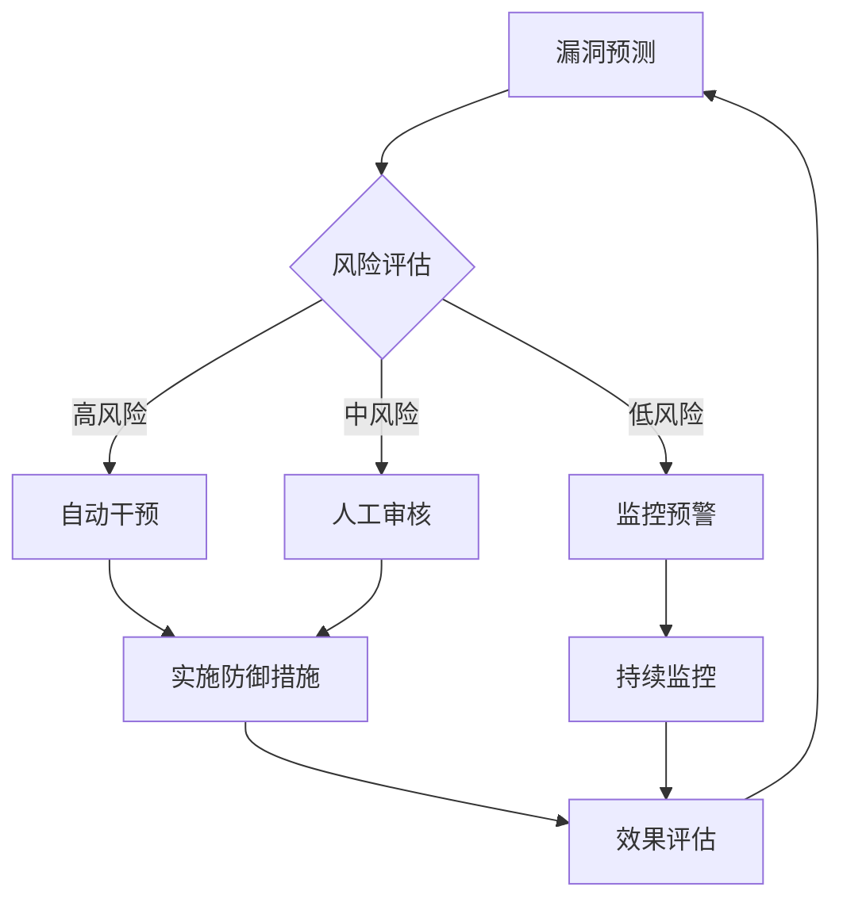

## 前言

在当今快速变化的威胁环境中，传统的安全防御模式已难以应对日益复杂的攻击手段。🤔 当我们还在忙于修补已知漏洞时，攻击者早已发现了新的攻击面。~~被动防御就像是"亡羊补牢"，永远慢人一步~~。幸运的是，随着人工智能和大数据技术的发展，我们正迎来安全防御的范式转变——从被动响应转向主动预测。

> "预测未来的最好方式，就是创造它。" —— 彼得·德鲁克

在这篇文章中，我将探讨如何利用数据分析和机器学习技术，构建能够预测潜在漏洞并实施主动防御的前瞻性安全体系。让我们一起探索安全领域的"水晶球"，看看如何在不远的未来"预见"攻击。

## 安全漏洞预测技术

### 数据驱动的漏洞预测

安全漏洞预测的核心在于从海量数据中识别出可能被利用的模式和趋势。这不仅仅是简单的威胁情报收集，而是通过深度分析历史漏洞数据、代码特征、攻击模式等多维度信息，预测哪些系统或组件可能成为下一个攻击目标。

::: tip
漏洞预测不是凭空猜测，而是基于历史数据和算法模型的科学推断。就像气象学家通过分析大气数据预测天气一样，安全专家可以通过分析漏洞数据预测潜在风险。
:::

### 机器学习在漏洞预测中的应用

机器学习算法，特别是深度学习模型，在漏洞预测中展现出巨大潜力。以下是一些关键应用场景：

- **代码相似性分析**：通过比较代码片段，识别可能存在相同漏洞的相似代码
- **依赖关系分析**：分析软件组件间的依赖关系，预测供应链攻击风险
- **漏洞模式识别**：从历史漏洞数据中学习攻击模式，识别类似的新漏洞
- **攻击者行为建模**：分析攻击者的行为模式，预测可能的攻击路径

```python
# 伪代码：基于代码特征的漏洞预测模型
def predict_vulnerabilities(code_features, model):
    """
    使用预训练模型预测代码中的潜在漏洞
    :param code_features: 提取的代码特征向量
    :param model: 预训练的漏洞预测模型
    :return: 漏洞风险评分和可能漏洞类型
    """
    risk_score = model.predict(code_features)
    vulnerability_types = model.classify(code_features)
    return risk_score, vulnerability_types
```

### 漏洞预测的数据源

有效的漏洞预测需要多源数据的融合：

1. **内部数据**：
   - 代码仓库提交历史
   - 漏洞扫描报告
   - 安全测试结果
   - 系统配置信息

2. **外部数据**：
   - 公开漏洞数据库（CVE、NVD等）
   - 漏洞赏金平台数据
   - 学术研究论文
   - 暗网威胁情报

## 主动防御策略

### 从预测到行动

漏洞预测的价值在于指导主动防御。当系统识别出潜在的高风险区域时，应立即采取防御措施，而不是等待漏洞被实际利用。

::: theorem
主动防御三角模型：
1. **预测**：识别潜在风险
2. **优先级**：评估风险影响和可能性
3. **干预**：实施针对性防御措施
:::

### 实时响应机制

构建能够自动响应预测结果的防御系统：

- **自动补丁部署**：对预测的高风险组件自动应用安全补丁
- **访问控制调整**：基于预测风险动态调整访问控制策略
- **流量重定向**：将可能受攻击的流量转移到安全环境
- **资源隔离**：对预测的高风险系统进行隔离保护

### 预测性安全编排

将预测结果与安全编排自动化响应(SOAR)系统集成，实现从预测到响应的闭环：



## 实施挑战与解决方案

### 数据质量与完整性挑战

高质量的预测依赖于高质量的数据。然而，安全数据往往分散、不完整且格式不一。

**解决方案**：
- 建立统一的数据收集和标准化流程
- 实施数据清洗和增强技术
- 开发专门的安全数据湖，整合多源数据

### 模型准确性与可解释性

复杂的机器学习模型虽然准确率高，但往往缺乏可解释性，难以让安全团队理解和信任预测结果。

**解决方案**：
- 采用可解释AI(XAI)技术，如SHAP、LIME
- 开发可视化工具展示预测依据
- 建立人机协作的审核机制

### 组织文化与流程变革

引入预测性安全需要改变传统的安全工作方式，这往往面临组织文化和流程的阻力。

**解决方案**：
- 从小规模试点项目开始，逐步推广
- 提供充分的培训和变更管理支持
- 建立明确的KPI，量化预测性安全的价值

## 案例研究

### 案例一：金融行业的漏洞预测平台

某全球金融机构开发了一个基于机器学习的漏洞预测平台，通过分析内部代码库和外部漏洞数据，成功预测了87%的关键漏洞，并将平均修复时间从14天缩短至3天。

**关键成功因素**：
- 高质量的代码特征提取
- 跨部门数据共享机制
- 自动化响应流程

### 案例二：科技公司的主动防御系统

一家大型科技公司实施了预测性安全系统，通过分析开发活动模式，预测了多个潜在的供应链攻击风险，并提前部署了防御措施，避免了潜在的数百万美元损失。

**关键成功因素**：
- 实时数据流处理能力
- 精细化的风险评估模型
- 与DevOps流程的深度集成

## 未来展望

### 预测性安全的发展趋势

1. **更智能的预测模型**：结合图神经网络和强化学习，提高预测准确性
2. **边缘计算应用**：将预测能力下沉到边缘设备，实现本地化防御
3. **自适应防御系统**：能够根据预测结果自动调整防御策略
4. **跨组织协作预测**：通过行业联盟共享预测模型和数据

### 面临的新挑战

随着预测技术的发展，攻击者也会进化，可能出现针对预测系统的对抗性攻击。我们需要不断改进预测模型，提高其鲁棒性和抗干扰能力。

## 结语

安全漏洞预测与主动防御代表了安全领域的重要发展方向。它不仅改变了我们应对威胁的方式，更从根本上重塑了安全防护的理念——从被动响应转向主动预防。

正如我在这篇文章中探讨的，构建预测性安全体系虽然面临诸多挑战，但其带来的价值是巨大的。通过数据驱动的洞见和智能化的防御策略，我们可以预见风险、提前布局，真正做到"防患于未然"。

对于希望在这一领域探索的组织，我建议从小处着手，逐步构建数据基础和预测能力，同时培养相应的安全文化。记住，预测性安全不是一蹴而就的项目，而是一个持续演进的过程。

> "最好的安全策略是让攻击者觉得你的系统'太难啃'，从而转向更容易的目标。" —— 不知名安全专家

让我们一起拥抱安全预测的未来，构建更智能、更主动的安全防护体系！🚀