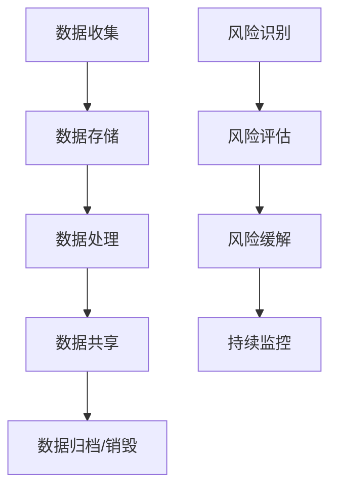

## 前言

在数字化转型的浪潮中，数据已成为企业最宝贵的资产之一。然而，随着数据价值的提升，数据泄露和隐私侵犯事件也频频发生，从Facebook的剑桥分析丑闻到Marriott酒店的数据库泄露，这些事件不仅给企业带来巨大经济损失，更严重损害了用户信任。~~作为开发者，我们常常只关注功能实现，却忽略了数据安全这个"看不见的防线"~~。

本文将深入探讨数据安全与隐私保护的核心概念、最佳实践以及如何构建一个全面的数据安全框架，帮助你在开发过程中将数据安全融入DNA。

## 数据安全与隐私保护的核心概念

### 数据分类与分级

::: tip
数据分类是数据安全的第一步，就像整理衣柜一样，我们需要知道哪些是"贵重物品"，哪些是"日常衣物"。
:::

数据分类通常基于以下几个维度：

- **敏感性**：数据的敏感程度，如个人身份信息(PII)、财务信息、健康数据等
- **价值**：数据对企业的重要性，如商业秘密、客户数据等
- **使用场景**：数据的用途和处理方式

常见的数据分级包括：

| 分级 | 定义 | 示例 | 保护要求 |
|------|------|------|---------|
| 公开 | 可以自由共享的信息 | 公司介绍、产品信息 | 基本保护 |
| 内部 | 仅限组织内部使用的信息 | 内部文档、会议记录 | 中等保护 |
| 机密 | 对组织有重要价值的信息 | 商业计划、技术方案 | 高度保护 |
| 绝密 | 对组织生存至关重要的信息 | 核心算法、战略规划 | 最高保护 |

### 数据生命周期管理

数据生命周期包括以下几个关键阶段：

1. **创建**：数据生成或收集的阶段
2. **存储**：数据保存的阶段，需要考虑存储位置、加密等
3. **使用**：数据被访问和处理的阶段
4. **共享**：数据在内部或外部传递的阶段
5. **归档**：数据不再活跃但仍需保留的阶段
6. **销毁**：数据被永久删除的阶段

在每个阶段，都需要实施相应的安全控制措施。

## 隐私保护框架与法规

### 全球主要隐私法规

随着数据隐私意识的提高，各国纷纷出台了数据保护法规：

| 法规 | 适用地区 | 核心要求 | 违规后果 |
|------|----------|----------|----------|
| GDPR | 欧盟 | 数据最小化、目的限制、用户同意 | 全球年营业额4%或2000万欧元(取较高者) |
| CCPA | 加州 | 消费者权利、数据删除权 | 每次违规最高7500美元 |
| PIPL | 中国 | 个人信息处理、跨境传输 | 最高可处5000万元以下或上一年度营业额5%以下罚款 |
| PDPA | 新加坡 | 同意机制、访问权 | 最高100万新加坡元罚款 |

### 隐私设计(Privacy by Design)

隐私设计是一种将隐私保护融入系统设计和开发的方法论，其核心原则包括：

1. **主动而非被动**：在系统设计初期就考虑隐私问题，而非事后补救
2. **隐私默认设置**：默认情况下系统应保护隐私，用户需主动选择放弃
3. **嵌入式设计**：将隐私保护作为系统设计的核心组件
4. **端到端安全**：在整个数据生命周期中保护数据
5. **透明度**：确保数据处理过程对用户可见且可理解
6. **用户赋权**：让用户能够有效控制其个人数据

## 数据安全关键技术

### 数据加密技术

加密是保护数据安全的基础技术，主要分为以下几种类型：

1. **传输加密**：
   - TLS/SSL：保护数据在传输过程中的安全
   - VPN：创建安全的远程访问通道

2. **存储加密**：
   - 全盘加密：如BitLocker、FileVault
   - 文件/文件夹加密：如VeraCrypt
   - 数据库加密：透明数据加密(TDE)

3. **应用层加密**：
   - 字段级加密：对敏感字段单独加密
   - 令牌化：用令牌替换原始数据
   - 同态加密：允许对加密数据进行计算

### 数据泄露防护(DLP)

数据泄露防护系统旨在监控和控制数据流动，防止敏感数据外泄。DLP解决方案通常包括：

- **网络DLP**：监控网络流量，检测和阻止敏感数据传输
- **终端DLP**：控制终端设备上的数据操作
- **云DLP**：保护云环境中的数据
- **数据发现与分类**：自动发现和分类敏感数据

## 实施数据安全与隐私保护的实践步骤

### 1. 建立数据治理框架

::: theorem
数据治理是数据安全的基础，没有良好的治理框架，安全技术就如同没有地基的建筑。
:::

数据治理框架应包括：

- 数据所有权与责任分配
- 数据标准与定义
- 数据质量监控
- 数据生命周期管理策略
- 合规性要求

### 2. 进行数据映射与风险评估

数据映射是了解数据流向和处理过程的关键步骤：

### 3. 实施技术控制措施

基于风险评估结果，实施相应的技术控制：

- **访问控制**：
  - 基于角色的访问控制(RBAC)
  - 多因素认证(MFA)
  - 特权访问管理(PAM)

- **数据保护**：
  - 静态数据加密
  - 传输中数据加密
  - 数据脱敏

- **安全监控**：
  - 安全信息和事件管理(SIEM)
  - 用户行为分析(UEBA)
  - 数据活动监控(DAM)

### 4. 建立响应与恢复机制

即使有最好的防护措施，数据泄露仍可能发生。因此，需要建立：

- 事件响应计划
- 数据泄露通知流程
- 业务连续性计划
- 灾难恢复策略

## 结语

数据安全与隐私保护不仅是技术问题，更是业务问题和信任问题。在数字化时代，用户越来越关注自己的数据如何被使用，企业必须将数据安全与隐私保护作为核心竞争力之一。

~~记住，数据安全不是一次性的项目，而是一个持续的过程。就像健身一样，需要长期坚持才能看到效果~~。通过建立全面的数据安全框架、实施适当的技术控制措施，并培养全员的安全意识，我们才能构建一个既安全又可信的数字环境。

> "数据是新时代的石油，但保护数据安全的责任比开采石油更重大。" — Jorgen

---

*注：本文仅代表个人观点，如有不当之处，欢迎指正。*