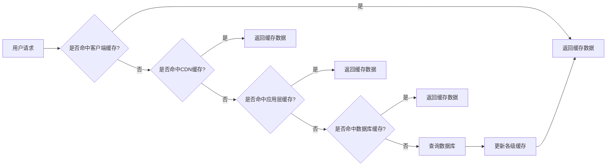

## 前言

在当今数字化时代，用户对应用的响应速度和系统性能有着越来越高的要求。一个性能不佳的应用不仅会影响用户体验，还可能导致业务损失。作为架构师，我们需要从架构层面思考如何设计和优化系统，以满足性能需求。

本文将探讨架构性能优化的关键策略和实践方法，帮助构建高效、可扩展的系统。

## 性能架构的重要性

性能不仅仅是代码层面的问题，更是架构设计的重要考量。良好的性能架构可以在系统面临高负载时保持稳定，而糟糕的架构则可能导致系统在流量增长时迅速崩溃。

::: tip
"过早的优化是万恶之源，但忽视性能问题同样危险。"
- Donald Knuth
:::

## 性能优化的核心原则

### 1. 测量而非猜测

在进行性能优化前，必须先通过测量确定性能瓶颈。盲目优化不仅浪费资源，还可能引入新的问题。

### 2. 优化关键路径

将资源集中在影响用户体验的关键路径上，而不是平均用力。

### 3. 考虑可扩展性

优化方案应考虑系统的可扩展性，确保随着业务增长，系统性能能够线性或接近线性地扩展。

## 架构层面的性能优化策略

### 1. 缓存策略

缓存是提升系统性能最有效的方式之一。在架构设计中，可以采用多级缓存策略：

- **客户端缓存**：在客户端缓存静态资源，减少服务器请求
- **CDN缓存**：使用内容分发网络缓存静态资源，加速全球访问
- **应用层缓存**：在应用服务中缓存热点数据，如Redis、Memcached
- **数据库缓存**：利用数据库自身的缓存机制，如MySQL的查询缓存

### 2. 异步处理

对于耗时的操作，采用异步处理可以显著提高系统的响应速度：

- **消息队列**：使用RabbitMQ、Kafka等消息队列解耦系统组件，实现异步处理
- **事件驱动架构**：通过事件通知机制，让系统组件松耦合，提高并发处理能力
- **后台任务**：将非实时性任务放到后台处理，如使用Celery、Sidekiq等

### 3. 负载均衡

通过负载均衡将请求分发到多个服务实例，提高系统的并发处理能力：

- **客户端负载均衡**：在客户端实现负载均衡逻辑，如Ribbon
- **服务端负载均衡**：使用Nginx、HAProxy等实现服务端负载均衡
- **DNS负载均衡**：通过DNS轮询实现负载均衡
- **云负载均衡**：使用云服务商提供的负载均衡服务，如AWS ALB、阿里云SLB

### 4. 数据库优化

数据库往往是系统性能的瓶颈，可以从以下方面进行优化：

- **读写分离**：将读操作和写操作分离到不同的数据库实例
- **分库分表**：按照业务维度对数据进行水平或垂直拆分
- **索引优化**：合理设计索引，提高查询效率
- **连接池**：使用数据库连接池，减少连接创建和销毁的开销

### 5. 微服务拆分

合理的服务拆分可以提高系统的并发处理能力和可扩展性：

- **单一职责**：每个微服务专注于单一业务领域
- **独立部署**：微服务可以独立部署和扩展
- **数据隔离**：每个微服务拥有自己的数据存储

## 性能测试与监控

### 1. 性能测试

在架构设计完成后，需要进行全面的性能测试：

- **负载测试**：模拟正常负载下的系统表现
- **压力测试**：逐步增加负载，确定系统的极限
- **稳定性测试**：长时间运行系统，检查是否存在内存泄漏等问题
- **容量规划**：根据性能测试结果，预测系统在不同负载下的表现

### 2. 性能监控

建立完善的性能监控体系，实时掌握系统状态：

- **APM工具**：使用New Relic、Dynatrace等应用性能监控工具
- **日志分析**：通过ELK(Elasticsearch, Logstash, Kibana)等工具分析系统日志
- **指标监控**：使用Prometheus、Grafana等工具监控系统关键指标

## 架构性能优化的实践案例

### 案例1：电商平台的高并发处理

某电商平台在促销活动期间面临高并发挑战，通过以下架构优化解决了性能问题：

1. **引入多级缓存**：在客户端、CDN、应用层和数据库层设置缓存
2. **实现异步下单**：用户下单后先返回成功，后台异步处理订单
3. **服务拆分**：将订单、支付、库存等服务拆分为独立微服务
4. **读写分离**：将商品详情等读密集型操作分离到只读数据库

### 案例2：社交媒体的内容分发

某社交媒体平台通过以下架构优化提升了内容分发效率：

1. **边缘计算**：在边缘节点缓存热门内容
2. **内容预加载**：根据用户行为预测可能感兴趣的内容，提前加载
3. **智能缓存**：使用机器学习算法预测热点内容，提前缓存
4. **CDN优化**：根据用户位置选择最近的CDN节点

## 架构性能优化的挑战与对策

### 1. 复杂性管理

性能优化往往增加系统复杂度，对策包括：

- **渐进式优化**：逐步实施优化方案，避免一次性大规模重构
- **自动化测试**：建立完善的自动化测试体系，确保优化不引入新问题
- **文档记录**：详细记录优化决策和实施过程，便于团队理解和维护

### 2. 成本控制

性能优化可能带来额外的成本，对策包括：

- **资源弹性伸缩**：根据负载自动调整资源，避免资源浪费
- **性能与成本平衡**：在性能和成本之间找到平衡点
- **优先级排序**：根据业务价值和用户影响确定优化优先级

## 结语

架构性能优化是一个持续的过程，需要根据业务需求和系统特点不断调整和优化。通过合理的架构设计、有效的缓存策略、异步处理、负载均衡等技术手段，我们可以构建高性能、高可用的系统，为用户提供更好的体验。

作为架构师，我们需要在性能、可维护性、可扩展性和成本之间找到平衡，做出明智的架构决策。记住，优化不是目的，而是手段，最终目标是构建能够支撑业务发展的稳健系统。

> "架构的本质是在约束条件下做出最优决策，而性能优化是这些决策中至关重要的一环。"