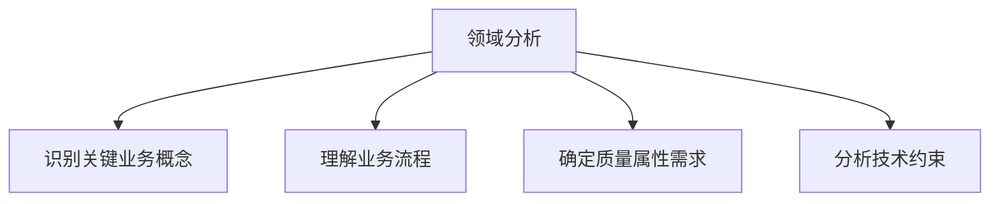

## 前言

作为一名架构师，我经常面临一个挑战：如何在复杂多变的业务需求和技术约束下，设计出既满足当前需求又具备未来扩展性的系统。~~有时候感觉就像在迷宫中寻找出路，每一步都可能影响整个系统的命运~~。幸运的是，架构模式语言为我们提供了一张"地图"，帮助我们在这个复杂的领域中导航。

今天，我想和大家分享一个常常被忽视但极其重要的架构概念——架构模式语言。它不仅仅是单个架构模式的集合，更是一种系统化的思维方式，帮助我们构建更加优雅、可维护的软件系统。

## 什么是架构模式语言

::: theorem
架构模式语言是一组相互关联的架构模式，这些模式按照特定的关系组织在一起，形成一种描述和解决特定领域架构问题的语言。
:::

在深入探讨之前，让我们先区分几个容易混淆的概念：

1. **架构模式**：描述软件系统中基本的结构和组织方案，如分层架构、微服务架构等。
2. **设计模式**：关注软件设计中特定问题的解决方案，通常局限于类或对象级别。
3. **架构模式语言**：将多个架构模式组织起来，形成一种系统化的语言，用于描述和解决更复杂的架构问题。

架构模式语言的价值在于它不仅仅是提供"预制件"，而是提供了一种"组装指南"，告诉我们如何将这些模式组合起来，构建出满足特定需求的系统。

## 架构模式语言的核心要素

### 1. 模式词汇表

架构模式语言的基础是一组精心选择的架构模式，这些模式应该：

- 覆盖特定领域的主要架构问题
- 具有明确的适用场景和约束条件
- 相互之间有清晰的语义关系

例如，在电商领域，模式词汇表可能包括：
- 领域驱动设计(DDD)模式
- CQRS模式
- 事件驱动架构模式
- 微服务模式
- API网关模式

### 2. 模式关系

架构模式语言中的模式不是孤立的，它们之间存在多种关系：

- **组合关系**：一个模式可以包含或组合其他模式
  - 例如：微服务架构可以组合领域驱动设计模式
- **依赖关系**：一个模式依赖于另一个模式的实现
  - 例如：CQRS模式通常依赖于事件溯源模式
- **替代关系**：在某些场景下，一个模式可以替代另一个模式
  - 例如：在简单场景下，分层架构可以替代微服务架构

### 3. 模式应用指南

架构模式语言不仅提供模式，还提供如何应用这些模式的指导：

- 模式选择策略：根据系统需求选择合适的模式
- 模式组合规则：如何将多个模式组合在一起
- 模式演化路径：随着系统增长如何调整模式应用

## 构建架构模式语言的步骤

### 1. 领域分析

在开始构建模式语言之前，我们需要深入理解目标领域：

### 2. 模式收集与分类

收集领域相关的架构模式，并按照一定的标准进行分类：

- 按抽象层次：高层架构模式、中层架构模式、低层架构模式
- 按关注领域：业务架构模式、技术架构模式、数据架构模式
- 按质量属性：性能模式、可靠性模式、安全性模式

### 3. 建立模式关系

分析模式之间的关系，构建模式网络：

- 使用有向图表示模式之间的依赖和组合关系
- 识别模式组合的最佳实践
- 定义模式冲突的解决策略

### 4. 创建模式应用指南

为每个模式或模式组合创建详细的应用指南：

- 适用场景和约束条件
- 实现步骤和关键决策点
- 常见问题和解决方案
- 模式演化路径

## 架构模式语言的应用实例

让我们以电商系统为例，看看如何应用架构模式语言：

### 电商系统的核心需求

- 高并发处理能力
- 业务规则频繁变更
- 多渠道接入需求
- 数据一致性要求高

### 模式语言选择

基于上述需求，我们可以构建如下的模式语言：

1. **高层架构模式**：微服务架构
   - 提供系统的高层次组织结构
   - 支持独立部署和扩展

2. **领域组织模式**：领域驱动设计(DDD)
   - 将业务逻辑封装在领域模型中
   - 通过限界上下文明确系统边界

3. **数据访问模式**：CQRS + 事件溯源
   - 分离读写操作，提高查询性能
   - 通过事件保证数据一致性

4. **集成模式**：API网关 + 事件驱动架构
   - 统一外部接入点
   - 通过事件实现服务间松耦合

### 模式组合应用

这些模式如何组合在一起工作呢？

1. 使用DDD划分限界上下文，确定微服务的边界
2. 在每个微服务内部，根据业务复杂度决定是否采用CQRS模式
3. 使用事件驱动架构实现微服务间的通信
4. 通过API网关统一管理外部请求

## 架构模式语言的优势

### 1. 提高设计一致性

架构模式语言确保整个系统使用统一的设计语言和原则，避免设计上的不一致性。

### 2. 加速设计决策

通过模式语言，架构师可以快速找到适合特定问题的解决方案，减少设计决策时间。

### 3. 促进知识共享

模式语言成为团队共享的知识资产，帮助新成员快速理解系统设计。

### 4. 支持系统演化

良好的模式语言不仅支持当前系统的设计，还为系统的未来演化提供指导。

## 挑战与应对策略

### 1. 模式过度使用

**挑战**：过度依赖模式语言可能导致过度工程化。

**应对策略**：
- 保持模式语言的简洁性
- 区分必要模式和可选模式
- 根据项目规模调整模式语言的复杂度

### 2. 模式冲突

**挑战**：不同模式之间可能存在冲突。

**应对策略**：
- 明确模式的适用场景和约束条件
- 建立模式冲突的解决机制
- 在必要时进行模式定制或组合

### 3. 团队接受度

**挑战**：团队成员可能对新的模式语言不熟悉。

**应对策略**：
- 提供充分的培训和文档
- 从小规模项目开始应用
- 建立模式应用的反馈机制

## 结语

架构模式语言不仅仅是一组架构模式的集合，更是一种系统化的思维方式，帮助我们应对复杂系统设计的挑战。通过构建和应用架构模式语言，我们可以更加自信地面对架构设计中的各种问题。

> 正如Christopher Alexander所言："每一个模式都是一个三段论：情境、问题、解决方案。"架构模式语言则将这些三段论组织起来，形成一种描述和解决复杂问题的语言。

在未来的架构实践中，我鼓励大家不仅关注单个架构模式的应用，更要思考如何将这些模式组织成一种有意义的语言，为我们的系统设计提供更强大的指导。

让我们一起探索架构模式语言的奥秘，构建更加优雅、可维护的软件系统！

## 个人建议

1. 从你的项目中提取和总结常用的架构模式，构建属于自己团队的模式语言
2. 在团队中推广模式语言的使用，建立共享的设计词汇
3. 持续迭代和完善你的模式语言，使其适应不断变化的技术和业务环境
4. 将模式语言与架构决策记录(ADR)结合，记录模式选择的原因和上下文

记住，最好的架构模式语言是那些能够真正解决你团队面临的问题，并被团队成员广泛接受和使用的语言。