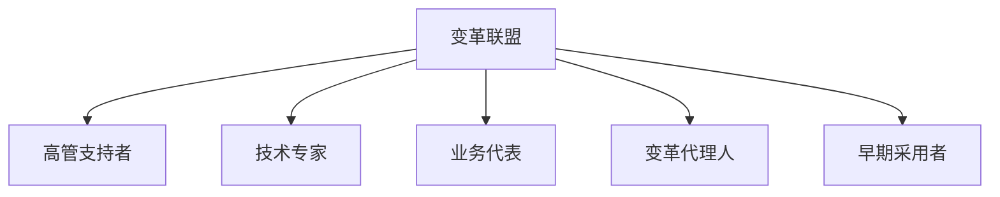

## 前言

作为一名架构师，我常常陷入这样的困境：😵‍💫 设计出完美的架构蓝图，却在实际落地中遭遇重重阻力。~~"这不是技术问题，这是人的问题"~~ —— 这句话我听过无数次，却总是低估了其中的复杂性。

架构转型不仅仅是技术升级，更是组织的一场深刻变革。当我们试图将单体应用拆分为微服务，或者从传统架构迁移到云原生时，技术只是冰山一角，水面之下是人的适应、流程的重塑、文化的转变。

本文将探讨架构转型的核心挑战，分享我在实践中总结的变革管理策略，希望能为正在或即将经历架构转型的你提供一些思路。

## 架构转型的本质挑战

架构转型远不止是替换代码或重新设计系统，它是一场涉及多方面的组织变革。以下是我在实践中遇到的核心挑战：

### 1. 技术债务与认知偏差

架构转型常常伴随着对现有系统的否定，这很容易引发团队的技术债务焦虑和认知偏差：

- **沉没成本谬误**："我们已经投入这么多在这个系统上了，现在放弃太可惜了"
- **过度优化**："新架构必须解决所有现有问题"
- **完美主义陷阱**："等一切都设计完美了再开始"

::: tip
记住：架构转型是一个旅程，不是目的地。接受"足够好"的起点，比追求完美的起点更重要。
:::

### 2. 组织惯性

组织就像一艘巨轮，转向需要时间和空间。常见的组织惯性表现包括：

- **角色与职责模糊**：新架构下，谁负责什么？
- **技能缺口**：团队是否具备新技术栈的能力？
- **流程不匹配**：现有开发流程是否适应新的架构模式？

### 3. 利益相关者管理

架构转型影响多方利益，有效的利益相关者管理至关重要：

| 利益相关者 | 关注点 | 潜在阻力 |
|------------|--------|----------|
| 业务部门 | 功能交付、业务连续性 | 担心转型影响业务 |
| 开发团队 | 技术挑战、工作负担 | 害怕学习新技能 |
| 运维团队 | 系统稳定性、运维复杂度 | 担心运维负担增加 |
| 高管 | ROI、战略对齐 | 关注投资回报 |
| 最终用户 | 体验变化、功能可用性 | 担心影响日常工作 |

## 架构转型的变革管理框架

基于我的经验，有效的架构转型需要系统性的变革管理。以下是我总结的框架：

### 1. 建立变革愿景

架构转型的第一步是建立清晰、引人入胜的变革愿景：

- **明确"为什么"**：阐述转型的必要性和价值
- **描绘未来状态**：让团队看到转型后的美好图景
- **对齐业务目标**：确保架构转型服务于业务战略

::: theorem
变革愿景必须回答三个问题：我们要去哪里？为什么要去？如何到达？
::>

### 2. 组建变革联盟

单靠架构师无法推动变革，需要组建多元化的变革联盟：

关键角色：
- **高管支持者**：提供资源和政治资本
- **技术专家**：提供专业指导
- **业务代表**：确保业务价值
- **变革代理人**：在组织内传播变革理念
- **早期采用者**：成为变革的榜样

### 3. 设计转型路径

架构转型不是一蹴而就的，需要分阶段实施：

1. **准备阶段**：评估现状、制定计划、获取支持
2. **试点阶段**：选择小范围项目进行试点
3. **扩展阶段**：基于经验教训扩大转型范围
4. **优化阶段**：全面实施并持续优化

### 4. 管理转型阻力

转型过程中不可避免会遇到阻力，有效的阻力管理策略包括：

- **识别阻力来源**：是技术、流程还是人员问题？
- **针对性沟通**：针对不同利益相关者的顾虑提供解答
- **赋能培训**：提供必要的培训和资源支持
- **庆祝小胜利**：认可阶段性成果，建立信心

## 实践案例：从单体到微服务的转型之旅

去年，我主导了一个将核心业务系统从单体架构迁移到微服务的项目。以下是我们的关键经验：

### 1. 转型策略

我们采用了"绞杀者模式"(Strangler Pattern)进行渐进式转型：

1. **识别边界上下文**：将单体系统划分为清晰的业务领域
2. **构建适配层**：在单体和微服务之间建立适配层
3. **逐步迁移**：按优先级逐个迁移业务功能
4. **逐步下线**：迁移完成后逐步下线单体系统组件

### 2. 变革管理实践

- **建立转型办公室**：专职负责协调和监督转型过程
- **定期沟通机制**：每周转型状态更新，每月全员大会
- **技能提升计划**：针对微服务、容器化等技术提供培训
- **架构决策记录**：记录重要决策及其理由，确保透明度

### 3. 关键成功因素

1. **高管明确支持**：CTO亲自参与关键决策
2. **业务价值导向**：确保每个迁移步骤都创造业务价值
3. **技术债务管理**：平衡新功能开发和架构重构
4. **团队自主权**：给予微服务团队足够的自主决策空间

## 结语

架构转型是一场技术与人的双重变革。🚀 作为架构师，我们不仅需要设计优雅的系统，还需要驾驭组织变革的复杂性。

记住：成功的架构转型不只是关于技术，更是关于人、流程和文化的转变。建立清晰的愿景，组建强大的变革联盟，设计合理的转型路径，并有效管理阻力，这些都是架构转型成功的关键。

正如一位智者所说："变革的唯一不变的就是变革本身。"拥抱变化，持续学习，我们才能在技术进化的浪潮中立于不败之地。

> 架构转型的艺术，在于平衡理想与现实，在变革的浪潮中找到前进的方向，带领团队共同成长。

---

*本文是"架构思想"系列的第184篇文章，探讨架构转型与变革管理的核心挑战与实践策略。*