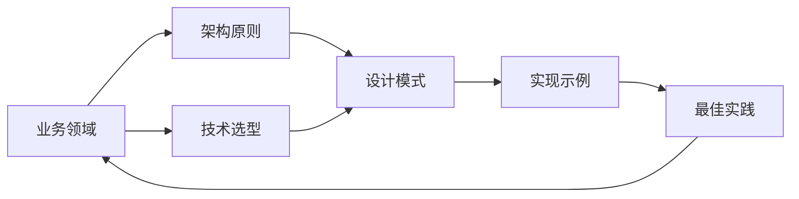

## 前言

在多年的架构实践中，我经常遇到一个普遍现象：团队投入大量精力设计出优秀的架构方案，但几年后当需要回顾决策过程或理解系统演进时，却找不到完整的架构记录。🤔 这就像建造了一座宏伟的建筑却没有保存设计图纸和施工日志，最终只能依靠"记忆碎片"来拼凑历史。

架构知识是组织最宝贵的无形资产之一，而系统化的文档化与知识管理正是将这种资产转化为可传承、可复用知识的关键环节。本文将探讨如何构建完善的架构文档化体系，让架构知识真正成为团队的"活资产"。

## 架构文档化的价值与现状

### 为什么架构文档化如此重要？

::: tip
架构文档不是"文档工作"的负担，而是架构师最重要的"技术遗产"。
:::

1. **决策可追溯性**：清晰记录每个架构决策的背景、备选方案和权衡依据，避免"凭记忆决策"的风险
2. **新人快速融入**：新团队成员通过架构文档能在数周内理解系统全貌，而非数月的"摸爬滚打"
3. **技术债务管理**：记录设计妥协和遗留问题，为后续重构提供明确指引
4. **知识沉淀**：避免因人员流动导致关键设计知识流失
5. **架构评审基础**：为架构评审提供客观依据，而非主观争论

### 当前实践的常见误区

在接触的数十个团队中，我发现以下典型问题：

- ~~"架构文档就是画几张图"~~：将文档化简化为UML或架构图
- ~~"文档写完就束之高阁"~~：文档与实际系统脱节，成为"僵尸文档"
- ~~"文档是架构师的专属工作"~~：文档化被视为额外负担而非集体责任
- ~~"文档必须完美才能发布"~~：追求完美导致文档永远无法完成

## 架构文档化的核心框架

### 1. 多层次文档体系

架构文档应采用分层结构，满足不同角色的需求：

| 文档层级 | 目标读者 | 核心内容 | 更新频率 |
|---------|---------|---------|---------|
| **战略层** | 高管、产品负责人 | 业务目标映射、技术战略、投资回报 | 季度更新 |
| **战术层** | 架构师、技术负责人 | 技术选型、架构模式、约束条件 | 月度更新 |
| **执行层** | 开发团队 | 代码规范、部署流程、具体实现 | 持续更新 |

### 2. 架构决策记录(ADR)

ADR是架构文档的核心构件，每个ADR应包含：

```markdown
# ADR-001: 选择微服务架构

**日期**: 2023-10-15  
**状态**: 已批准  

## 背景  
当前单体应用已无法支持业务快速迭代，团队规模扩大导致代码冲突频发。

## 决策  
采用领域驱动设计(DDD)原则将系统拆分为12个微服务。

## 替代方案评估
1. **单体应用**：开发效率高，但扩展性差  
2. **SOA**：服务边界模糊，治理复杂  
3. **无服务器**：成本不可控，不适合核心业务  

## 权衡依据  
- **优势**：团队自主性提升，故障隔离性增强  
- **劣势**：分布式事务复杂，运维成本增加  

## 后续影响  
- 需建立服务网格治理  
- 制定API版本管理规范  
```

### 3. 架构知识图谱

将架构知识组织为可关联的知识网络：



## 实践指南：构建可持续的文档化流程

### 1. 文档即代码原则

将架构文档纳入版本控制系统，与代码同步演进：

```bash
├── docs/
│   ├── architecture/
│   │   ├── adr/          # 架构决策记录
│   │   ├── diagrams/     # 架构图
│   │   └── knowledge/    # 知识库
│   └── deployment/      # 部署文档
└── src/
    └── services/         # 源代码
```

### 2. 文档自动化工具链

利用工具减少文档维护负担：

- **架构可视化工具**：如C4模型、Graphviz自动生成架构图
- **代码注释提取**：通过工具从代码注释中提取架构决策
- **API文档生成**：Swagger/OpenAPI自动生成API文档
- **变更检测**：Git钩子检测架构变更并触发文档更新

### 3. 文档质量保障机制

建立文档评审流程确保质量：

1. **同行评审**：架构文档必须由至少2位架构师评审
2. **使用反馈**：建立文档评分系统，收集读者反馈
3. **定期审计**：每季度检查文档与实际系统的一致性
4. **文档测试**：关键文档应有配套的示例或验证步骤

## 知识管理的进阶实践

### 1. 架构知识社区

构建内部知识共享平台：

- **架构案例库**：收集成功/失败的架构案例
- **决策模板**：提供标准化决策记录模板
- **专家问答**：架构师轮值解答技术问题
- **学习路径**：新架构师成长指南

### 2. 知识度量体系

量化架构知识管理效果：

| 指标 | 计算方式 | 目标值 |
|------|----------|--------|
| 文档覆盖率 | 已文档化组件数 / 总组件数 | >90% |
| ADR完成率 | 季度新增ADR数 / 重要决策数 | 100% |
| 知识复用率 | 复用架构方案的项目数 | >70% |
| 新人上手周期 | 从入职到能独立负责模块 | <4周 |

### 3. 知识激励制度

将知识贡献纳入绩效考核：

- 架构文档贡献度（权重15%）
- 技术分享质量（权重10%）
- 知识社区活跃度（权重5%）

## 结语

架构文档化不是一次性的"文档工程"，而是持续的知识管理实践。当我们将文档化视为架构师的核心职责而非额外负担时，才能真正构建起组织的"技术记忆"。

> 架构的真正价值不在于画出多么精美的架构图，而在于让每个决策都有据可查、每个演进都有迹可循。

正如建筑大师弗兰克·劳埃德·赖特所说："建筑始于图纸终于建造，但伟大的建筑始于思想终于传承"。让我们从今天开始，构建属于自己团队的架构知识体系，让优秀的架构思想真正成为组织永恒的财富。

---

**行动建议**：
1. 本周内完成现有架构的文档清单梳理
2. 为团队建立ADR模板和评审流程
3. 选择一个核心服务进行完整文档化实践
4. 在团队会议中增加"知识分享"环节

记住：最好的文档是"正在被使用"的文档，而不是"完美无缺"的文档。🚀