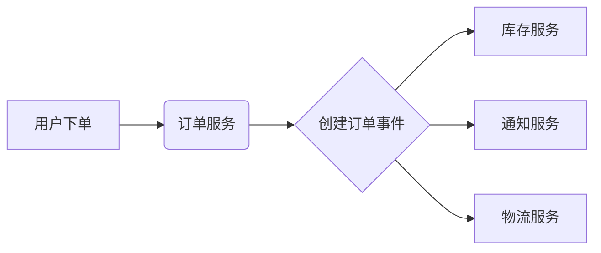
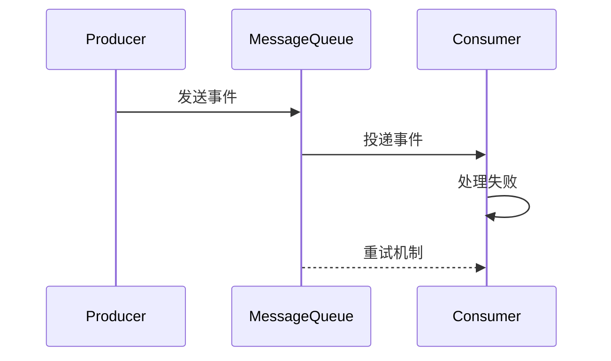
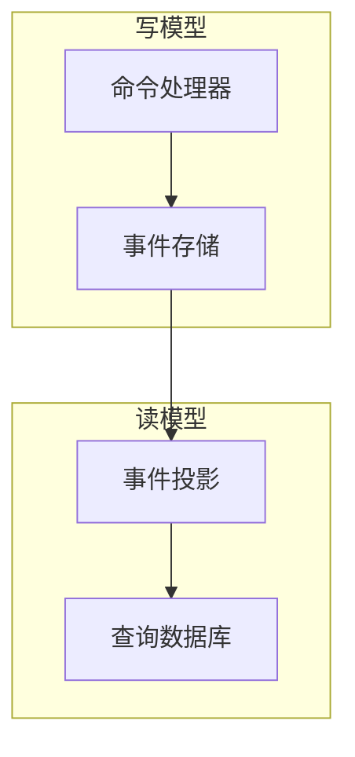

## 前言

在软件架构的演进历程中，我们经历了从单体架构到微服务架构的范式转变。然而，当系统规模不断扩大时，服务间的通信复杂性成为新的瓶颈。🤔 这时，一种更优雅的架构风格应运而生——**事件驱动架构**（Event-Driven Architecture, EDA）。它就像是为系统注入了"神经系统"，让各个组件能够像生物体一样感知环境变化并做出响应。

::: tip
> "事件驱动不是银弹，但它提供了一种优雅的方式来解耦系统组件，使系统更具弹性和可扩展性。" —— 来自分布式系统实践者的忠告
:::

## 事件驱动架构的核心概念

### 什么是事件驱动架构？

事件驱动架构是一种以**事件**为中心的架构风格，其中系统组件通过异步交换事件来通信。当某个状态发生变化时，系统会触发一个事件，其他组件订阅这些事件并做出相应处理。



### 核心组件

1. **事件生产者**：产生事件的组件（如订单服务）
2. **事件消费者**：监听并处理事件的组件（如库存服务）
3. **事件通道**：传递事件的媒介（消息队列/事件总线）
4. **事件存储**：持久化事件历史（可选）

## 事件驱动架构的优势

### 🏗️ 系统解耦

传统API调用会导致服务间紧耦合：
```java
// 紧耦合示例
class OrderService {
    public void createOrder(Order order) {
        // 直接调用库存服务
        inventoryService.reserveItems(order.getItems());
        // 直接调用通知服务
        notificationService.sendConfirmation(order.getUser());
    }
}
```

事件驱动实现松耦合：
```java
// 事件驱动示例
class OrderService {
    public void createOrder(Order order) {
        orderRepository.save(order);
        eventBus.publish(new OrderCreatedEvent(order));
    }
}
```

### 📡 可扩展性

当系统负载增加时，只需增加消费者实例即可：
```bash
# 消费者水平扩展
kubectl scale deployment inventory-consumer --replicas=5
```

### 💡 弹性容错

消费者失败不会阻塞主流程：


## 实现模式对比

### 模式一：事件溯源（Event Sourcing）

```java
// 事件溯源示例
class Order {
    private List<OrderEvent> events = new ArrayList<>();
    
    public void addItem(Product product) {
        events.add(new ItemAddedEvent(product));
    }
    
    public void applyEvents() {
        events.forEach(event -> {
            if (event instanceof ItemAddedEvent) {
                // 应用事件状态
            }
        });
    }
}
```

### 模式二：CQRS（命令查询责任分离）



## 与DDD的完美结合

事件驱动架构与领域驱动设计是天作之合：

1. **领域事件**：DDD中的领域事件天然对应EDA中的事件
2. **聚合边界**：通过事件保持聚合间的一致性
3. **最终一致性**：实现跨聚合的业务流程

```java
// DDD领域事件示例
public class OrderDomainEvent {
    private final OrderId orderId;
    private final OrderStatus status;
    
    // 事件处理逻辑
    public void handle(InventoryService inventory) {
        inventory.updateInventory(this);
    }
}
```

## 实践挑战与解决方案

### 挑战1：事件顺序保证

**解决方案**：
- 使用分区消息队列（如Kafka的分区）
- 为每个事件添加序列号

```java
public class OrderEvent {
    private String eventId;
    private int sequenceNumber;
    private Instant timestamp;
}
```

### 挑战2：事件溯源的复杂性

**解决方案**：
- 采用渐进式事件溯源
- 使用框架如Axon Event Sourcing

```java
// Axon框架示例
@EventSourcingHandler
public void on(OrderCreatedEvent event) {
    this.orderId = event.getOrderId();
    this.status = event.getStatus();
}
```

### 挑战3：调试困难

**解决方案**：
- 构建事件可视化工具
- 实现事件回放功能

```bash
# 事件回放命令
event-replay --from-date 2023-11-01 --to-date 2023-11-15 --order-events
```

## 结语

事件驱动架构不是银弹，但它为我们提供了一种优雅的方式来构建**响应式、可扩展、弹性**的系统。当我们面对复杂业务场景时，EDA就像是为系统安装了"神经系统"，让各个组件能够像生物体一样感知环境变化并做出响应。

> "在分布式系统中，我们追求的不是绝对的强一致性，而是通过事件流实现的最终一致性。"

随着云原生和Serverless技术的普及，事件驱动架构的重要性只会与日俱增。建议从非核心业务开始尝试事件驱动模式，逐步构建你的事件生态系统。记住，好的架构不是设计出来的，而是演进出来的！

---

*本文基于实际项目经验总结，结合了DDD、微服务架构和事件驱动设计的最佳实践。欢迎在评论区分享你的事件驱动架构经验！*
```