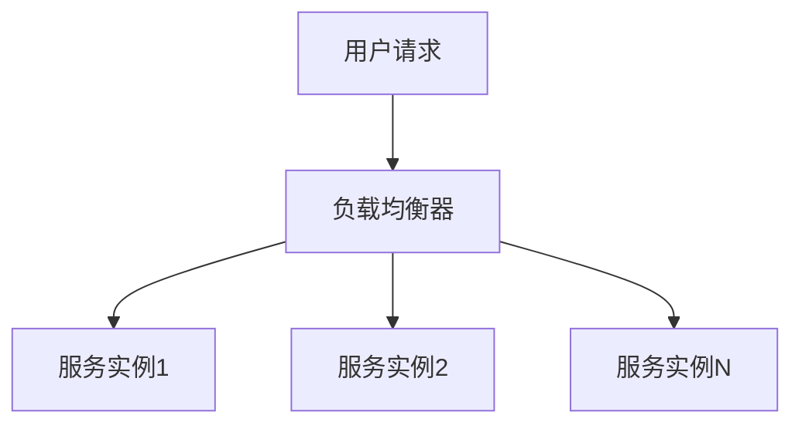

```yaml
---
title: 微服务架构-构建现代分布式系统的基石
date: 2023-11-15 10:30:00
permalink: /pages/7a8b2c3d/
categories: 
  - 架构思想
tags:
  - 微服务
  - 分布式系统
  - 架构设计
  - 系统扩展性
author: 
  name: Jorgen
  link: https://github.com/jorgen-zhao
---

## 前言

在软件开发领域，架构设计始终是决定系统成败的关键因素。随着业务复杂度的增加和用户规模的扩大，传统的单体架构逐渐暴露出扩展性差、维护困难等问题。微服务架构作为一种新兴的架构风格，正在被越来越多的企业所采纳。

::: tip
微服务不是银弹，它解决了单体架构的许多问题，但也引入了新的复杂性。选择适合自己业务的架构风格才是关键。
:::

本文将深入探讨微服务架构的核心思想、优势与挑战，以及如何在实际项目中成功实施微服务架构。

## 微服务架构概述

微服务架构是一种将应用程序设计为小型、自治的服务集合的架构风格。每个服务都围绕特定业务能力构建，可以独立开发、部署和扩展。

### 微服务架构的特点

- **单一职责**：每个服务专注于解决特定的业务问题
- **自治性**：服务可以独立开发、测试、部署和扩展
- **去中心化治理**：团队可以选择最适合的技术栈
- **多样性持久化**：不同服务可以使用不同的数据存储技术
- **基于业务能力组织**：服务划分基于业务领域而非技术层次

## 微服务架构的优势

### 🏗 提高系统可扩展性

微服务架构允许我们针对不同服务的负载特性进行独立扩展。例如，订单处理服务在促销活动期间可能需要更多资源，而用户认证服务则相对稳定。



### 💡 加快开发速度

由于服务边界清晰，团队可以并行开发不同服务，减少团队间的等待时间。小型团队负责特定服务，提高了开发效率和代码质量。

### 📡 增强系统弹性

微服务架构中的故障隔离机制可以防止一个服务的故障影响整个系统。例如，支付服务出现问题时，用户仍然可以浏览商品和添加到购物车。

## 微服务架构的挑战

### 🤔 分布式系统复杂性

微服务本质上是分布式系统，需要处理网络延迟、消息传递、数据一致性等问题。

```markdown
| 挑战 | 解决方案 |
|------|----------|
| 服务发现 | 使用注册中心如Consul、Eureka |
| 配置管理 | 集中化配置管理如Spring Cloud Config |
| 负载均衡 | 客户端或服务端负载均衡 |
| 断路器 | Hystrix、Resilience4j等断路器模式 |
```

### 🧩 数据一致性挑战

在单体应用中，数据库事务可以保证数据一致性。而在微服务架构中，跨服务的数据一致性需要采用最终一致性模式，如Saga模式或事件驱动架构。

### 🔧 运维复杂度增加

微服务架构需要更复杂的部署策略、监控系统和日志管理，这对DevOps能力提出了更高要求。

## 微服务架构设计原则

### 🎯 领域驱动设计(DDD)与微服务

DDD为微服务划分提供了理论基础。通过限界上下文(Bounded Context)识别业务边界，可以将每个限界上下文映射到一个微服务。

### 🔄 API优先设计

在微服务架构中，API是服务间通信的契约。采用API优先设计可以确保服务间的兼容性，减少集成问题。

### 🚀 渐进式迁移策略

对于现有系统，采用"绞杀者模式"(Strangler Pattern)逐步将单体应用迁移到微服务架构，降低迁移风险。

## 微服务技术栈选择

### 服务框架

- **Java生态**：Spring Cloud、Dubbo
- **Node.js**：Express、NestJS
- **Python**：Flask、FastAPI

### 服务治理

- **服务发现**：Consul、Eureka、Zookeeper
- **API网关**：Kong、Spring Cloud Gateway、Zuul
- **配置中心**：Spring Cloud Config、Apollo

### 分布式事务

- **两阶段提交**：XA协议
- **Saga模式**：事件驱动补偿
- **TCC模式**：Try-Confirm-Cancel

## 微服务架构实践案例

### 电商平台微服务拆分

一个典型的电商平台可以拆分为以下微服务：

- 用户服务：管理用户账户和认证
- 商品服务：管理商品信息和库存
- 订单服务：处理订单创建和状态管理
- 支付服务：处理支付流程
- 通知服务：发送邮件、短信等通知
- 推荐服务：个性化商品推荐

### 数据一致性处理

以订单创建流程为例，可以采用Saga模式处理跨服务的数据一致性：

1. 订单服务创建订单
2. 库存服务扣减库存
3. 支付服务处理支付
4. 如果任何步骤失败，执行相应的补偿操作

## 结语

微服务架构为构建复杂、可扩展的系统提供了有力的工具，但它也带来了新的挑战。成功实施微服务架构需要深入理解分布式系统原理，并结合业务特点进行合理设计。

> 架构不是一成不变的，而是随着业务发展和技术演进不断演化的过程。微服务只是我们工具箱中的一种工具，选择适合当前业务场景的架构风格才是关键。

对于初创公司或小型项目，从单体架构开始，随着业务增长逐步演进到微服务架构可能更为明智。而对于大型企业，微服务架构可以帮助组织更好地应对复杂性和规模挑战。

无论选择何种架构风格，持续学习和实践都是提升架构设计能力的不二法门。

::: right
"架构不是关于技术，而是关于平衡。"
:::
```