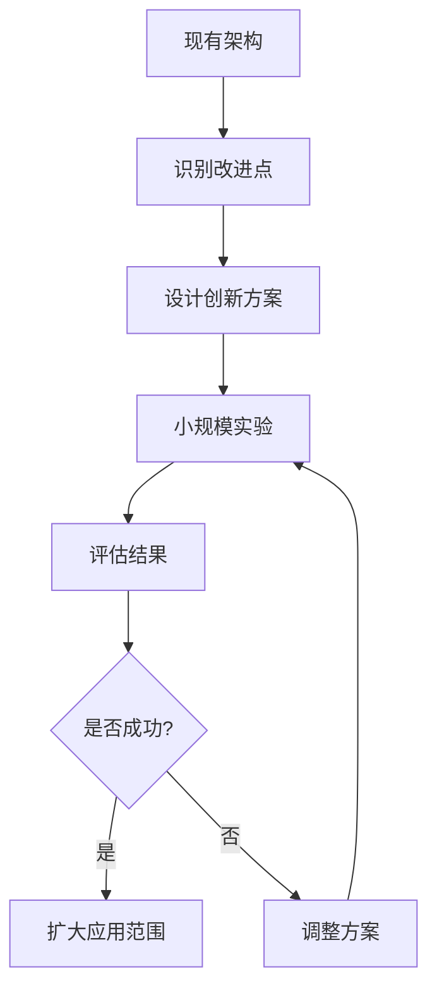

## 前言

在当今快速变化的技术环境中，软件架构师面临着前所未有的挑战。一方面，我们需要构建稳定、可靠、高效的系统；另一方面，我们又需要不断探索新技术、新方法，以应对不断变化的需求和环境。~~这就像走钢丝，既要保持平衡，又要不断前进~~

架构创新与实验，正是应对这一挑战的关键能力。它不仅关乎技术的前沿探索，更关乎组织的长期竞争力。在这篇文章中，我将探讨架构创新与实验的重要性、方法以及实践。

## 为什么需要架构创新与实验？

### 技术变革的加速

随着云计算、人工智能、区块链等新兴技术的快速发展，传统的架构方法可能无法充分利用这些新技术的潜力。只有通过创新和实验，才能将这些新技术有效地整合到架构中。

### 业务需求的多样化

现代业务需求变得越来越复杂和多样化，传统的架构模式可能无法满足所有需求。创新和实验可以帮助我们找到更适合特定场景的架构解决方案。

### 竞争压力的增加

在竞争激烈的市场中，技术创新往往是企业保持竞争优势的关键。架构创新可以为企业带来技术上的差异化，从而在市场中脱颖而出。

## 架构创新与实验的方法

### 渐进式创新

渐进式创新是指在现有架构的基础上，逐步引入新的技术和方法，以改进和优化系统。这种方法风险较低，适合大多数组织。

### 颠覆式创新

颠覆式创新是指完全打破传统架构思维，探索全新的架构方法。这种方法风险较高，但可能带来突破性的成果。

### 架构实验平台

建立专门的架构实验平台，用于测试和验证新的架构方法。这个平台应该具备以下特点：

- 独立于生产环境
- 提供必要的资源和工具
- 支持快速部署和测试
- 提供详细的监控和分析

## 架构创新与实验的实践

### 1. 建立创新文化

鼓励团队成员提出新的想法和尝试不同的方法。建立安全的失败环境，让团队成员敢于尝试和创新。

### 2. 采用敏捷方法

采用敏捷开发方法，通过短周期的迭代和反馈，快速验证和创新架构方案。

### 3. 持续学习

架构师需要保持持续学习的态度，不断了解新的技术和方法，为创新提供知识基础。

### 4. 架构沙盒

创建架构沙盒，允许团队成员在不影响生产系统的情况下，尝试新的架构方法和技术。

### 5. 架构创新实验室

建立专门的架构创新实验室，专注于探索和实验新的架构方法，并将有价值的创新推广到生产系统中。

## 架构创新与实验的挑战

### 风险管理

创新和实验总是伴随着风险，如何有效管理这些风险是一个重要挑战。

### 资源限制

创新和实验需要投入时间和资源，如何在有限的资源下最大化创新成果是一个挑战。

### 组织阻力

创新往往会遇到组织内部的阻力，如何克服这些阻力，推动创新的实施是一个挑战。

## 结语

架构创新与实验是架构师应对快速变化环境的关键能力。通过渐进式创新、颠覆式创新和架构实验平台等方法，我们可以不断探索和尝试新的架构方法，为组织带来技术上的竞争优势。

> 架构创新不是一蹴而就的过程，而是需要持续投入和不断尝试的旅程。只有保持开放的心态和勇于尝试的精神，才能在技术的浪潮中立于不败之地。

在未来的架构实践中，让我们将创新与实验视为核心能力，不断探索和尝试，为构建更优秀的系统而努力。

---

## 个人建议

1. **从小处着手**：不要一开始就追求颠覆性创新，可以从小的改进和优化开始，逐步积累经验。

2. **建立度量体系**：建立科学的度量体系，评估创新和实验的成果，为后续决策提供依据。

3. **分享与交流**：积极分享创新和实验的经验和教训，促进团队和组织的学习和成长。

4. **保持平衡**：在创新和稳定之间保持平衡，确保系统的可靠性和安全性。

---

## 未来展望

随着技术的不断发展，架构创新与实验将变得越来越重要。未来，我们可以预见以下几个趋势：

1. **AI辅助架构设计**：人工智能将在架构创新中发挥越来越重要的作用，辅助架构师进行设计和决策。

2. **低代码/无代码架构平台**：低代码/无代码平台将使更多人能够参与架构创新，降低创新的门槛。

3. **架构即代码**：架构即代码的理念将进一步普及，使架构创新更加自动化和可重复。

4. **跨领域架构融合**：不同领域的架构知识和方法将更加融合，产生更多的创新机会。

让我们共同期待和参与架构创新与实验的未来，为构建更美好的技术世界而努力！