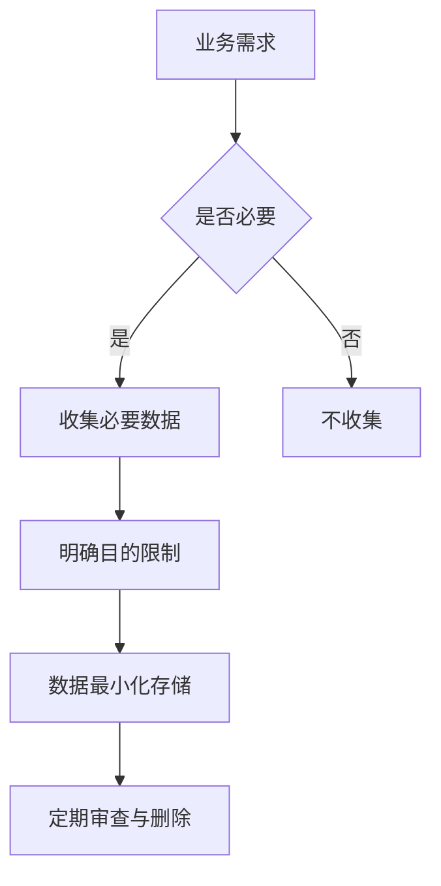

## 前言

作为一名架构师，我经常思考如何在设计系统时平衡功能需求与非功能性需求。在众多质量属性中，**安全性**和**隐私保护**往往容易被忽视，直到出现安全事件才被紧急修补。这种"事后补救"的方式不仅成本高昂，而且往往无法彻底解决问题。🤔

::: tip
"安全不是添加到系统中的功能，而是系统设计的基础原则。"
- 架构安全领域的经典观点
:::

在当今数据驱动的时代，架构师必须将安全和隐私保护视为一等公民，从架构设计之初就融入这些考量。本文将探讨如何在架构层面构建安全与隐私保护机制，打造真正可信的系统。

## 架构安全的核心原则

架构安全不仅仅是防火墙和加密那么简单，它需要贯穿整个系统生命周期。以下是我在实践中总结的核心原则：

### 1. 零信任架构 (Zero Trust Architecture)

传统的边界安全模型已经不再适应现代云原生环境。零信任架构假设内部网络同样存在威胁，要求每次访问请求都经过严格验证。


**零信任架构的关键实践**：
- 强身份认证和多因素认证
- 最小权限原则
- 持续验证和监控
- 微分段网络

### 2. 深度防御 (Defense in Depth)

单一安全措施很容易被绕过，架构设计应当采用多层防御策略：

```
外部威胁 → 边界防护 → 网络隔离 → 应用层安全 → 数据加密 → 身份认证
```

每层安全措施都应当独立设计，即使一层被突破，其他层仍能提供保护。

### 3. 安全设计模式

在架构设计中，可以采用以下安全设计模式：

- **安全边界模式**：明确定义系统安全边界，控制跨边界流量
- **数据分类模式**：根据敏感度对数据进行分类，实施差异化保护
- **安全审计模式**：记录所有安全相关事件，支持事后调查
- **故障安全模式**：确保系统在安全组件失效时进入安全状态

## 隐私保护架构设计

随着隐私法规日益严格（如GDPR、CCPA等），隐私保护已成为架构设计的必要组成部分。

### 1. 隐私设计 (Privacy by Design)

隐私设计原则要求将隐私保护融入系统设计的每个环节：

::: theorem
隐私设计七大原则：
1. 主动而非被动
2. 隐私设置默认
3. 嵌入式设计
4. 全生命周期保护
5. 透明性
6. 尊重用户隐私
7. 责任归属
:::

### 2. 数据最小化原则

架构设计应当遵循数据最小化原则，只收集和处理必要的个人数据：



### 3. 隐私增强技术 (PETs)

架构中可以集成以下隐私增强技术：

- **差分隐私**：在数据分析中添加噪声，防止识别个体
- **联邦学习**：在不共享原始数据的情况下训练模型
- **同态加密**：在加密数据上直接进行计算
- **零知识证明**：在不泄露信息的情况下证明某个陈述

## 架构安全与隐私的实施策略

将安全与隐私融入架构需要系统性的方法：

### 1. 威胁建模与风险评估

在架构设计早期进行威胁建模，识别潜在安全风险：

1. **识别资产**：系统中的关键数据和功能
2. **识别威胁**：可能面临的攻击向量
3. **识别漏洞**：系统中的安全弱点
4. **评估风险**：结合可能性和影响评估风险等级
5. **制定缓解措施**：针对高风险项制定缓解策略

### 2. 安全架构评审

建立定期的架构评审机制，专门关注安全与隐私方面：

- 设计阶段的安全评审
- 实施阶段的安全检查
- 部署前的安全验证
- 定期的安全架构评估

### 3. 安全编码与配置标准

制定并实施安全编码标准和安全配置基线：

```markdown
| 安全类别 | 推荐实践 | 检查工具 |
|---------|---------|---------|
| 输入验证 | 所有输入进行严格验证 | OWASP ZAP |
| 认证授权 | 实施强身份认证和最小权限 | Burp Suite |
| 数据保护 | 敏感数据加密存储 | SonarQube |
| 会话管理 | 安全的会话管理机制 | Veracode |
| 错误处理 | 不泄露敏感信息的错误处理 | Checkmarx |
```

### 4. 安全监控与响应

建立全面的安全监控和响应机制：

- 实时安全事件监控
- 异常行为检测
- 自动化响应机制
- 事件响应流程
- 安全态势感知

## 架构安全与隐私的挑战

在实践中，架构安全与隐私面临诸多挑战：

### 1. 业务需求与安全需求的平衡

安全措施可能影响用户体验和系统性能，架构师需要在安全与可用性之间找到平衡点。

**解决方案**：
- 采用渐进式安全策略
- 基于风险的安全投入
- 安全度量与ROI分析

### 2. 新兴技术的安全挑战

新技术如AI、IoT、区块链等带来新的安全挑战：

- AI模型的对抗性攻击
- IoT设备的广泛攻击面
- 区块链的智能合约漏洞

### 3. 复杂系统的安全治理

随着系统复杂度增加，安全治理变得困难：

- 分布式系统的安全一致性
- 第三方组件的安全管理
- 供应链安全风险

## 结语

架构安全与隐私保护不是一次性项目，而是持续的过程。作为架构师，我们需要将安全和隐私融入架构设计的DNA，从系统构思之初就考虑这些关键质量属性。

> 安全架构不是关于消除所有风险，而是关于理解、接受和管理风险，使系统在面临威胁时仍能保持核心功能和业务连续性。

随着技术发展，新的安全挑战不断涌现，唯有持续学习和实践，才能构建真正可信的系统。让我们共同努力，打造安全、隐私、可信的数字未来！

---

**思考与讨论**：
1. 您在架构设计中如何平衡安全与用户体验？
2. 您认为未来架构安全领域会出现哪些新的挑战？
3. 贵公司在架构安全方面有哪些最佳实践？

欢迎在评论区分享您的经验和见解！🙌