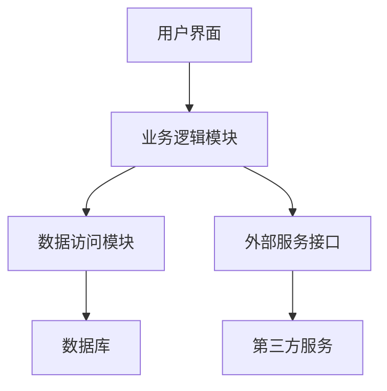
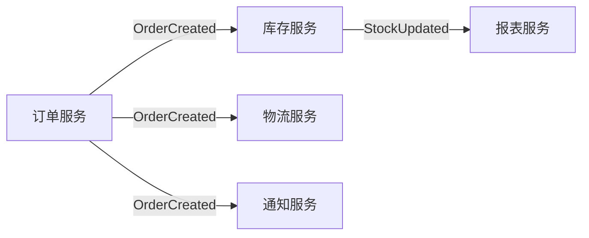
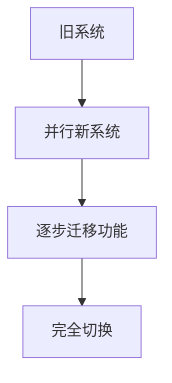

## 前言

作为一名架构师，我常常思考一个问题：为什么有些系统能够随着业务发展持续演进，而另一些系统却在几年后就变得难以维护，最终被推倒重来？🤔

在过去的几年里，我见证了多个项目的兴衰。有些系统从简单的单体应用开始，经过多次迭代，最终成长为复杂的分布式架构；而有些系统一开始设计就过于复杂，却无法适应业务的变化，最终成为技术债务的温床。

今天，我想和大家探讨架构演进与适应性的重要性，以及如何在设计之初就考虑系统的长期进化能力。

## 架构演进的本质

架构演进不是简单的"打补丁"，而是一个有计划、有策略的持续改进过程。它包括：

- **渐进式重构**：在不影响系统正常运行的前提下，逐步改进架构设计
- **技术栈更新**：引入新技术，替换过时的组件
- **架构模式迁移**：从单体到微服务，从同步到异步等
- **能力扩展**：增加新功能模块，支持新的业务场景

### 架构演进的动力

架构演进通常由以下因素驱动：

1. **业务需求变化**：业务模式创新、市场变化、用户需求升级
2. **技术发展**：新技术出现、最佳实践更新、性能要求提升
3. **规模扩张**：用户量增长、数据量增大、系统复杂度提高
4. **成本优化**：降低运维成本、提高资源利用率、减少技术债务

::: tip
架构演进不是"想不想"的问题，而是"何时"和"如何"的问题。拒绝演进的架构最终会被淘汰。
:::

## 架构适应性的关键要素

### 1. 模块化设计

模块化是架构适应性的基础。良好的模块化设计应该具备以下特点：

- **高内聚**：模块内部功能紧密相关
- **低耦合**：模块之间依赖关系简单清晰
- **边界清晰**：模块接口定义明确，易于替换和扩展



### 2. 可插拔架构

可插拔架构允许在不影响整体系统的情况下替换或升级组件：

```java
// 插件接口定义
public interface PaymentProcessor {
    PaymentResult process(PaymentRequest request);
}

// 多种实现
public class AlipayProcessor implements PaymentProcessor { ... }
public class WeChatPayProcessor implements PaymentProcessor { ... }
public class UnionPayProcessor implements PaymentProcessor { ... }
```

### 3. 事件驱动设计

事件驱动架构使系统组件能够通过事件进行松耦合通信，提高系统的适应能力：



### 4. 契约优先设计

通过定义清晰的接口契约，允许不同团队并行开发，提高适应变化的能力：

```typescript
// API契约定义
interface UserService {
  getUser(id: string): Promise<User>;
  updateUser(id: string, updates: Partial<User>): Promise<User>;
}

// 实现契约
class RestUserService implements UserService {
  // REST API实现
}

class GraphQLUserService implements UserService {
  // GraphQL实现
}
```

## 架构演进策略

### 1. 领域驱动设计(DDD)

DDD通过将业务领域划分为限界上下文(Bounded Context)，为架构演进提供了清晰的边界：

| 限界上下文 | 职责 | 技术选型 | 演进路径 |
|------------|------|----------|----------|
| 订单管理 | 处理订单创建、修改、查询 | 微服务 | 逐步拆分子领域 |
| 支付处理 | 处理各种支付方式 | 微服务 | 支持新支付方式 |
| 库存管理 | 管理商品库存 | 微服务 | 优化库存算法 |
| 用户中心 | 用户信息管理 | 微服务 | 扩展用户画像 |

### 2. 微服务化演进路径

从单体架构到微服务架构的演进通常遵循以下路径：

1. **模块化单体**：将单体应用划分为清晰的模块
2. **服务拆分**：按业务边界拆分为独立服务
3. **服务网格**：引入服务网格管理服务间通信
4. **事件驱动**：实现事件驱动的服务间协作

### 3. 渐进式重构

渐进式重构允许在不影响系统正常运行的前提下改进架构：



### 4. 特性开关

特性开关(Feature Flag)允许在不部署新代码的情况下启用或禁用功能：

```java
public class OrderService {
    public void processOrder(Order order) {
        if (featureFlags.isEnabled("newPaymentProcessor")) {
            newPaymentProcessor.process(order);
        } else {
            legacyPaymentProcessor.process(order);
        }
    }
}
```

## 架构适应性的挑战与解决方案

### 1. 技术债务管理

**挑战**：技术债务会随着时间积累，降低架构的适应能力。

**解决方案**：
- 建立技术债务追踪机制
- 定期偿还关键债务
- 将债务偿还纳入迭代计划

### 2. 组织结构与架构不匹配

**挑战**：团队组织结构与系统架构不匹配，导致沟通效率低下。

**解决方案**：
- 采用康威定律，让系统架构反映组织结构
- 建立跨职能团队
- 推行DevOps文化

### 3. 演进过程中的稳定性

**挑战**：架构演进过程中如何保持系统稳定性。

**解决方案**：
- 实施蓝绿部署或金丝雀发布
- 建立完善的监控和告警机制
- 制定回滚策略

### 4. 演进速度与业务需求不匹配

**挑战**：架构演进速度跟不上业务发展速度。

**解决方案**：
- 识别关键演进路径，优先处理
- 建立架构演进委员会，协调资源
- 采用技术雷达，提前规划技术方向

## 架构适应性的度量指标

为了评估架构的适应能力，我们可以关注以下指标：

| 指标类别 | 具体指标 | 目标值 |
|---------|---------|--------|
| 模块耦合度 | 模块间依赖数量 | 低 |
| 变更影响范围 | 单次变更影响的服务/模块数量 | 小 |
| 部署频率 | 每周部署次数 | 高 |
| 变更前置时间 | 从代码提交到生产部署的时间 | 短 |
| 系统可用性 | 系统正常运行时间百分比 | >99.9% |
| 技术债务占比 | 技术债务工作占总工作量的比例 | <10% |

## 实践案例：电商平台架构演进

让我们以一个电商平台为例，看看架构如何随着业务发展而演进。

### 阶段一：初创期

- **架构特点**：单体应用，MVC模式
- **优势**：开发快速，部署简单
- **局限性**：难以扩展，技术栈单一

### 阶段二：成长期

- **架构特点**：按业务领域拆分为微服务
- **优势**：独立部署，技术栈多样化
- **挑战**：分布式系统复杂性增加

### 阶段三：成熟期

- **架构特点**：事件驱动架构，服务网格
- **优势**：高可用，弹性扩展
- **挑战**：运维复杂度提高

### 阶段四：创新期

- **架构特点**：AI驱动架构，无服务器组件
- **优势**：智能化，成本优化
- **挑战**：人才要求高

## 结语

架构演进与适应性是现代软件架构的核心能力。在快速变化的技术环境中，只有能够持续适应和进化的架构才能支持业务的长期发展。

作为架构师，我们需要：

1. **前瞻性设计**：在设计之初就考虑未来的演进路径
2. **渐进式改进**：通过小步快跑的方式持续优化架构
3. **平衡艺术**：在理想与现实之间找到平衡点
4. **持续学习**：保持对新技术的敏感度和学习能力

> 正如《架构整洁之道》中所说："软件架构的本质是管理复杂性，而架构演进的本质是持续适应变化。"

架构不是一成不变的蓝图，而是一个持续进化的生命体。只有拥抱变化，才能构建出真正能够支持业务长期发展的系统。

---

**思考题**：你所在的项目或团队是如何管理架构演进的？有哪些经验教训可以分享？欢迎在评论区交流讨论！👇