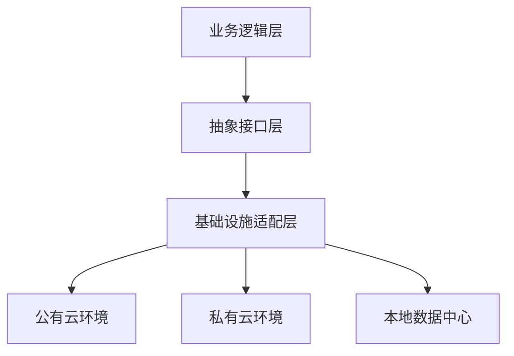
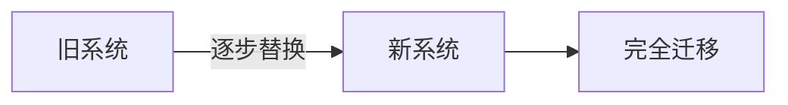
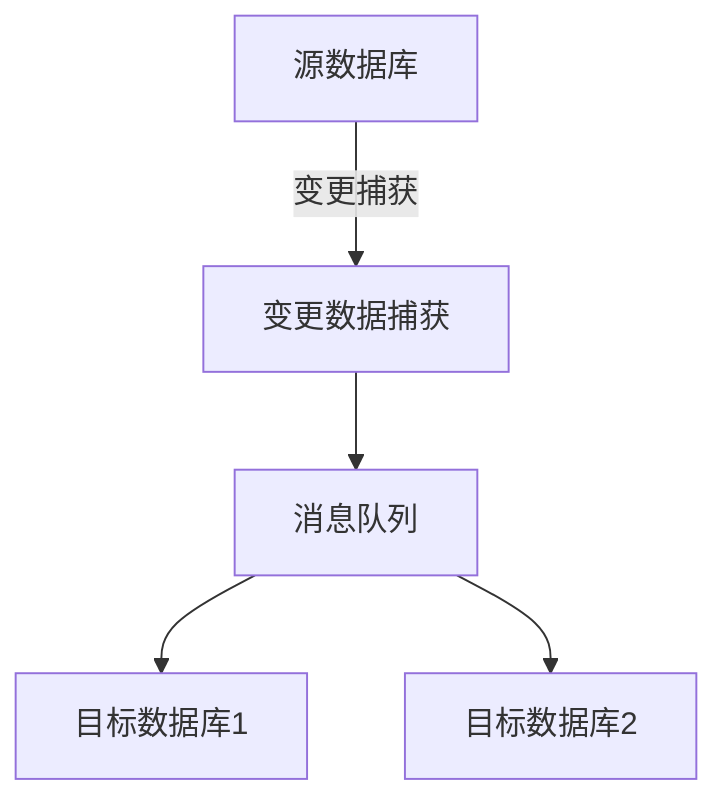

## 前言

在当今云计算、混合云和边缘计算日益普及的技术环境中，应用系统不再局限于单一的运行环境。企业常常需要在公有云、私有云、本地数据中心甚至边缘设备间部署和迁移应用。这种多样化的部署环境对架构设计提出了新的挑战：如何确保应用能够在不同环境间无缝迁移和互操作？这就是架构可移植性与互操作性的核心所在。

> 🌐 **架构可移植性**是指软件系统在不同环境间迁移的能力，而**互操作性**则是不同系统间交换信息和协同工作的能力。这两者共同构成了现代架构设计的关键维度。

::: tip
正如Martin Fowler所言："架构是那些重要决策的集合，而这些决策一旦做出，就很难改变。"在多云时代，可移植性和互操作性应当成为这些重要决策的核心考量。
:::

## 架构可移植性的核心原则

### 1. 环境抽象化

架构设计应当通过抽象层隔离具体环境依赖，使业务逻辑与基础设施解耦。



### 2. 配置与代码分离

将环境特定的配置信息与代码逻辑分离，实现一套代码多环境部署。

```yaml
# application-config.yaml - 公有云环境
database:
  host: "prod-db.cloudprovider.com"
  port: 5432

# application-config.yaml - 私有云环境
database:
  host: "prod-db.internal.com"
  port: 5432
```

### 3. 容器化与标准化

使用容器技术（如Docker）封装应用及其依赖，确保跨环境的一致性运行。

```dockerfile
# Dockerfile示例
FROM openjdk:17-jdk-slim
COPY target/myapp.jar /app.jar
EXPOSE 8080
ENTRYPOINT ["java", "-jar", "/app.jar"]
```

### 4. 无服务器与函数抽象

采用函数即服务(FaaS)模式，将应用逻辑封装为独立函数，实现跨平台执行。

```javascript
// AWS Lambda函数示例
exports.handler = async (event) => {
    // 业务逻辑
    return {
        statusCode: 200,
        body: JSON.stringify('Hello from Lambda!')
    };
};
```

## 互操作性的关键考量因素

### 1. API标准化

采用统一的API设计规范，确保不同系统间能够无缝集成。

```yaml
# OpenAPI 3.0规范片段
openapi: 3.0.0
info:
  title: 用户服务API
  version: 1.0.0
paths:
  /users:
    get:
      summary: 获取用户列表
      responses:
        '200':
          description: 用户列表
          content:
            application/json:
              schema:
                type: array
                items:
                  $ref: '#/components/schemas/User'
```

### 2. 数据格式统一

确保跨系统数据交换采用标准化的数据格式和协议。

```json
{
  "id": "12345",
  "name": "张三",
  "email": "zhangsan@example.com",
  "metadata": {
    "createdAt": "2023-01-01T00:00:00Z",
    "updatedAt": "2023-01-02T00:00:00Z"
  }
}
```

### 3. 事件驱动架构

采用事件驱动模式实现系统间的松耦合通信。

```kotlin
// Kotlin事件定义示例
data class UserCreatedEvent(
    val userId: String,
    val userName: String,
    val timestamp: Instant
) : DomainEvent
```

### 4. 服务网格与通信治理

使用服务网格技术统一管理服务间通信，确保跨环境服务调用的一致性。

```yaml
# Istio服务配置示例
apiVersion: networking.istio.io/v1alpha3
kind: VirtualService
metadata:
  name: reviews-route
spec:
  hosts:
  - reviews
  http:
  - match:
    - headers:
        cookie:
          regex: "^(.*?;)?(user=jorgen)(;.*)?$"
    route:
    - destination:
        host: reviews
        subset: v2
  - route:
    - destination:
        host: reviews
        subset: v1
```

## 实现可移植性的架构模式

### 1. 多云抽象层模式

构建抽象层隐藏不同云服务的差异，提供统一的接口。

```java
// 多云存储抽象接口示例
public interface MultiCloudStorage {
    String upload(String bucket, String key, InputStream data);
    InputStream download(String bucket, String key);
    void delete(String bucket, String key);
}

// AWS S3实现
public class AWSS3Storage implements MultiCloudStorage {
    // AWS S3特定实现
}

// Azure Blob Storage实现
public class AzureBlobStorage implements MultiCloudStorage {
    // Azure Blob特定实现
}
```

### 2. 渐进式迁移模式

采用"绞杀者模式"(Strangler Pattern)逐步迁移系统，确保业务连续性。



### 3. 特性标志模式

使用特性标志控制不同环境下的功能开关，实现渐进式部署。

```yaml
# feature-flags.yaml
features:
  new-payment-gateway:
    enabled: true
    environments:
      - production
      - staging
  advanced-analytics:
    enabled: false
    environments:
      - staging
```

### 4. 基础设施即代码(IaC)

使用代码定义和管理基础设施，确保环境一致性。

```terraform
# Terraform示例
resource "aws_instance" "web" {
  ami           = "ami-0c55b159cbfafe1f0"
  instance_type = "t2.micro"
  
  tags = {
    Name = "web-server"
  }
}
```

## 构建互操作性机制的实践方法

### 1. API网关与服务发现

使用API网关统一管理外部访问，结合服务发现机制实现动态路由。

```yaml
# Kong API网关配置示例
services:
  - name: user-service
    url: http://user-service:8080
    routes:
      - name: user-route
        strip_path: true
        paths:
          - /users
```

### 2. 消息队列与事件总线

采用消息队列实现系统间的异步通信，确保可靠的消息传递。

```python
# RabbitMQ消费者示例
def process_message(ch, method, properties, body):
    # 处理消息
    print(f"Received message: {body}")
    ch.basic_ack(delivery_tag=method.delivery_tag)

channel.basic_consume(queue='user_events', on_message_callback=process_message)
```

### 3. 数据同步与复制

实现跨环境的数据同步机制，确保数据一致性。



### 4. 身份认证与授权统一

采用统一的身份认证机制，实现跨系统的单点登录。

```yaml
# OAuth 2.0配置示例
authorization:
  endpoint: https://auth.example.com/oauth/authorize
  token: https://auth.example.com/oauth/token
  userinfo: https://auth.example.com/userinfo
```

## 案例分析：成功实施可移植性与互操作性的企业架构

### 案例背景

某全球零售企业需要将其电商平台从本地数据中心迁移到多云环境，同时保持与现有系统的无缝集成。

### 实施策略

1. **架构重构**：采用微服务架构重构单体应用，每个服务独立部署
2. **容器化封装**：所有服务容器化，使用Kubernetes进行编排
3. **多云管理**：使用Terraform和Crossplane实现多云基础设施统一管理
4. **API标准化**：采用OpenAPI规范定义所有服务接口
5. **事件驱动**：实现基于Kafka的事件总线，实现系统间松耦合通信

### 实施效果

- 部署时间从数周缩短至数小时
- 系统可用性提升至99.99%
- 成本降低30%，通过资源优化和多云定价策略
- 新功能上线时间缩短50%
- 跨环境数据一致性得到保障

## 挑战与应对策略

### 1. 环境差异挑战

**挑战**：不同云服务提供商的API和功能差异导致迁移困难。

**应对策略**：
- 构建抽象层隐藏底层差异
- 采用多云管理工具统一操作界面
- 建立兼容性测试矩阵，确保跨环境一致性

### 2. 数据一致性挑战

**挑战**：跨环境数据同步可能导致一致性问题。

**应对策略**：
- 实现最终一致性模型
- 采用分布式事务协议
- 建立数据校验和修复机制

### 3. 安全与合规挑战

**挑战**：不同环境的安全策略和合规要求可能冲突。

**应对策略**：
- 实现统一的安全框架
- 采用零信任架构模型
- 建立自动化合规检查机制

### 4. 性能优化挑战

**挑战**：跨环境部署可能带来网络延迟和性能问题。

**应对策略**：
- 实现智能路由和负载均衡
- 采用边缘计算优化用户体验
- 建立性能监控和自动扩缩容机制

## 未来趋势与建议

### 1. 趋势一：边缘计算与云原生融合

随着边缘计算的发展，架构设计需要考虑如何将云原生能力扩展到边缘环境。

```yaml
# 边缘-云协同架构示例
edge:
  - compute: lightweight-kubernetes
    data-sync: bi-directional
    offline-capability: true
cloud:
  - compute: serverless-functions
    data-storage: distributed-database
    analytics: real-time
```

### 2. 趋势二：AI驱动的架构优化

人工智能技术将被用于自动优化跨环境部署和资源分配。

### 3. 趋势三：无状态架构普及

无状态设计将成为可移植性的基础，减少环境依赖。

### 实施建议

1. **从小处开始**：选择非关键系统作为可移植性改造的试点
2. **建立标准**：制定跨环境部署的标准和最佳实践
3. **投资工具**：采用多云管理、容器编排等工具简化迁移过程
4. **培养人才**：提升团队对多云架构和互操作性的理解
5. **持续演进**：将可移植性和互操作性纳入架构演进的核心考量

## 结语

架构可移植性与互操作性不仅是技术问题，更是战略问题。在多云和混合云日益普及的今天，构建能够跨环境无缝集成的系统已成为企业数字化转型的关键能力。

通过环境抽象、配置与代码分离、容器化等策略实现可移植性，通过API标准化、数据格式统一、事件驱动等机制保障互操作性，企业能够构建更加灵活、敏捷和适应变化的架构。

> 🚀 **记住**：架构的可移植性和互操作性不是一次性项目，而是持续演进的过程。随着技术环境和业务需求的变化，架构设计需要不断调整和优化，以保持其在不同环境中的适应能力和互操作能力。

在未来的技术浪潮中，那些能够成功驾驭可移植性与互操作性的组织，将能够在数字化转型中占据更有利的位置，实现真正的技术敏捷性和业务连续性。