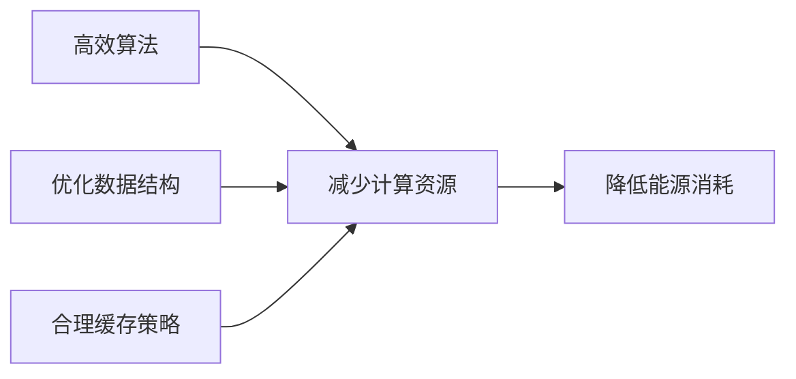

## 前言

在全球气候变化和环境问题日益严峻的今天，软件行业作为全球能源消耗的重要领域之一，也面临着如何减少碳足迹、提高能源效率的挑战。然而，在架构设计领域，可持续发展往往被忽视，架构师们更关注功能性、性能和可扩展性等传统指标。

🌍 **你知道吗？** 全球信息通信技术(ICT)行业的碳排放约占全球总排放量的3.7%，与航空业的排放相当！

本文将探讨如何在架构设计中融入可持续发展理念，构建绿色环保的软件系统，为我们的地球贡献一份力量。

## 可持续架构的重要性

软件系统虽然是无形的，但其运行需要消耗大量的计算资源，而这些资源的生产和使用都会产生碳排放。随着数字化转型的加速，这一数字预计还会继续增长。因此，作为架构师，我们有责任在设计系统时考虑其环境影响。

::: tip
可持续架构不仅是对环境负责，也是对未来负责。每一个架构决策都可能对地球产生长期影响。
:::

## 可持续架构的核心原则

### 1. 资源效率优先

资源效率是可持续架构的核心原则之一。这意味着我们应该设计能够在最少的计算资源下完成任务的系统。



### 2. 延长系统寿命

可持续架构应该注重系统的长期可维护性和可演进性，避免频繁的重构和重建。这不仅减少了开发成本，也减少了因系统更替而产生的资源浪费。

### 3. 最小化碳足迹

架构设计应该考虑系统的整体碳足迹，包括开发、部署、运行和退役的全生命周期。通过选择低碳的技术栈、优化资源使用和减少不必要的服务，可以显著降低系统的碳足迹。

## 可持续架构的实践策略

### 1. 选择低碳技术栈

不同的技术栈和框架在能源效率上存在显著差异：

- **编程语言**：编译型语言(如Rust、Go)通常比解释型语言更高效
- **数据库**：列式存储数据库通常比行式存储数据库更高效
- **云服务**：选择使用可再生能源供电的云服务提供商

### 2. 优化系统性能

系统性能直接影响能源消耗。高性能的系统通常可以在更短的时间内完成相同的任务，从而减少能源消耗：

- **算法优化**：选择时间复杂度更低的算法
- **并发处理**：合理利用多核处理器，提高CPU利用率
- **异步处理**：减少阻塞操作，提高系统吞吐量

### 3. 实施智能扩展策略

云计算的弹性扩展能力是实现可持续架构的重要工具。通过智能扩展策略，可以根据实际负载动态调整资源使用：

```python
# 示例：基于负载的自动扩展策略
def auto_scale(resources, current_load, threshold):
    if current_load > threshold:
        # 增加资源
        return scale_up(resources)
    elif current_load < threshold * 0.5:
        # 减少资源
        return scale_down(resources)
    else:
        # 保持当前资源
        return resources
```

### 4. 优化数据存储和传输

数据是现代系统的核心，但数据的存储和传输也是能源消耗的重要来源：

- **数据压缩**：在传输和存储前对数据进行压缩
- **边缘计算**：将计算任务尽可能推向边缘，减少数据传输
- **冷热数据分离**：将不常用的数据存储在更节能的存储介质中

### 5. 建立可持续架构度量体系

为了评估架构的可持续性，我们需要建立相应的度量体系：

- **能源消耗指标**：系统运行时的能源消耗
- **碳足迹指标**：系统的碳排放量
- **资源利用率**：CPU、内存、网络等资源的使用效率
- **系统寿命**：系统在需要重大重构前可以运行的时间

## 可持续架构的案例分析

### 案例1：Netflix的边缘计算架构

Netflix通过边缘计算架构，将内容缓存尽可能靠近用户，减少数据传输距离，从而降低能源消耗。这种架构不仅提高了用户体验，也减少了系统的碳足迹。

### 案例2：Google的数据中心优化

Google通过机器学习优化其数据中心的能源使用，将PUE(Power Usage Effectiveness)降低到了1.1以下，远低于行业平均水平的1.6。这意味着Google的数据中心只有10%的能源用于非计算设备，而行业平均水平为40%。

## 未来展望

随着技术的进步和环保意识的增强，可持续架构将变得越来越重要。未来，我们可能会看到：

1. **可持续架构标准**：像ISO这样的组织可能会推出专门针对软件架构可持续性的标准
2. **绿色云服务认证**：云服务提供商可能会获得基于其能源使用效率和可再生能源使用比例的认证
3. **可持续架构工具**：出现更多专门用于评估和优化架构可持续性的工具和框架

## 个人建议

作为架构师，我们可以采取以下行动来推动可持续架构的发展：

1. **提高意识**：首先认识到架构设计对环境的影响，将可持续性纳入架构决策的考量因素
2. **学习最佳实践**：研究和学习可持续架构的最佳实践，并将其应用到实际项目中
3. **分享知识**：在团队和组织内分享可持续架构的知识和实践，提高整个团队的意识
4. **推动变革**：在组织中倡导可持续架构的理念，推动相关政策和流程的变革

## 结语

可持续架构不仅是对环境负责，也是对未来负责。作为架构师，我们有能力通过我们的设计决策，为构建一个更加可持续的数字世界做出贡献。虽然实现完全可持续的架构是一个长期目标，但每一步小的改进都是有意义的。

让我们一起努力，构建绿色环保的软件系统，为我们的地球贡献一份力量！

> "我们不是从祖先那里继承了地球，而是向子孙后代借用它。" — 环保谚语