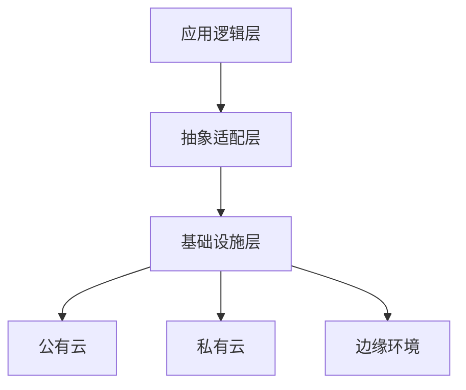

## 前言

作为一名架构师，我经常面临一个令人头疼的问题：如何在不同的云环境和部署场景中保持系统的一致性和灵活性？🤔 无论是公有云、私有云、混合云还是边缘计算，每种环境都有其独特的特性和限制。今天，我想和大家探讨一下架构适配性与多环境部署这个话题，分享一些我在实践中总结的经验和思考。

::: tip
"架构的本质不是构建单一环境下的完美系统，而是设计能够在多种环境中保持一致性和灵活性的解决方案。"
:::

## 多环境部署的挑战

在深入探讨解决方案之前，让我们先看看多环境部署面临的主要挑战：

### 环境差异性问题

不同的云环境（如AWS、Azure、GCP）和本地数据中心在基础设施、网络配置、安全策略等方面存在显著差异。这些差异可能导致：

- **配置不一致**：各环境间的配置参数和设置可能不同
- **API兼容性**：不同云服务商提供的API可能有差异
- **性能表现**：相同应用在不同环境中的性能表现可能截然不同

### 部署复杂性增加

随着环境数量的增加，部署流程变得越来越复杂：

- **环境管理成本**：维护多个环境需要额外的人力和资源
- **部署频率下降**：复杂的部署流程可能导致部署频率降低
- **回滚困难**：在多个环境中进行回滚操作变得更加复杂

### 安全与合规要求

不同环境可能有不同的安全要求和合规标准：

- **数据主权**：某些数据可能需要在特定地理区域存储
- **访问控制**：不同环境的安全策略可能不同
- **审计要求**：不同环境可能有不同的审计要求

## 架构适配性的核心原则

面对这些挑战，我们需要构建具有良好适配性的架构。以下是几个核心原则：

### 抽象层设计

通过抽象层将应用逻辑与基础设施细节分离：



抽象层负责处理不同环境间的差异，使应用逻辑无需关心底层基础设施的细节。

### 配置外部化

将环境特定的配置外部化，实现"一次构建，多次部署"：

```yaml
# 通用配置
app:
  name: "MyApp"
  version: "1.0.0"

# 环境特定配置（通过环境变量或配置中心注入）
database:
  host: "${DB_HOST}"
  port: "${DB_PORT}"
  username: "${DB_USERNAME}"
  password: "${DB_PASSWORD}"
```

### 容器化与编排

使用容器技术（如Docker）和容器编排工具（如Kubernetes）实现环境一致性：

- **容器化**：将应用及其依赖打包成容器镜像
- **编排**：使用Kubernetes等工具统一管理不同环境中的容器部署

## 多环境部署策略

基于上述原则，我们可以采用以下策略实现多环境部署：

### 基础设施即代码 (IaC)

使用IaC工具（如Terraform、CloudFormation）管理不同环境的基础设施：

```hcl
# 示例：使用Terraform定义跨云环境的基础设施
resource "aws_instance" "web" {
  count         = var.environment == "production" ? 3 : 1
  ami           = data.aws_ami.latest.id
  instance_type = "t3.micro"
  
  tags = {
    Environment = var.environment
  }
}

resource "azurerm_linux_virtual_machine" "web" {
  count               = var.environment == "production" && var.cloud_provider == "azure" ? 3 : 0
  name                = "web-${count.index}"
  resource_group_name = azurerm_resource_group.main.name
  location            = azurerm_resource_group.main.location
  size                = "Standard_B1s"
  # ... 其他配置
}
```

### 环境配置管理

建立统一的环境配置管理机制：

1. **配置中心**：使用Consul、etcd或Spring Cloud Config等工具集中管理配置
2. **环境变量注入**：通过CI/CD管道注入环境特定配置
3. **配置验证**：部署前验证配置的完整性和正确性

### 蓝绿部署与金丝雀发布

采用渐进式部署策略减少风险：

- **蓝绿部署**：同时维护两个生产环境，实现零停机部署
- **金丝雀发布**：逐步将流量导向新版本，监控性能和稳定性

## 架构适配模式

在实践中，我总结了几种有效的架构适配模式：

### 适配器模式

为不同环境创建适配器，统一接口：

```java
// 统一接口
public interface StorageAdapter {
    void store(String key, byte[] data);
    byte[] retrieve(String key);
}

// AWS S3适配器
public class S3StorageAdapter implements StorageAdapter {
    // 实现S3存储逻辑
}

// Azure Blob适配器
public class AzureBlobStorageAdapter implements StorageAdapter {
    // 实现Azure Blob存储逻辑
}
```

### 特性标志 (Feature Flags)

使用特性标志控制不同环境的功能启用情况：

```yaml
# feature-flags.yaml
features:
  new-analytics:
    environments:
      - development
      - staging
      # 生产环境暂不启用
  experimental-ui:
    environments:
      - development
```

### 环境感知设计

使应用能够感知并适应运行环境：

```java
public class EnvironmentAwareService {
    private final EnvironmentConfig config;
    
    public EnvironmentAwareService(EnvironmentConfig config) {
        this.config = config;
    }
    
    public void performOperation() {
        if (config.isProduction()) {
            // 生产环境特定逻辑
        } else if (config.isCloudEnvironment()) {
            // 云环境特定逻辑
        } else {
            // 默认逻辑
        }
    }
}
```

## 实施建议

基于我的经验，以下是实施架构适配性与多环境部署的一些建议：

### 1. 从设计阶段开始考虑适配性

在架构设计初期就应该考虑多环境部署的需求，而不是事后补救。这包括：

- 定义清晰的接口边界
- 将环境特定逻辑集中管理
- 建立配置管理的标准流程

### 2. 建立环境标准化

尽可能标准化不同环境的配置和部署流程：

- 使用容器技术确保环境一致性
- 建立基础设施即代码的标准
- 统一监控和日志收集方式

### 3. 实施自动化测试

建立全面的自动化测试体系，包括：

- 单元测试：验证核心逻辑
- 集成测试：验证组件交互
- 端到端测试：验证完整功能
- 性能测试：验证不同环境下的性能

### 4. 建立监控和可观测性

确保在不同环境中都能有效监控系统状态：

- 统一日志格式和收集方式
- 建立跨环境的监控仪表板
- 实施自动化告警机制

## 未来展望

随着技术的不断发展，架构适配性与多环境部署将面临新的挑战和机遇：

### 边缘计算的兴起

边缘计算将使部署环境更加分散和多样化，架构需要更好地支持：

- 低延迟要求
- 离线操作能力
- 资源受限环境

### 环境感知AI

AI技术可以帮助实现更智能的环境适配：

- 自动检测环境特性
- 动态调整资源配置
- 预测性能瓶颈

### 无服务器架构的普及

无服务器架构将进一步简化部署过程，但也会带来新的适配挑战：

- 函数冷启动问题
- 供应商锁定风险
- 状态管理复杂性

## 结语

架构适配性与多环境部署是现代架构设计中的重要课题。通过抽象层设计、配置外部化、容器化与编排等策略，我们可以构建能够在多种环境中保持一致性和灵活性的系统。

> "优秀的架构师不仅设计能够解决当前问题的系统，还设计能够适应未来变化的系统。"

在多云和混合云日益普及的今天，架构适配性将成为衡量架构质量的重要标准。希望今天的分享能够为大家在架构设计和部署过程中提供一些有价值的参考。

记住，架构适配不是一蹴而就的事情，它需要持续的关注和改进。让我们一起努力，构建更加灵活、可适应的架构吧！🚀