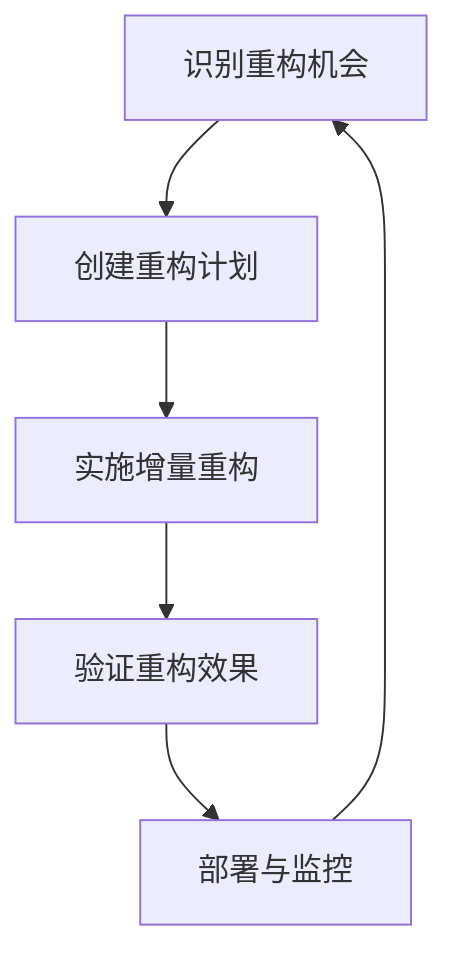

## 前言

在软件开发的漫长旅程中，几乎每个组织都会面临一个共同的挑战：如何处理日益老化的遗产系统。这些系统往往承载着关键业务功能，却可能基于过时的技术栈，难以维护和扩展。正如Martin Fowler所言："**遗产系统不是没有价值的系统，而是没有足够资源投入的系统**"。本文将深入探讨架构遗产系统管理的策略与实践，帮助技术团队在保护业务价值的同时，实现系统的现代化转型。

## 遗产系统的定义与特征

::: theorem
遗产系统是指那些虽然仍在运行，但技术栈已过时、架构设计不符合现代标准、难以维护和扩展的软件系统。
:::

典型的遗产系统具有以下特征：

- **技术栈过时**：使用已停止维护的框架、库或编程语言
- **架构陈旧**：采用单体架构，缺乏模块化和可测试性
- **文档缺失**：缺乏完整的架构文档和API规范
- **知识孤岛**：只有少数团队成员理解系统工作原理
- **测试不足**：缺乏自动化测试，回归风险高
- **扩展困难**：难以适应新的业务需求和技术趋势

## 遗产系统管理的挑战

处理遗产系统面临多重挑战：

1. **业务连续性风险**：系统承载关键业务功能，任何改动都可能影响业务运行
2. **技术债务累积**：长期缺乏维护导致技术债务不断累积
3. **人才流失风险**：熟悉系统的老员工离职可能导致知识断层
4. **资源限制**：组织往往难以投入足够资源进行全面重构
5. **期望管理**：业务部门对现代化改造的期望往往与实际可行性不符

## 遗产系统管理策略

### 1. 逐步重构策略

逐步重构是最常用的遗产系统现代化方法，核心思想是"**小步快跑，持续改进**"：

**实施要点**：
- 识别系统中"痛点"最明显的模块
- 制定详细的重构计划和回滚策略
- 每次重构控制在可管理的范围内
- 充分测试并监控重构后的系统表现

### 2. 遗留系统封装与适配

对于难以立即重构的核心模块，可采用封装与适配策略：

- **创建适配层**：在旧系统接口与现代系统之间创建适配器
- **API网关模式**：通过API网关统一管理新旧系统的接口
- **防腐层**：在旧系统边界创建防腐层，防止旧系统设计污染新系统

### 3. 微服务化转型

对于大型单体遗产系统，微服务化转型是一种有效的现代化路径：

**转型步骤**：
1. 识别系统中的业务能力边界
2. 将系统分解为松耦合的服务
3. 逐步迁移数据和服务
4. 实现服务间的通信机制
5. 建立服务治理和监控体系

### 4. 遗留系统与现代系统的集成

在转型过程中，新旧系统往往需要并行运行：

**集成策略**：
- **双写模式**：关键数据同时写入新旧系统
- **同步网关**：通过网关实现新旧系统间的数据同步
- **功能开关**：通过功能开关控制新旧系统的切换

## 技术债务管理

遗产系统往往伴随着大量技术债务，有效的技术债务管理是现代化成功的关键：

### 技术债务识别与分类

| 债务类型 | 特征 | 优先级 |
|---------|------|--------|
| 代码债务 | 代码质量差，难以维护 | 高 |
| 设计债务 | 架构不合理，扩展性差 | 高 |
| 测试债务 | 缺乏自动化测试 | 中 |
| 文档债务 | 文档缺失或不准确 | 中 |
| 技术栈债务 | 使用过时技术 | 低 |

### 技术债务偿还策略

1. **预防为主**：在开发新功能时偿还相关技术债务
2. **定期偿还**：安排专门的时间窗口偿还高优先级债务
3. **债务追踪**：建立技术债务登记簿，跟踪债务状态
4. **债务量化**：评估技术债务对业务的影响，优先偿还影响最大的债务

## 架构遗产系统管理最佳实践

### 1. 建立遗产系统治理框架

::: tip
有效的遗产系统治理需要明确责任分工、制定标准流程、建立监控机制，并定期评估遗产系统状态。
:::

### 2. 知识管理与传承

- 建立系统知识库，记录系统架构和关键决策
- 实施导师制，促进知识传承
- 创建系统地图和依赖关系图
- 定期组织技术分享会

### 3. 渐进式现代化路线图

制定清晰的现代化路线图，包括：

- 短期目标：解决紧急问题，提高系统稳定性
- 中期目标：重构关键模块，提高系统可维护性
- 长期目标：实现架构现代化，支持业务创新

### 4. 自动化与DevOps实践

- 建立自动化测试体系，降低回归风险
- 实施持续集成/持续部署，提高交付效率
- 建立监控系统，实时系统健康状况
- 实施基础设施即代码，提高环境一致性

## 案例分析：某金融机构核心系统现代化

### 背景

某金融机构的核心交易系统运行超过15年，基于COBOL和大型机架构，面临以下挑战：

- 系统响应时间过长，影响客户体验
- 难以集成新的业务功能
- 技术人才招聘困难
- 维护成本逐年上升

### 现代化策略

采用"**核心保留，外围现代化**"的策略：

1. **保留核心交易逻辑**：保持COBOL核心不变，确保业务连续性
2. **创建服务层**：在核心系统之上构建现代化服务层
3. **渐进式界面现代化**：逐步将用户界面迁移到Web和移动平台
4. **数据现代化**：建立数据仓库，实现数据分析现代化

### 实施结果

- 系统响应时间提升60%
- 新功能开发周期缩短70%
- 维护成本降低40%
- 客户满意度提升35%

## 结语

遗产系统管理不是简单的技术问题，而是涉及业务、技术和组织的综合性挑战。成功的遗产系统现代化需要：

> **平衡短期业务需求与长期技术愿景，在保护现有价值的同时，为未来发展奠定基础。**

架构师需要具备系统思维，制定切实可行的现代化路线图，并持续推动技术债务管理。通过采用渐进式重构、封装与适配、微服务化等策略，结合有效的技术债务管理和知识传承机制，组织可以成功驾驭技术债务，实现系统的现代化转型。

正如架构是一场永无止境的旅程，遗产系统管理也是持续的过程。唯有保持学习的态度，不断适应变化，才能构建出既满足当前需求，又具备未来适应性的稳健系统架构。

---

*本文是"架构思想"系列文章的一部分，探讨软件架构的核心理念与实践方法。*