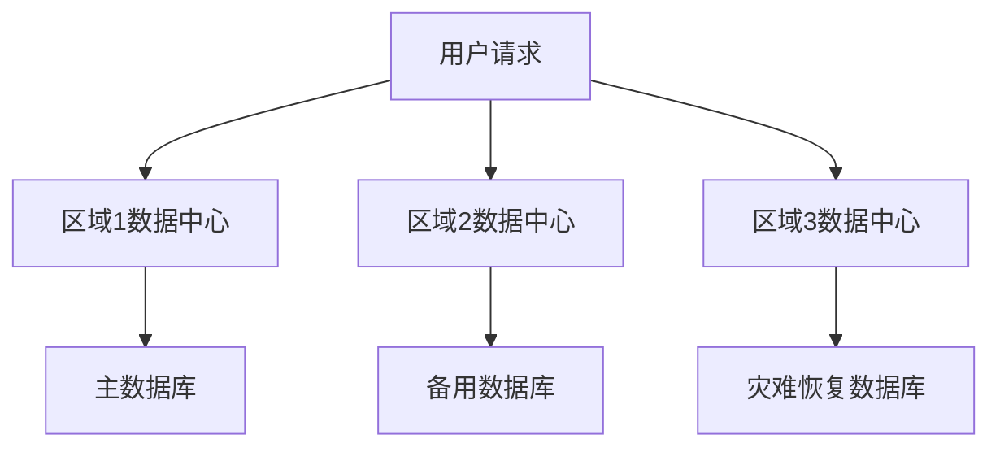
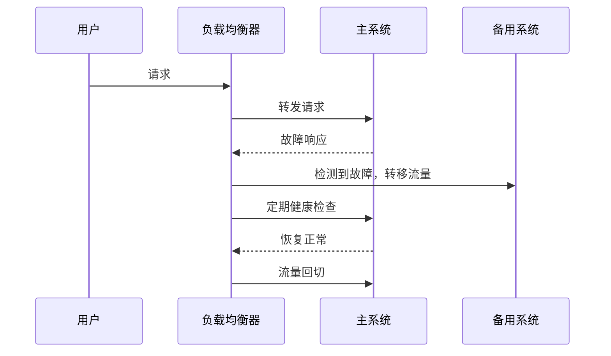
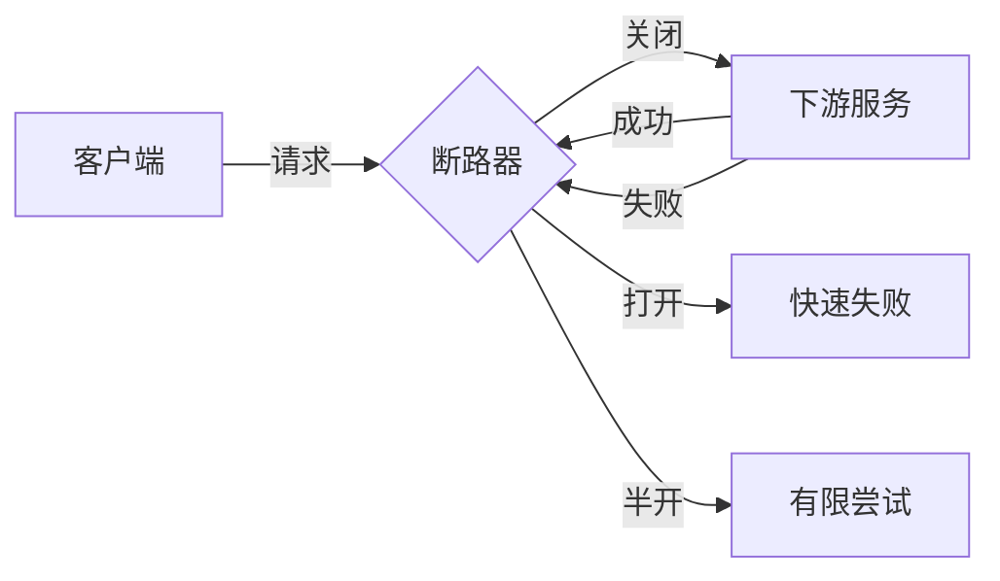

## 前言

在当今数字化时代，系统可用性和业务连续性已成为企业竞争力的关键因素。~~想象一下，如果您的核心系统突然崩溃，无法在承诺的时间内恢复，那将是多么可怕的场景~~。架构弹性与可恢复性作为构建抗灾难系统的关键能力，正受到越来越多的关注。本文将深入探讨如何设计具有高度弹性和可恢复性的系统架构，以确保在各种故障场景下仍能维持业务连续性。

## 什么是架构弹性与可恢复性？

架构弹性与可恢复性是指系统在面对严重故障、灾难或攻击时，能够维持基本功能并在可接受的时间内恢复全部能力的设计特性。它不仅关注预防故障，更强调在故障发生后如何快速、有效地恢复业务能力。

::: theorem
架构弹性与可恢复性是系统韧性的高级表现形式，它要求系统不仅能够"承受"冲击，还要能够"迅速恢复"。
:::

## 架构弹性的核心原则

### 1. 多区域部署

将系统部署在多个地理位置不同的数据中心或云区域，避免单点故障影响整个系统。

### 2. 数据复制与一致性

确保数据在多个区域之间保持一致性，同时考虑不同一致性模型对性能的影响。

- 强一致性：所有副本在同一时间具有相同数据
- 最终一致性：允许短期不一致，但保证最终达到一致状态

### 3. 自动故障检测与转移

实现自动化的故障检测机制，当主系统或数据中心发生故障时，能够自动将流量转移到备用系统。

## 架构可恢复性的关键策略

### 1. 分层恢复策略

采用分层恢复策略，根据业务重要性确定恢复优先级：

- RTO (Recovery Time Objective)：恢复时间目标，系统需要多长时间恢复
- RPO (Recovery Point Objective)：恢复点目标，可以容忍多少数据丢失

| 业务层级 | RTO | RPO | 恢复策略 |
|---------|-----|-----|---------|
| 核心交易系统 | 分钟级 | 秒级 | 实时复制 + 自动故障转移 |
| 重要业务系统 | 小时级 | 分钟级 | 定期备份 + 快速恢复 |
| 一般业务系统 | 天级 | 小时级 | 定期备份 + 手动恢复 |
| 非关键系统 | 周级 | 天级 | 定期备份 + 按需恢复 |

### 2. 灾难恢复站点

建立专门的灾难恢复站点，与主生产环境保持地理隔离：

- 热备份站点：实时同步数据，可立即接管业务
- 温备份站点：定期同步数据，需一定时间恢复
- 冷备份站点：仅保留数据备份，需完全重建环境

### 3. 数据备份与恢复

实施全面的数据备份策略：

- 全量备份：定期完整复制所有数据
- 增量备份：仅备份自上次备份以来的变化
- 差异备份：备份自上次全量备份以来的所有变化

### 4. 蓝绿部署与金丝雀发布

采用蓝绿部署和金丝雀发布策略，确保新版本部署不影响系统可用性：

- 蓝绿部署：保持两个完全相同的生产环境，一个运行当前版本，一个部署新版本
- 金丝雀发布：逐步将流量切换到新版本，监控性能和稳定性

## 架构弹性的实践模式

### 1. 断路器模式

当系统检测到下游服务故障时，断路器打开，直接返回错误或默认值，避免资源浪费和级联故障。

### 2. 舱壁隔离模式

将系统资源划分为独立的"舱壁"，防止一个组件的故障影响整个系统。

### 3. 重试模式

实现智能重试机制，包括指数退避、断路器配合等策略，提高系统面对临时故障的弹性。

## 架构可恢复性的评估方法

### 1. 混沌工程

通过故意注入故障，测试系统弹性和恢复能力：

- 故障注入：模拟各种故障场景
- 混乱实验：在真实环境中进行测试
- 监控与度量：评估系统行为和恢复能力

### 2. 灾难恢复演练

定期组织灾难恢复演练，验证恢复计划和流程的有效性：

- 桌面演练：通过讨论模拟恢复过程
- 组件演练：测试特定组件的恢复能力
- 全面演练：模拟完整灾难场景并执行恢复

## 架构弹性与可恢复性的技术实现

### 1. 云原生弹性解决方案

利用云平台提供的弹性服务：

- AWS: Route 53, Elastic Load Balancing, Auto Scaling, Backup
- Azure: Traffic Manager, Load Balancer, Auto Scale, Site Recovery
- GCP: Cloud Load Balancing, Instance Groups, Cloud Backup

### 2. 容器编排与弹性

使用Kubernetes等容器编排平台实现弹性：

- Pod自动扩缩容
- 多区域部署
- 服务网格与流量管理

### 3. 数据库弹性方案

- 主从复制与故障转移
- 分库分表
- 数据库集群

## 架构弹性的挑战与权衡

### 1. 成本与弹性的平衡

提高系统弹性通常意味着更高的基础设施成本，需要在弹性和成本之间找到平衡点。

### 2. 一致性与可用性的权衡

在分布式系统中，一致性和可用性往往需要根据CAP理论进行权衡。

### 3. 复杂度管理

弹性架构通常比简单架构更复杂，需要良好的设计和管理。

## 个人建议

基于我的实践经验，以下是构建高弹性与可恢复性系统的几点建议：

1. **从业务需求出发**：不要盲目追求高弹性，而是根据业务需求确定适当的RTO和RPO目标。

2. **采用渐进式方法**：从核心系统开始，逐步扩展弹性能力，避免一次性过度设计。

3. **自动化一切**：将故障检测、转移和恢复过程尽可能自动化，减少人为错误。

4. **持续测试与演练**：定期进行混沌工程和灾难恢复演练，确保弹性和恢复能力有效。

5. **建立监控与度量体系**：建立完善的监控体系，实时监控系统状态，及时发现异常。

## 结语

架构弹性与可恢复性是构建抗灾难系统的关键能力，它不仅关乎技术实现，更关乎业务连续性和用户体验。在当今不确定的技术环境中，具备弹性和可恢复性的系统能够更好地应对各种挑战，确保业务持续稳定运行。通过合理的设计、实施和持续优化，我们可以构建出既可靠又弹性的系统架构，为企业的数字化转型提供坚实的技术支撑。

> "在系统设计中，我们不仅要考虑如何避免故障，更要考虑当故障发生时如何快速恢复。这是衡量系统成熟度的重要标准。"