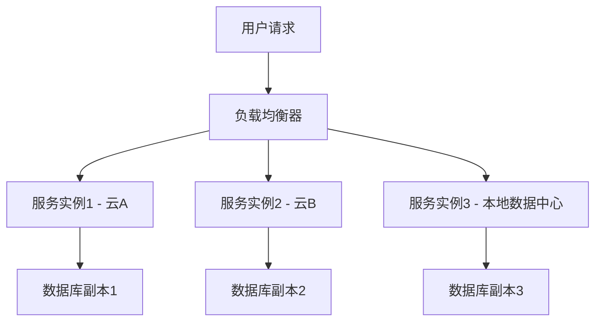
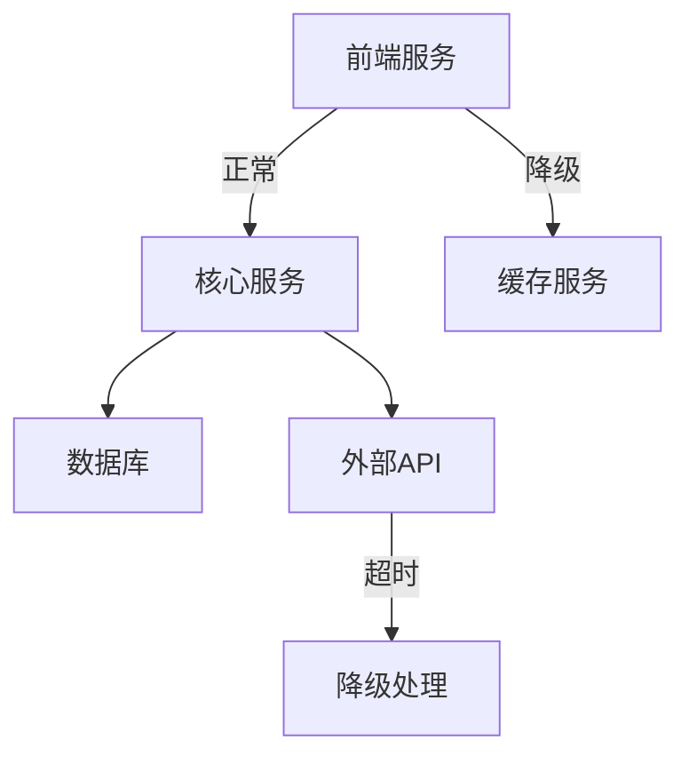

## 前言

在当今快速变化的数字化世界中，系统面临的不确定性日益增加。从网络中断、硬件故障到供应链问题、自然灾害，各种潜在威胁时刻挑战着我们的系统稳定性。传统的"防弹"架构设计理念已不足以应对这些挑战，我们需要一种新的思维方式——架构韧性设计。

韧性(Resilience)不仅仅是系统在遭受故障后恢复的能力，更是系统在面对持续变化和干扰时保持核心功能和性能的能力。正如生态系统能够适应环境变化而保持其基本功能一样，韧性架构能够在不确定性中维持系统的核心价值。

::: tip
"韧性不是避免所有问题，而是当问题发生时，系统能够优雅地降级、适应并继续提供核心价值。"
:::

## 什么是架构韧性设计

架构韧性设计是一种系统设计方法，旨在构建能够适应、吸收和从各种干扰中恢复的系统。与传统的可靠性设计不同，韧性设计接受失败是不可避免的，并专注于系统在失败情况下的行为。

韧性设计的核心原则包括：

1. **接受失败**：承认系统组件可能会失败，并设计系统以优雅地处理这些失败。
2. **保持核心功能**：即使在部分系统失效的情况下，也能维持关键业务功能的运行。
3. **适应变化**：系统能够根据环境变化自动调整其行为和资源分配。
4. **从失败中学习**：系统应能够从过去的故障中学习，并改进其应对未来故障的能力。

## 韧性架构的关键特性

韧性架构通常具备以下关键特性：

### 1. 冗余与多样性

冗余是韧性的基础，但简单的复制并不足够。真正的韧性来自于多样性——使用不同的技术、实现方式和部署策略来避免单点故障和级联故障。



### 2. 隔离与边界

良好的边界定义可以防止故障在系统内部传播。通过断路器、舱壁模式和请求超时等技术，可以将故障限制在局部范围内。



### 3. 监测与感知

韧性系统必须能够实时感知自身状态和环境变化，以便及时做出响应。这包括全面的监控、日志记录和分布式追踪。

### 4. 自适应与自愈

韧性系统能够根据当前状态自动调整其行为。这可能包括自动扩展、流量重路由、负载转移等。

### 5. 混沌工程

通过主动注入故障来测试系统韧性，并从中学习和改进。混沌工程不是简单的破坏测试，而是有控制的实验，旨在发现系统中的弱点。

## 韧性架构设计模式

### 1. 断路器模式

断路器模式可以防止系统在服务不可用时持续尝试调用，从而避免资源浪费和级联故障。

```javascript
// 断路器模式示例代码
class CircuitBreaker {
  constructor(service, threshold = 5, timeout = 60000) {
    this.service = service;
    this.threshold = threshold;
    this.timeout = timeout;
    this.failures = 0;
    this.lastFailureTime = null;
    this.state = 'CLOSED'; // CLOSED, OPEN, HALF_OPEN
  }

  async execute() {
    if (this.state === 'OPEN') {
      if (this.lastFailureTime && Date.now() - this.lastFailureTime > this.timeout) {
        this.state = 'HALF_OPEN';
      } else {
        throw new Error('Service unavailable');
      }
    }

    try {
      const result = await this.service();
      this.onSuccess();
      return result;
    } catch (error) {
      this.onFailure();
      throw error;
    }
  }

  onSuccess() {
    this.failures = 0;
    this.state = 'CLOSED';
  }

  onFailure() {
    this.failures++;
    this.lastFailureTime = Date.now();
    
    if (this.failures >= this.threshold) {
      this.state = 'OPEN';
    }
  }
}
```

### 2. 舱壁模式

舱壁模式将系统资源划分为独立的池，防止一个组件的故障耗尽所有资源。

```java
// 舱壁模式示例代码
public class Bulkhead {
    private final ExecutorService executorService;
    
    public Bulkhead(int maxConcurrentRequests) {
        this.executorService = Executors.newFixedThreadPool(maxConcurrentRequests);
    }
    
    public <T> CompletableFuture<T> execute(Callable<T> task) {
        return CompletableFuture.supplyAsync(() -> {
            try {
                return task.call();
            } catch (Exception e) {
                throw new RuntimeException(e);
            }
        }, executorService);
    }
}
```

### 3. 重试模式

重试模式在遇到暂时性故障时自动重试操作，但需要实现指数退避和最大重试次数限制，避免雪崩效应。

```python
# 重试模式示例代码
import time
import random

def retry_with_backoff(func, max_retries=3, initial_backoff=1, max_backoff=32):
    retries = 0
    backoff = initial_backoff
    
    while retries < max_retries:
        try {
            return func()
        } except Exception as e:
            retries += 1
            if retries >= max_retries:
                raise e
            
            # 指数退避加上随机抖动
            sleep_time = backoff * (1 + random.uniform(0, 0.1))
            time.sleep(sleep_time)
            backoff = min(backoff * 2, max_backoff)
```

### 4. 降级模式

降级模式在系统压力过大或部分功能不可用时，提供简化版本的服务，确保核心功能可用。

```javascript
// 降级模式示例代码
class FeatureService {
  constructor() {
    this.cache = new Map();
    this.fallbackEnabled = true;
  }

  async getUserData(userId) {
    try {
      // 尝试从主服务获取数据
      const data = await this.fetchFromMainService(userId);
      this.cache.set(userId, data);
      return data;
    } catch (error) {
      if (this.fallbackEnabled) {
        // 降级到缓存或简化数据
        console.warn('Falling back to cached data for user:', userId);
        return this.cache.get(userId) || this.getFallbackUserData(userId);
      }
      throw error;
    }
  }

  getFallbackUserData(userId) {
    // 返回简化版用户数据
    return {
      id: userId,
      name: 'User ' + userId,
      // 只包含最基本的信息
    };
  }
}
```

## 实现韧性架构的实践策略

### 1. 韧性需求分析

在设计阶段明确定义韧性需求，包括：

- **可接受的停机时间**：系统在故障期间可以承受多长时间的功能降级
- **关键功能识别**：即使在部分系统失效时也必须保持的功能
- **恢复时间目标(RTO)**：系统从故障中恢复所需的时间
- **恢复点目标(RPO)**：系统可以容忍的数据丢失量

### 2. 分布式事务与一致性

在分布式系统中，传统的ACID事务往往难以实现。可以考虑以下韧性策略：

- **最终一致性**：接受短暂的不一致，系统最终会达到一致状态
- **补偿事务**：当主事务失败时，执行反向操作来撤销已执行的操作
- **Saga模式**：将长事务分解为一系列小事务，每个事务都有对应的补偿操作

### 3. 多区域部署

将系统部署在多个地理区域，以应对区域性灾难：

- **主动-主动**：所有区域都可以处理流量
- **主动-被动**：一个区域处理流量，其他区域待命
- **数据同步策略**：确保跨区域数据的一致性或最终一致性

### 4. 混沌工程实践

建立混沌工程文化，定期进行故障注入实验：

1. **定义系统正常行为**：明确什么是系统的"正常"状态
2. **假设潜在故障**：识别可能发生的故障场景
3. **运行实验**：在受控环境中注入故障
4. **观察系统行为**：记录系统如何响应
5. **学习与改进**：从实验结果中学习并改进系统

### 5. 韧性度量与监控

建立韧性度量体系，持续监控和改进系统韧性：

- **错误率**：系统组件的错误率
- **恢复时间**：从故障中恢复所需的时间
- **降级事件**：系统进入降级模式的频率和持续时间
- **用户影响**：故障对用户体验的影响程度

## 韧性架构案例分析

### 案例一：Netflix的韧性架构

Netflix是韧性架构的典范，其通过以下策略构建了高度韧性的系统：

1. **混沌猴子**：自动随机终止生产环境中的虚拟机，测试系统弹性
2. **断路器模式**：广泛使用Hystrix等库实现断路器，防止级联故障
3. **多区域部署**：服务部署在多个AWS区域，实现区域级别的故障隔离
4. **自适应降级**：根据系统负载和健康状况动态调整服务质量

### 案例二：Amazon的韧性设计

Amazon通过以下实践构建韧性系统：

1. **系统故障注入测试**：定期在生产环境中注入故障，测试系统响应
2. **事件响应自动化**：建立自动化响应机制，减少人工干预
3. **分布式系统设计**：采用无状态服务和幂等操作，简化故障恢复
4. **多可用区部署**：关键服务部署在多个可用区，实现硬件级别的故障隔离

## 韧性架构的挑战与考量

### 1. 复杂性管理

韧性架构往往增加系统复杂性，需要在韧性和简单性之间找到平衡：

- **过度设计**：为所有可能的故障场景设计解决方案可能导致系统过于复杂
- **渐进式韧性**：从最关键的韧性需求开始，逐步扩展

### 2. 成本与资源

韧性架构通常需要更多的资源：

- **冗余资源**：需要额外的计算、存储和网络资源
- **监控开销**：全面的监控和日志记录需要额外资源
- **人力成本**：需要专门的团队来设计和维护韧性系统

### 3. 组织文化

韧性架构需要组织文化的支持：

- **心理安全**：鼓励团队报告故障和错误，而不担心指责
- **学习文化**：从故障中学习并改进，而不是简单地修复问题
- **实验文化**：鼓励团队进行受控实验，测试系统韧性

## 未来韧性架构的发展趋势

### 1. AI驱动的韧性

人工智能和机器学习将被用于：

- **预测性故障检测**：提前识别可能的故障模式
- **自适应系统**：系统能够根据预测自动调整其行为
- **自动化响应**：自动执行故障恢复操作

### 2. 韧性即代码

将韧性配置和策略作为代码管理：

- **即声明式韧性**：使用声明式方法定义韧性策略
- **版本控制**：韧性配置与代码一起进行版本控制
- **自动化测试**：自动化测试韧性策略的有效性

### 3. 韧性度量与优化

更精细的韧性度量将帮助优化系统韧性：

- **韧性评分**：量化系统的韧性水平
- **韧性成本分析**：评估韧性投入的回报
- **韧性优化**：基于度量数据持续优化系统韧性

## 结语

架构韧性设计是现代系统架构中不可或缺的一部分。在充满不确定性的数字世界中，韧性架构不仅能够提高系统的可靠性，还能使组织更好地适应变化和挑战。

构建韧性架构不是一蹴而就的过程，而是一个持续改进的旅程。从接受失败的基本心态开始，通过冗余、隔离、监测和自适应等策略，逐步构建能够应对各种挑战的系统。

韧性架构的核心价值在于，它使系统能够在不确定性中保持核心功能和价值，为用户提供持续稳定的服务。正如生态系统能够适应环境变化一样，韧性架构使我们的系统能够在不断变化的技术环境中持续演进和繁荣。

> "在复杂系统中，韧性不是避免所有问题，而是当问题发生时，系统能够优雅地适应、恢复并继续提供价值。韧性架构师的任务不是构建不会失败的系统，而是构建能够从失败中学习和成长的系统。"