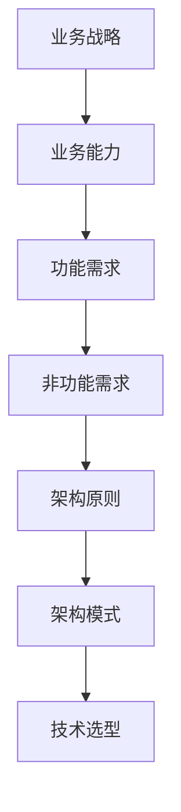

## 前言

在当今快速变化的商业环境中，技术不再仅仅是支持业务的工具，而是驱动业务创新和保持竞争优势的核心引擎。然而，许多组织仍然面临着技术与业务脱节的困境：技术团队埋头于实现功能，而业务团队则抱怨技术无法快速响应市场变化。这种割裂往往源于缺乏一个将技术架构与业务战略紧密结合的系统性框架。

本文将探讨架构与技术战略的深度融合，阐述如何构建能够支撑业务未来发展的技术基石，帮助组织在数字化转型的浪潮中保持领先地位。

## 技术战略的内涵

### 什么是技术战略？

技术战略是指组织为实现其业务目标而制定的长期技术发展方向和规划。它不仅仅是关于选择何种技术或架构，更是关于如何利用技术创造业务价值、获得竞争优势和适应未来变化的系统性思考。

### 技术战略与业务战略的关系

技术战略与业务战略应该是相辅相成的关系：

- **业务战略驱动技术战略**：业务目标和市场定位决定技术发展方向
- **技术战略赋能业务战略**：技术创新可以创造新的业务机会和竞争优势
- **双向反馈与调整**：技术进展和业务变化相互影响，战略需要持续调整

## 架构在技术战略中的核心地位

### 架构作为战略载体

软件架构是技术战略的具体体现，它定义了系统的结构、组件及其关系。良好的架构能够：

- **支持业务目标**：直接对齐业务需求和能力要求
- **适应变化**：为未来业务扩展和变化提供灵活性
- **控制复杂性**：在满足功能需求的同时管理系统的复杂性
- **平衡质量属性**：在性能、可靠性、安全性、可维护性等属性间取得平衡

### 架构决策的战略影响

架构决策往往具有长期影响，一旦做出，很难在不付出高昂代价的情况下改变。因此，架构决策必须基于对业务战略的深刻理解：

- **技术选型**：选择能够支持业务长期发展的技术栈
- **架构模式**：采用能够适应未来变化的架构模式
- **质量属性优先级**：根据业务需求确定质量属性的优先级
- **演进路径**：规划架构的渐进式演进路径

## 构建战略对齐的架构框架

### 业务能力映射

将业务战略分解为具体的能力需求，然后映射到技术架构上：



### 架构原则与业务目标对齐

架构原则是指导架构决策的基本准则，应该直接反映业务目标：

| 业务目标 | 对应架构原则 | 实现方式 |
|---------|------------|---------|
| 快速响应市场变化 | 模块化、松耦合 | 微服务、事件驱动 |
| 降低运营成本 | 效率优化、自动化 | 云原生、DevOps |
| 提升用户体验 | 性能优化、可靠性 | 边缘计算、容错设计 |
| 创新业务模式 | 灵活性、可扩展性 | API优先、插件化 |

### 架构演进路线图

制定与业务发展阶段相匹配的架构演进路线：

1. **当前状态评估**：分析现有架构的优势和不足
2. **目标状态定义**：基于业务战略定义3-5年后的架构目标
3. **里程碑设定**：设定关键里程碑和交付物
4. **实施计划**：制定详细的实施计划和资源需求
5. **风险与缓解措施**：识别潜在风险并制定应对策略

## 技术战略与架构实践的融合方法

### 战略工作坊

定期组织战略工作坊，确保技术团队与业务团队对齐：

- **参与者**：业务领导、产品负责人、技术架构师、开发团队代表
- **频率**：季度或半年一次
- **产出**：战略调整、架构原则更新、优先级排序

### 架构决策记录(ADR)

使用架构决策记录(ADR)来记录重要架构决策及其与业务战略的对齐关系：

```
## ADR-001: 采用微服务架构

**日期**: 2023-01-15
**状态**: 已批准

### 背景
公司业务多元化发展，各业务线需求差异增大，单体架构难以满足快速迭代需求。

### 决策
采用微服务架构，将系统拆分为多个独立服务。

**原因**
1. 支持业务线独立开发和部署
2. 提高系统弹性和可扩展性
3. 允许不同业务线使用最适合的技术栈

### 后果
- 正面: 加速产品迭代，提高系统可靠性
- 负面: 增加系统复杂性，需要解决分布式系统问题
```

### 架构质量门

建立与业务目标对齐的架构质量门，确保架构决策符合战略方向：

| 质量属性 | 业务关联 | 测量指标 | 质量标准 |
|---------|---------|---------|---------|
| 性能 | 用户体验 | 响应时间 < 200ms | 90%请求达标 |
| 可靠性 | 服务可用性 | 故障恢复时间 < 5分钟 | 月度可用性 > 99.9% |
| 安全性 | 数据保护 | 安全漏洞数量 | 0高危漏洞 |
| 可扩展性 | 业务增长 | 自动扩展能力 | 支持10倍流量增长 |

## 案例分析：从业务战略到架构实现

### 案例背景

某零售企业制定了"全渠道融合"的业务战略，目标是打通线上线下的购物体验，提供一致的品牌体验。

### 战略分解

1. **业务目标**: 提供无缝的全渠道购物体验
2. **能力需求**:
   - 统一的商品目录
   - 一致的会员体系
   - 灵活的订单履行
   - 个性化的营销推送

### 架构设计

基于业务战略，设计了以下架构：

1. **API优先策略**：构建统一的API层，支持前端和第三方系统集成
2. **事件驱动架构**：使用事件总线实现系统间的松耦合通信
3. **微服务架构**：按业务领域划分服务，如商品服务、订单服务、会员服务等
4. **数据一致性策略**：采用最终一致性模式，确保跨渠道数据同步

### 实施效果

架构实施后，实现了以下业务成果：

- 线上线下一体化会员体系，会员复购率提升35%
- 统一的商品目录管理，减少商品信息不一致问题90%
- 灵活的订单履行能力，支持线上下单、门店提货等多种场景
- 个性化营销转化率提升28%

## 架构战略实施的常见挑战

### 挑战一：技术与业务语言不通

**症状**：技术团队和业务团队使用不同的术语，难以有效沟通。

**解决方案**：
- 建立共同的语言词典
- 使用可视化工具（如业务能力地图、上下文图）
- 鼓励技术团队学习业务知识，业务团队了解技术可能性

### 挑战二：短期压力与长期战略的冲突

**症状**：日常开发和维护工作占用了大量资源，战略项目难以推进。

**解决方案**：
- 采用"70-20-10"资源分配模型：70%日常维护，20%战略项目，10%创新实验
- 将战略目标分解为可执行的小任务
- 建立战略项目的独立团队，减少日常工作的干扰

### 挑战三：技术债务积累

**症状**：为了快速交付而牺牲架构质量，导致技术债务积累。

**解决方案**：
- 将技术债务管理纳入技术战略
- 定期进行架构评估和重构
- 建立技术债务偿还计划，与业务优先级对齐

### 挑战四：组织结构与架构不匹配

**症状**：团队组织方式与系统架构不一致，导致协作效率低下。

**解决方案**：
- 采用康威定律，设计反映沟通需求的组织结构
- 建立跨职能团队，每个团队负责完整的业务能力
- 明确团队间的接口和协作机制

## 架构战略的未来趋势

### 战略敏捷化

传统的年度战略规划模式正在被更敏捷的战略迭代所取代：

- **季度战略调整**：根据市场反馈快速调整技术方向
- **场景化战略**：针对不同业务场景制定针对性策略
- **实验驱动**：通过小规模实验验证战略假设

### AI赋能的架构决策

人工智能技术正在改变架构决策的方式：

- **数据驱动的架构评估**：利用AI分析系统性能数据，识别架构瓶颈
- **自动化架构优化**：AI辅助进行架构重构和优化
- **预测性架构规划**：基于业务趋势预测未来架构需求

### 架构即代码(Infrastructure as Code)的演进

架构即代码正在向更广的范围扩展：

- **策略即代码(Policy as Code)**：将架构策略和规则代码化
- **架构即服务(Architecture as a Service)**：提供架构模板和最佳实践
- **治理即代码(Governance as Code)**：将架构治理流程自动化

## 结语

架构与技术战略的深度融合是现代组织成功的关键。通过建立战略对齐的架构框架，采用有效的实践方法，并应对实施过程中的挑战，组织可以构建出既能满足当前需求，又能适应未来变化的技术基石。

在数字化转型的浪潮中，技术架构不再是纯粹的技术问题，而是业务战略的核心组成部分。只有将架构思维与战略思考相结合，才能在复杂多变的商业环境中保持竞争优势，实现可持续发展。

正如著名架构师Martin Fowler所言："架构是关于重要决策的集合，这些决策一旦做出，就很难在不付出高昂代价的情况下改变。"因此，每一个架构决策都应该基于对业务战略的深刻理解，确保技术真正成为业务成功的驱动力。

> 在这个快速变化的时代，唯一不变的就是变化本身。构建战略对齐的架构，不仅是为了应对今天的挑战，更是为了拥抱明天的机遇。